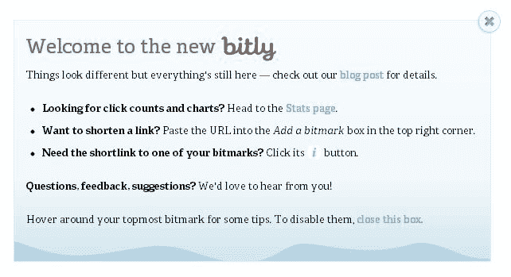
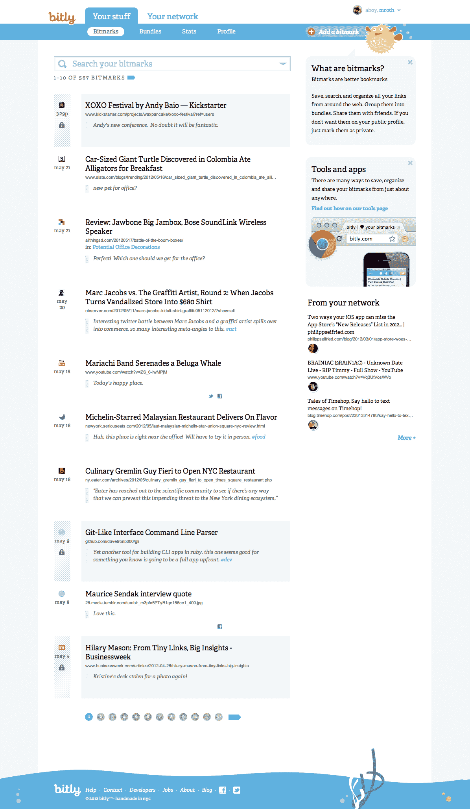

# Bitly 推出新的书签功能、个人资料、搜索和 iPhone 应用 TechCrunch

> 原文：<https://web.archive.org/web/https://techcrunch.com/2012/05/29/bitly-launches-new-bookmarking-features-profiles-search-iphone-app/>

# Bitly 推出新的书签功能、个人资料、搜索和 iPhone 应用程序

今天[发布了](https://web.archive.org/web/20221205114335/http://blog.bitly.com/post/23998132587/welcome-to-the-new-bitly)一个重大的重新设计和一些新功能，所有这些加起来就是公司自己所说的“一个新的比特”这些新功能包括“bitmarks”，Bitly 对其新书签功能的名称，搜索和找到这些书签的能力，快速搜索功能，以及增强的公共配置文件，给用户更多的隐私控制。Bitly 还推出了新的 bookmarklets、Chrome 扩展和[其首个 iPhone 应用](https://web.archive.org/web/20221205114335/http://itunes.apple.com/app/id525106063)。

自 2008 年推出以来，Bitly 一直是 Twitter 和脸书等社交网络上社交分享生态系统的重要组成部分。Bitly 的用户目前每天保存大约 1 亿个链接，该公司告诉我们，到目前为止，Bitly 已经创建了超过 250 亿个链接。该公司每天注册的链接点击量约为 3 亿次，约占互联网总点击量的 1%。

今天发布的重点显然是为用户提供更多的监管功能。新的“比特标记”可以让你轻松地返回并查看你在脸书和推特上分享的链接。当然，你也可以将这些链接组织成捆绑包——这是该公司在 2010 年推出的一项功能。在这个版本中，Bitly 还使这些包的组织更具协作性，现在更明显的是“你可以邀请人们与你协作并编辑一个包。”

Bitly 现在还提供了一个网络视图，可以让你看到你的朋友在 Twitter 和脸书上公开分享的链接。

Bitly 强调，此次更新旨在使服务成为“保存和分享链接、从朋友和整个网络中发现有趣事物的最佳场所。”

从今天开始，开发者将能够使用 Bitly 的开放 API 将这些“位标记功能”添加到他们的应用程序中。

以下是 Bitly 更新的完整列表:

*   轻松保存、共享和发现链接——它们被称为位标记，就像书签一样。
*   立即搜索您保存的位标记。
*   将多组位标记整理成包，并与朋友就包进行合作。
*   将任何位标记或捆绑包设为私有或公共。
*   在一个地方查看朋友在多个社交网络上共享的内容。
*   使用我们新的 bitmarklet、Chrome 扩展和 iPhone 应用程序，从任何地方保存和共享链接。

