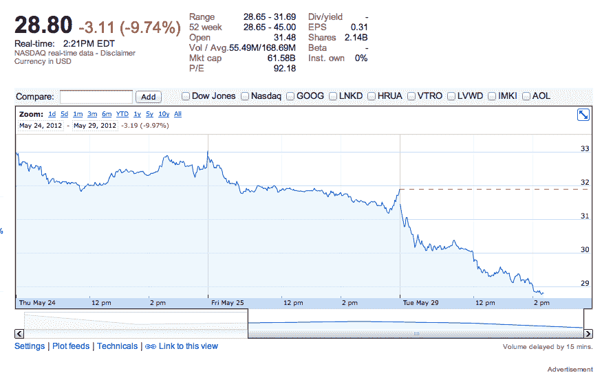

# 自首次公开募股以来，由于股价跌至 29 美元以下，脸书已经损失了约 350 亿美元

> 原文：<https://web.archive.org/web/https://techcrunch.com/2012/05/29/facebook-has-lost-about-35-billion-in-value-since-ipo-as-shares-dip-below-29/>

# 自首次公开募股以来，随着股价跌至 29 美元以下，脸书已经损失了约 350 亿美元的市值

痛苦，痛苦，脸书股票的更多痛苦。脸书今天首次跌破 20 美元，随着期权交易的开始，下跌了约 9%。股价下跌的前一天，第三波关于脸书手机的报道出现，这将把该公司推入高风险、高成本的硬件制造领域。

股价创下 28.65 美元的新低，[收盘下跌近 10%，至 28.84 美元](https://web.archive.org/web/20221207180518/https://www.google.com/finance?client=ob&q=NASDAQ:FB)。盘后交易中，该公司股价再次下跌 0.5%，至 28.69 美元。这使该公司的市值达到 790.2 亿美元，低于脸书首次公开募股当天的 1150 亿美元市值，当时该公司[开始交易时每股 42.05 美元](https://web.archive.org/web/20221207180518/http://m.beta.techcrunch.com/2012/05/18/facebook-share-open-10-5-higher-at-42/?icid=tc_home_art&)。**(也就是说，如果你是那种半杯水车薪的人，脸书现在很便宜，很便宜，很便宜！)

影响股价的关键因素可能是期权交易。彭博表示，看跌期权与看涨期权之比为 1.3 比 1。看跌期权赋予投资者以某一价格卖出股票的权利，而看涨期权赋予他们以某一价格买入股票的能力。当股票下跌时，看跌期权会增值。彭博表示，6 月份 30 美元的看跌期权是最活跃的合约。

就像我在昨晚的一篇报道中所说的，分析师们降低了他们对第二季度的预测，而且[我还从消息来源处获悉，第三季度也会疲软](https://web.archive.org/web/20221207180518/https://beta.techcrunch.com/2012/05/29/what-will-facebooks-perfect-storm-of-an-ipo-leave-behind/)。脸书将需要在自己网站的展示广告之外增加收入来源，以重振股票。有很多可能性。我们可以看到[的因果报应变成一个有趣的礼物收入流](https://web.archive.org/web/20221207180518/https://beta.techcrunch.com/2012/05/18/facebook-acquires-karma/)，改进的搜索成为类似谷歌的广告、类似 Adsense 的网络展示广告的基础，支付和脸书信用在社交游戏之外的扩展。

* *看起来每个人都在为脸书设定不同的市值。谷歌和雅虎财经报道称，脸书的市值约为 620 亿美元。华尔街日报说，脸书的市值在今天的低点是 804 亿美元。我打电话给促成此次发行的消息人士，正确的股票数量是 27.4 亿股。将它乘以当前价格，你就得到市值(这与雅虎和谷歌财经报道的错误数字不同)。