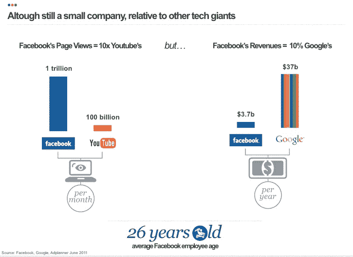
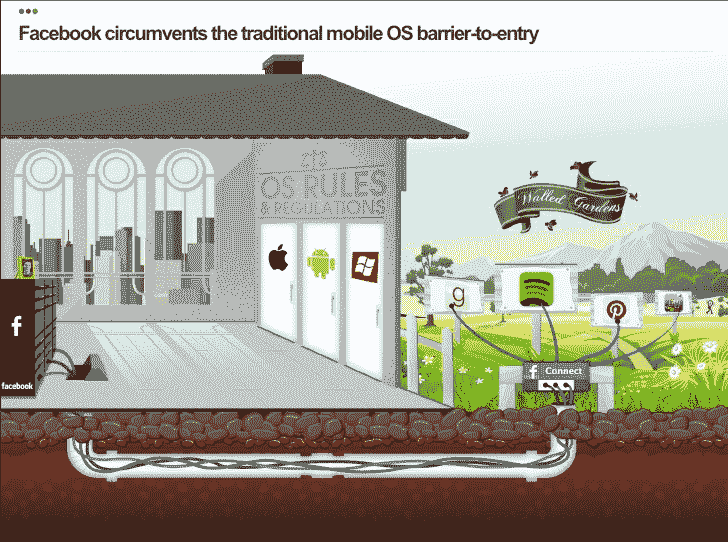

# 为什么脸书仍然是完美的创业公司(幻灯片)

> 原文：<https://web.archive.org/web/https://techcrunch.com/2012/05/29/why-facebook-is-still-the-perfect-startup-slides/>

脸书[今天在公开市场又经历了艰难的一天](https://web.archive.org/web/20230120172406/https://techcrunch.com/2012/05/29/facebook-has-lost-about-35-billion-in-value-since-ipo-as-shares-dip-below-29/)，股票在不到两周前首次亮相时为 42.05 美元，现在交易价格约为 28 美元。那么，今天，精品法国咨询公司 [faberNovel](https://web.archive.org/web/20230120172406/http://www.fabernovel.com/) 发布了一份新的[幻灯片报告](https://web.archive.org/web/20230120172406/http://www.slideshare.net/faberNovel/facebook-the-perfect-startup)，这是一个好时机，它鼓励我们着眼于更大的图景，以及为什么，用它的话说，脸书是“完美的创业公司”

巨大的幻灯片(休息后)是 faberNovel 每年的事情，它每年选择一家公司进行处理——其他的包括[亚马逊如何控制电子商务](https://web.archive.org/web/20230120172406/https://techcrunch.com/2011/05/11/how-amazon-controls-ecommerce-slides/)、[苹果如何主导](https://web.archive.org/web/20230120172406/https://techcrunch.com/2010/07/09/how-apple-dominates-slides/)以及[谷歌可能会出什么问题](https://web.archive.org/web/20230120172406/https://techcrunch.com/2009/03/26/what-could-go-wrong-with-google-the-slideshow/)。和之前的那些一样，今天在脸书发布的是对该公司的深入研究，它不仅关注社交网络的起源，还关注它与其他全球社交网络尝试——以及其他创业公司——的区别。(顺便说一句，faberNovel 认为 IPO 的所有戏剧性事件和关注只是“创业轨迹上的一个点。”一些投资者可能不这么认为。)

在 94 张相当紧凑的幻灯片中(这里没有[克里奇的方法](https://web.archive.org/web/20230120172406/https://techcrunch.com/2012/04/12/how-to-scale-a-1-billion-startup-a-guide-from-instagram-co-founder-mike-krieger/))，有大量的数据，偶尔有用地可视化公司面临的一些最大挑战。(例如:脸书的货币化问题。它的流量是 YouTube 的十倍，但收入只有 YouTube 所有者谷歌的十分之一。)

过了一会儿，回顾脸书在广告方面的不同试验，faberNovel 提出了一个很好的论点，说明在更传统的模式上缺乏成功是如何促使它成为这样一家创新公司的。具体来说，围绕新的社交广告形式(这是第 34 张幻灯片)，即使与用户在网站上花费的时间相比，其中一些形式还没有得到回报。

“脸书别无选择，只能改变游戏规则，”faberNovel 解释道，这也许是它如此成功的关键。

最吸引我的是 faberNovel 对脸书移动业务的收购，这可能是因为上周围绕脸书及其移动计划的所有新闻。

脸书已经拥有大量的移动用户(其 9.01 亿活跃用户中有超过 4 亿是通过移动访问的)，但它很可能会被完全挤出移动市场，因为苹果和谷歌自己控制着生态系统，而且最终会出现其他更好的移动应用。

这让脸书别无选择，只能通过收购、增加功能和自己开发移动平台来增强实力。具体来说，faberNovel 认为，应用中心可能真的会成为游戏规则的改变者，成为脸书如何开始在移动设备上“拥有”其用户的关键。

FaberNovel 则更进一步，宣称凭借其庞大的移动用户群和多样化的服务，“脸书是一种新型的电信公司。”

它甚至漫不经心地想知道，该公司是否有一天甚至可以运行自己的 ad-hoc 网状网络来完成拼图的最后一块。这是不是太离谱了？在一个价值超过 1000 亿美元的大部分免费服务的世界里，或许一切皆有可能。

[slide share id = 13120821 & doc = Facebook-theperfectstartubby-Faber novel-120529101300-PHP app 02]

