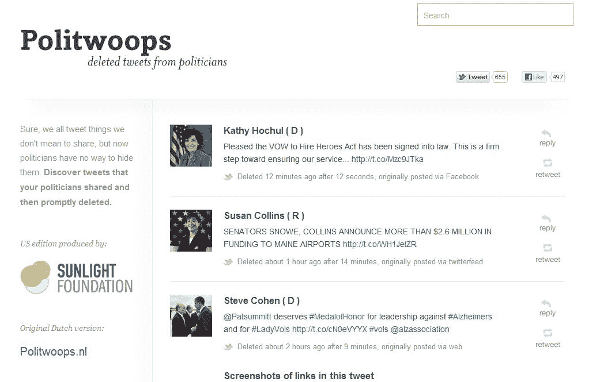

# 互联网永远不会忘记:Politwoops 保存了政客们试图删除的推文 TechCrunch

> 原文：<https://web.archive.org/web/https://techcrunch.com/2012/05/30/the-internet-never-forgets-politwoops-saves-the-tweets-your-politicians-tried-to-delete/>

# 互联网永远不会忘记:Politwoops 保存了你的政客试图删除的推文

一旦某些东西出现在互联网上，通常很难删除。不过，除非有人在 Twitter 上转发帖子，否则被删除的推文几乎永远消失了。然而，随着 [Politwoops](https://web.archive.org/web/20230123133834/http://politwoops.sunlightfoundation.com/) 的出现，阳光基金会现在[为后代保存了一些这样的推文](https://web.archive.org/web/20230123133834/http://sunlightfoundation.com/press/releases/2012/05/30/new-web-tool-finds-potential-political-gaffes-twit/)。Politwoops 关注国会议员的所有 433 个官方推特账户，以及[奥巴马总统的](https://web.archive.org/web/20230123133834/http://politwoops.sunlightfoundation.com/user/BarackObama)和[米特罗姆尼的](https://web.archive.org/web/20230123133834/http://politwoops.sunlightfoundation.com/user/MittRomney)。

正如阳光实验室主任汤姆·李在今天的发布会上指出的，“在政治上，Twitter 是数字时代无处不在的‘旋转室’的一部分。但与其他媒体不同的是，事件的记录可以被编辑；事后很难或者根本不可能看到从 twitter.com 删除的推文。”

Politwoops 不仅保存这些被删除的推文，还会告诉你它何时被删除，以及政治家(或他们的工作人员)花了多长时间删除它。

政客们删除一条推文的原因通常很明显，就像来自爱荷华州的参议员查克·格拉斯利，他的[账户在几个月前被黑客攻击](https://web.archive.org/web/20230123133834/http://politwoops.sunlightfoundation.com/user/ChuckGrassley)。一些被删除的推文可能只是有点[过于跑题](https://web.archive.org/web/20230123133834/http://politwoops.sunlightfoundation.com/tweet/159115600763961347)或[有争议](https://web.archive.org/web/20230123133834/http://politwoops.sunlightfoundation.com/tweet/203575137478524928)(或[全部大写](https://web.archive.org/web/20230123133834/http://politwoops.sunlightfoundation.com/tweet/207920445666758656))，但在大多数情况下，它们只是包括糟糕的链接、错别字或其他常见错误。

值得注意的是，这个项目最初是由荷兰的[开放国家基金会](https://web.archive.org/web/20230123133834/http://openstate.eu/)开发的。Politwoops 的美国版本实际上是该服务的第十三个本地版本，已经在许多其他国家推出，包括加拿大、丹麦、荷兰、西班牙、德国和法国。

