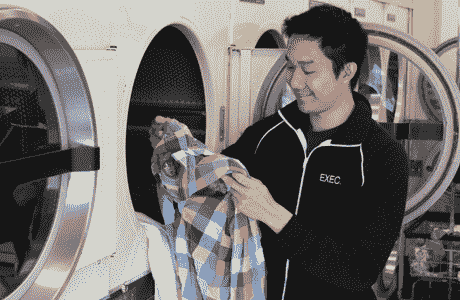

# 跑腿的移动应用 Exec 增加了消息功能(哦，山姆·奥特曼领导了这一轮)

> 原文：<https://web.archive.org/web/https://techcrunch.com/2012/05/31/exec-the-mobile-app-for-errands-adds-messaging-oh-and-sam-altman-led-their-round/>

# 跑腿的移动应用 Exec 增加了消息功能(哦，山姆·奥特曼领导了他们的这一轮)

[Exec](https://web.archive.org/web/20221209124452/http://itunes.apple.com/us/app/exec/id493905230?mt=8) ，[有点像优步遇到任务的兔子](https://web.archive.org/web/20221209124452/https://beta.techcrunch.com/2012/02/29/exec-justin-tv/)，今天正在检修它的产品。它在应用程序中添加了类似 iMessages 的功能，使客户更容易与跑腿的人同步。

这款应用来自 Y Combinator 校友组成的资深团队，其中包括 [Justin.tv](https://web.archive.org/web/20221209124452/http://www.crunchbase.com/company/justintv) 联合创始人 [Justin Kan](https://web.archive.org/web/20221209124452/http://twitter.com/#!/justinkan) ，它可以即时召集人们(被称为“高管”)完成基本任务。没有投标过程，从送花到打扫房间和其他零工，每小时收费 25 美元。该应用程序在一段时间内看起来非常基础，体现了该公司“把事情做完”的精神。但是团队发现需要更多。

“基本上，在做了几千份工作后，我们意识到的一件事是，人们希望与他们的高管进行更多的沟通，”Kan 说。“人们想知道工作发生时发生了什么。基本的想法是让高管们非常迅速地发送他们工作的最新情况。至于服务本身，Kan 说在旧金山大约有 100 名“高管”在跑腿。他专注于改进特定的用例，比如清洁。

关于我们上周报道的 330 万美元的资金，我们也有更多的细节。很不寻常的一轮。这里没有大型风险投资公司！菅直人称之为“YC 家庭式”谈判。

山姆·奥特曼(Sam Altman)是 Loopt 的首席执行官，最近被绿点收购。“他最近一直在做更大的投资，”菅直人说。

其他投资者包括 Stripe 联合创始人帕特里克·科利森、Parse 联合创始人吉洪·伯恩斯塔姆、Gmail 创始人兼 Y Combinator 合伙人保罗·布赫海特、谷歌董事会成员拉姆·施拉姆、马特·奥科、Delicious 创始人乔希·沙赫特等人。总共有大约 25 人参加了这一轮。

他为什么这样做？“我通常不需要那么多来测试一个商业概念，我们有很多人对此感兴趣，”他说。

我们最近已经看到几轮这样的融资，涉及一大群个人投资者。其中一个是 SocialCam(Kan 也是创始人之一)和[，另一个是 Pair](https://web.archive.org/web/20221209124452/https://beta.techcrunch.com/2012/05/01/yuri-milner-dave-morin-sv-angel-crunchfund-and-more-hook-up-pair-with-4-2m/) 。

