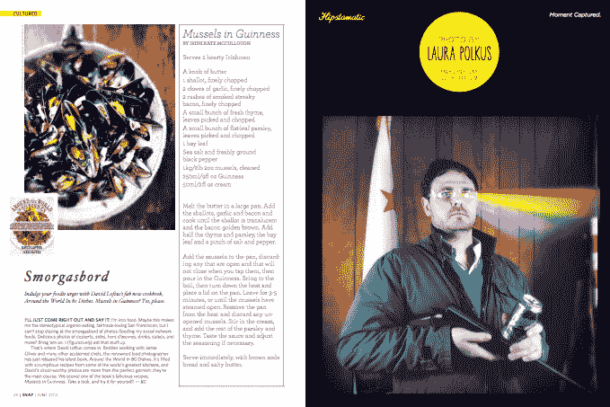

# Hipstamatic 推出了新的 iPad 杂志 Snap 和# make beautiful Social Campaign | TechCrunch

> 原文：<https://web.archive.org/web/https://techcrunch.com/2012/05/31/hipstamatic-branches-out-with-a-new-ipad-magazine-snap-and-makebeautiful-social-campaign/>

Hipstamatic 凭借其广受欢迎的(付费的) [iPhone 相机应用](https://web.archive.org/web/20230403093501/http://itunes.apple.com/us/app/hipstamatic/id342115564?mt=8)以及它为增强照片体验而加入的许多功能，取得了成功的业务:每月有 400 万活跃用户，每月通过它拍摄 5000 万张照片。现在，它背后的公司 Synthetic 正在寻求建立在这个基础上，并在现有的 Hipstamatic 社区中创造更多的参与，或许在这个过程中找到新的用户。如今，它成为了一家 iPad 杂志出版商，为 iPad 推出了一个名为 [*Snap*](https://web.archive.org/web/20230403093501/http://snapm.ag/) 的月度文化和生活方式标题，由 Hipstamatic 用户创作的原创内容和图片组成。与 Synthetic 的付费 Hipstamatic 应用不同， *Snap* 将是免费的。

此外，随着#makebeautiful 的推出，该公司正在提升其社交媒体形象。该项目将鼓励 Hipstamatic 用户使用标签标记图片，将它们放入 Twitter 和 Instagram 以及其自己的网站上的特殊流中——这是他们第一次以这种方式聚集用户的照片。

虽然对于照片应用程序的开发者来说，进军杂志出版业听起来像是一个太远的支点，但实际上它离 Synthetic 的根基并不远。

Synthetic 的联合创始人兼首席执行官卢卡斯·别克(Lucas Buick)最初是一家杂志的平面设计师(电信行业名称 *Telephony* ，对应用程序制造商来说是一个甜蜜的讽刺)。刚从艺术学校毕业，他就在那里开始接触出版业，并开始渴望做一些更有创意的事情。“几年后，我意识到在杂志工作很棒，但我想要更多的创作自由。他在第一版的介绍中写道:“我想从事令我兴奋的项目，这甚至可能改变世界。”。

别克告诉我，“我对杂志格式的热爱是如此之深。”

他还指出，iPad 杂志的想法也来自该公司现有的社交媒体活动:Hipstamatic 上的人们已经在 Instagram 和 Twitter 上发布了大量内容，所以这是更好地引导长尾的一种方式。

《快照》将每月发行一期，围绕一个主题，由八个部分和三个专题故事组成。(第一个主题将是 Make Beautiful，就像 hashtag 项目一样。)

这些版块有适当的模糊标题，让人想起许多其他生活方式/文化杂志:有教养的；痴迷；高潮；情况；臀停；Hipstaland 历险记；斜线；还有透镜。但是说实话，这个概念更多的是视觉上的，而不是口头上的，所以也许不值得过多的强调这一点。(事实上，正如你在下面看到的，这第一期的照片*非常惊人。)*

相反，由编辑凯蒂·卡罗尔领导的出版商/开发商的主要关注点应该是确保 *Snap* 不会让人感觉太像公开的时髦促销，而更像一本本身就是一本杂志的杂志——这才是让人们经常下载和使用它的原因。(把你自己的照片放入月刊的机会也应该有助于用户参与。)

我认为别克也意识到了这一点:“是的，这是一个漂亮的视觉糖果，但我也为我们的社论内容感到兴奋。特别是，高潮——对我们都在思考却很少谈论的事物的探索。我说的是性、宗教和政治。我希望这一部分能有助于开启对话。”

目前，没有迹象表明 Snap 背后有广告或任何其他收入。别克告诉我，“我们目前不打算将它货币化。”。“它旨在让我们以一种比社交媒体更具策划性和思想性的方式突出我们的用户。100%的 hipstamatic 用户都是内容创作者，且极具创造力。Snap 是一个机会，让我们展示美丽的照片，继续讲述创意阶层的故事。”

就其本身而言，这是该公司的一个转折点，因为 Hipstamatic 应用程序在通过应用程序推动收入方面取得了如此大的成功——去年为 1000 万美元——以及围绕它建立的打印和其他服务。

Hipstamatic 的开发者仍然没有关于他们是否以及何时将服务扩展到其他平台的消息——目前一切都只在 iOS 上进行。“我们发现我们的目标受众是 iPhone/iOS，所以我们打算暂时停留在那里，”一位发言人告诉我。

当 Instagram 和脸书在 4 月份宣布 10 亿美元的收购交易时，我的一个早期想法是，这对 Instagram 与 Hipstamatic 的新交易可能意味着什么，这似乎为两家公司带来了一些商业和内容承诺。Snap 可能是该公司对无论那里发生什么都将如何发展的答案。

