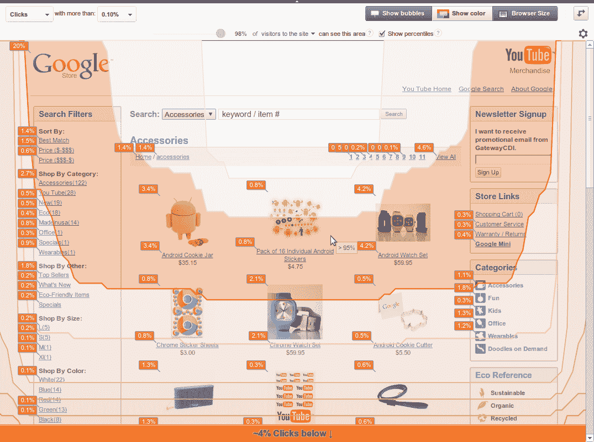

# Google Analytics 现在允许您进行浏览器大小分析 TechCrunch

> 原文：<https://web.archive.org/web/https://techcrunch.com/2012/06/04/google-analytics-now-lets-you-conduct-browser-size-analysis/>

# 谷歌分析现在可以让你进行浏览器大小的分析

谷歌刚刚为其谷歌分析产品增加了一个小而有趣的新功能。现在，你可以根据该公司刚刚添加到 Google Analytics 中的新浏览器大小分析，了解你的访问者真正看到了你网站的多少内容。通过分析，谷歌已经知道你网站的访问者使用的屏幕尺寸，所以它现在将这些信息与谷歌实验室之前发布的[浏览器尺寸工具](https://web.archive.org/web/20221206013018/http://browsersize.googlelabs.com/)结合起来。谷歌正在缓慢推出这一新工具，所以你可能需要一两周才能在你的谷歌分析账户中看到它(它已经在我的个人账户中上线，但你的里程数可能会有所不同)。

一旦它进入你的账户，只要进入谷歌分析的内容部分，寻找页面内分析。在那里，浏览器大小现在是查看网站点击率的现有选项之一。

正如谷歌指出的那样，由于有太多不同屏幕尺寸的移动设备，访问者只使用几个标准屏幕尺寸的日子已经一去不复返了。鉴于现代桌面屏幕的尺寸，你甚至不能从用户的屏幕尺寸中得出任何真正的结论，因为“对许多人来说，由于过多的工具栏和其他混乱，网页的可见部分比屏幕分辨率小得多。”然而，转换率很大程度上取决于访问者在页面上看到的内容，而无需滚动页面。

