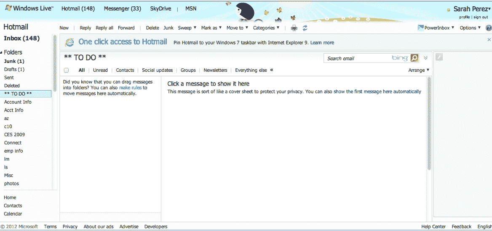
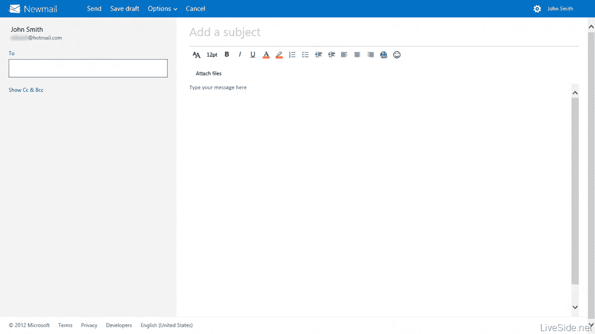
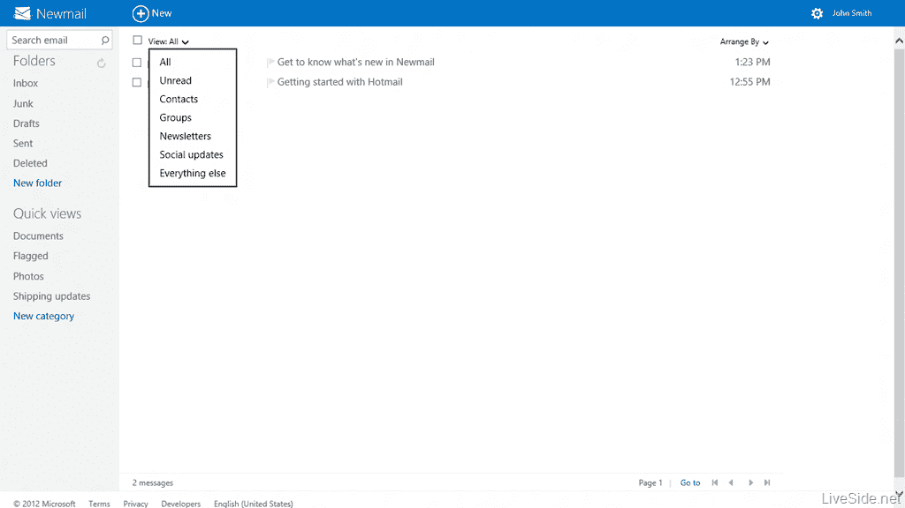
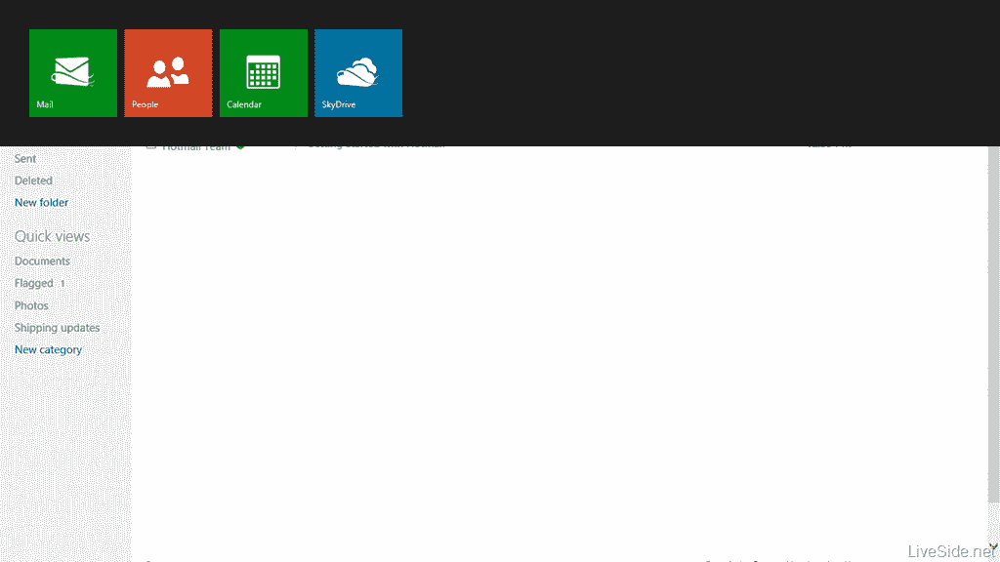

# 微软 Hotmail 将成为 Metro(但不会被称为“新邮件”)

> 原文：<https://web.archive.org/web/https://techcrunch.com/2012/06/08/microsoft-hotmail-is-going-metro-but-wont-be-called-newmail/>

# 微软 Hotmail 将成为 Metro(但不会被称为“新邮件”)

微软 Hotmail 正在进行改造。至少，一些[泄露的](https://web.archive.org/web/20221223163753/http://www.liveside.net/2012/06/07/exclusive-metro-style-hotmail-ui-revealed-via-new-microsoft-account-login-screen/) [截图](https://web.archive.org/web/20221223163753/http://www.liveside.net/2012/06/08/exclusive-even-better-screenshots-of-metro-style-hotmail-or-newmail-leaked-now-in-english9)是这么显示的。这项服务，今天仍然在“Windows Live”的保护伞下，将被精简和简化，给它一个地铁风格的外观和感觉。

细节是昨天通过微软爱好者网站 [LiveSide](https://web.archive.org/web/20221223163753/http://www.liveside.net/2012/06/07/exclusive-metro-style-hotmail-ui-revealed-via-new-microsoft-account-login-screen/) 获得的，他们现在已经收集了一整套展示新 Hotmail 运行的截图。在照片中，这项服务被奇怪地冠以“新邮件”的名称(“为你的新收件箱获取一个新的电子邮件地址…”例如，欢迎信息这样写道。)

什么，“新邮件？”不要担心——微软并没有试图再次重命名其网络邮件服务。(你知道，整个“Windows Live Mail”的事情从来没有真正成功过)。我们听说,“Newmail”只是一个占位符，所以你不会很快注册@newmail.com 电子邮件地址。咻。

LiveSide 的人注意到，Metro UI 在屏幕的顶部很明显，在新的 Hotmail/Newmail 的导航栏中。当你点击“新邮件”标志时，你可以在联系人、日历和 SkyDrive 之间导航。(也许他们都在改头换面，然后呢？)

同样值得注意的是，在他们获得的一张截图中，该服务的新外观被描述为具有“简单、流畅和交互的设计”，无论你是在“台式机、手机还是平板电脑”上，它都“更快、更干净”，后者暗示了新 Hotmail 据称的触摸友好性。

下面是来自 [LiveSide](https://web.archive.org/web/20221223163753/http://www.liveside.net/2012/06/08/exclusive-even-better-screenshots-of-metro-style-hotmail-or-newmail-leaked-now-in-english9) 的一些更新截图。(头那边看剩下的)。但首先，出于比较的目的，Hotmail 现在的可怕之处(不可否认，主题选择是我的错):

新邮件/新 Hotmail:

