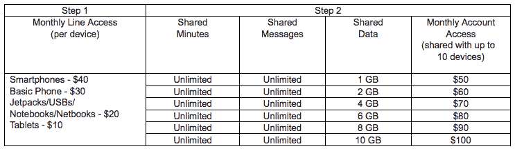

# 威瑞森 Intros 分享一切计划:无限通话/文本和多达 10 台设备的共享数据 TechCrunch

> 原文：<https://web.archive.org/web/https://techcrunch.com/2012/06/12/verizon-wireless-intros-share-everything-plans-unlimited-talktext-and-shared-data-for-up-to-10-devices/>

# 威瑞森 Intros 分享一切计划:无限通话/文本和多达 10 台设备的共享数据

威瑞森无线今天宣布增加“分享一切”计划。它们本质上是家庭计划，允许你、妈妈、爸爸、哥哥或妹妹分享无限的语音通话时间和短信，以及特定数量的数据。该服务还为计划中的任何设备提供免费的移动热点服务。分享一切计划支持多达十部手机。

这对威瑞森来说是个好消息，他一直在努力寻找与客户在数据定价上的共同点。

威瑞森无线公司副总裁兼 CMO 塔米·欧文说:“客户提出要求，今天威瑞森无线公司提供了一个行业第一。“分享一切计划是无线服务的新标准。它们很简单；客户再也不必考虑他们的语音和消息计划，因为两者都是无限的。”

这个想法是，你为计划中的每个设备支付原始费用——智能手机是 40 美元。语音和文本是无限的，所以不用担心，最小的数据量(1GB)从 50 美元开始。数据价格每层上涨 10 美元，包括 1GB、2GB、4GB、6GB、8GB 和 10GB(100 美元)。

他们觉得有点贵，但事实是，这些计划对很多青少年来说，完全无限制的语音和短信效果很好。任何父母都知道这可以拯救生命。但是威瑞森很聪明——如果你把你的妻子、孩子和你的平板电脑加入这个计划，你将为每部智能手机支付 40 美元(120 美元)，再为你的平板电脑支付 10 美元(130 美元)，你可能需要至少 6GB 的数据(210 美元)。

账单上涨很快，但这有时是你为无限制的电话使用、大量数据和免费移动热点功能所付出的代价。该计划将于 6 月 28 日发布，你可以在这里了解更多信息。