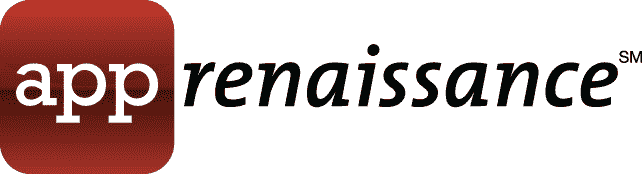
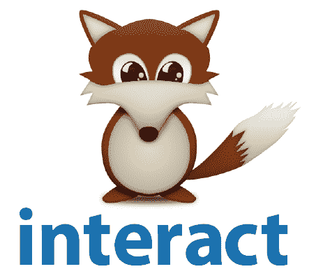
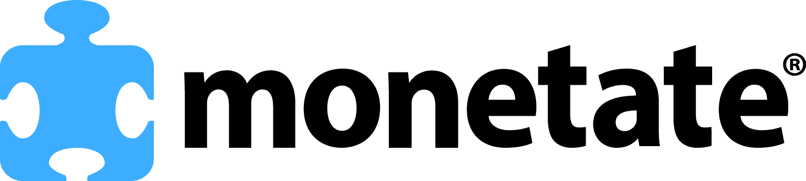
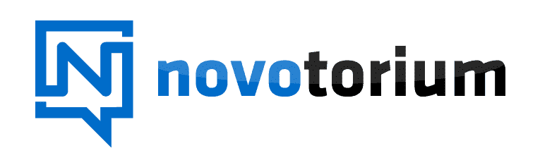
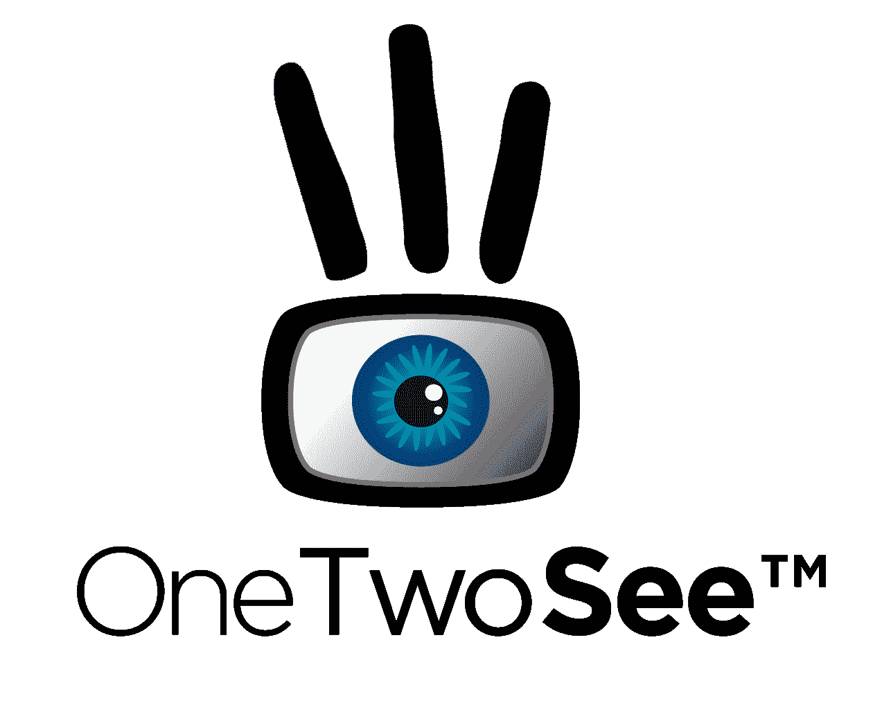
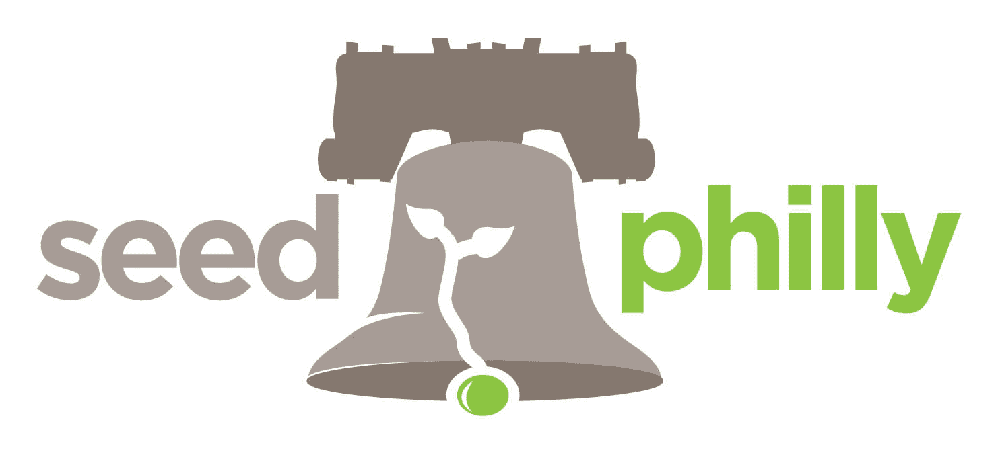
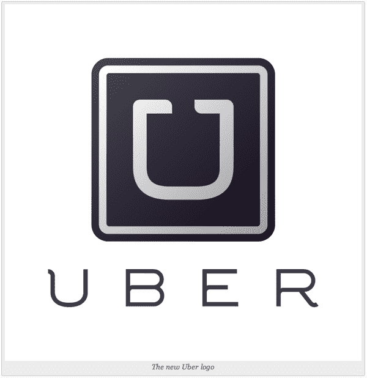

# 优步想开车送你去费城小型聚会 TechCrunch

> 原文：<https://web.archive.org/web/https://techcrunch.com/2012/06/15/uber-wants-to-drive-you-to-the-philly-mini-meet-up/>

下周二，我们将入侵费城，度过一个社交、娱乐和狂欢的夜晚。你来吗？

乔希·泽尔曼、乔丹·克鲁克、克里斯·维拉兹科和我本人将于周二上午前往费城，我们已经准备好谈论初创企业、科技以及这之间的所有事情。我们很高兴前往兄弟之爱的城市，我们也很高兴宣布一个新的赞助商，优步，他为我们费城的读者提供了一份特殊的礼物。

费城聚会将于下午 6 点准时开始，一直持续到晚上 10 点，并将于 6 月 19 日在球场举行。如果你想回复，请前往我们的 [Plancast 页面](https://web.archive.org/web/20221208005358/http://plancast.com/p/blnk)。具体问题可以向 john@beta.techcrunch.com 提出。哦，如果你想发微博给我们，可以发[@约翰比格斯](https://web.archive.org/web/20221208005358/https://twitter.com/#!/johnbiggs)和[@乔丹克鲁克](https://web.archive.org/web/20221208005358/https://twitter.com/#!/jordanrcrook)。

我们也在一天的早些时候，大约中午时分，保持办公时间，尽管官方预订已经关闭。尽管如此，这也不是我们第一次在办公时间的会议上遇到一些渴望但尚未宣布的创业公司，所以在那之前，请随意在 [Caribou Cafe](https://web.archive.org/web/20221208005358/http://www.yelp.com/biz/caribou-cafe-philadelphia) 停下来，我们会尽量让每个人都挤进来。

特别感谢我们出色的赞助商，他们帮助我们启动了这个项目，还有安东尼·库姆斯，他是我们在现场的耳朵。我们也将搜寻[扰乱战场](https://web.archive.org/web/20221208005358/https://beta.techcrunch.com/events/disrupt-sf-2012/)的公司，所以你要冷静下来。

如果你想在活动中志愿帮忙，请发邮件给乔丹@ beta.techcrunch.com，主题是“志愿费城”我们需要有人在门口等着，并帮助设置标志等。

优步也愿意帮助您参加此次活动，因此，如果您在请求乘车前输入优惠券代码**techcrunchfulli**，您将获得两次旅行 20%的优惠。

**赞助商**

 ****

见习

appRenaissance 位于费城老城区的中心，是一家受启发的手工移动应用程序开发商，也是独创性移动应用程序工具和基础设施的发明者。我们的产品包括革命性的 Unifeed Mobile Middleware 平台，可显著加快移动应用程序开发速度，简化与企业服务的集成，并降低持续维护成本。我们的客户来自不同的行业，从音乐和娱乐到零售和抵押贷款保险。欲了解更多信息，请访问

[www.apprenaissance.com](https://web.archive.org/web/20221208005358/http://www.apprenaissance.com/)

.

* * *

 [
互动](https://web.archive.org/web/20221208005358/http://bit.ly/interactapp)

Interact 是一款地理社交应用，它将你与你应该认识的人联系起来。使用我们的 Comp Score Interact 不仅能让你看到最适合你的人，还能让你有理由与他们交往。有了 Interact，用户可以随时决定他们为什么要使用这个应用。连接网络，社交，甚至约会。严格的隐私控制允许您只向您想与之互动的人显示您的个人资料。实时聊天，结交新朋友。有了 Interact，你就有了连接的理由！

* * *

 [
货币化](https://web.archive.org/web/20221208005358/http://monetate.com/)

Monetate 每年为世界上一些最知名的品牌带来数十亿美元的收入，包括百思买、QVC、Urban Outfitters、Aeropostale、体育权威机构和 PETCO。该公司全面的产品套件和转换专业知识使营销人员能够以前所未有的灵活性提供更相关的客户体验。领先的营销人员依靠 Monetate 基于云的浏览器技术实现了新的速度和控制水平，使他们能够运行比行业平均水平多 16 倍的优化活动。Monetate Agility 套件包括用于测试、销售、定位和跨渠道一致性的高级产品，提供了绕过 IT 限制并实时响应客户需求的机会。Monetate 还通过其专业的战略服务和内容发布团队，帮助营销人员实施最佳实践并推动在线收入。欲了解更多信息，请访问

[http://monetate.com/](https://web.archive.org/web/20221208005358/http://monetate.com/)

或者在 Twitter 上关注我们

[@Monetate.](https://web.archive.org/web/20221208005358/http://twitter.com/Monetate)

* * *

 [
诺沃里](https://web.archive.org/web/20221208005358/http://novotorium.com/)

[Novotorium](https://web.archive.org/web/20221208005358/http://novotorium.com/)

是为努力发展业务的企业家准备的。我们的综合项目为努力加速新兴公司发展的企业家提供所需的环境、建议、服务和资金。我们独特的方法着眼于中长期，帮助企业家跨越鸿沟，并能够发展和经营他们的业务，以实现可持续发展和盈利。我们为创业者提供一切免费、无风险的服务。我们的回报是当我们有机会通过提供增长所需的资本来参与企业的未来潜力时。创新机构是一个独立的私营机构，由 Baron Innovation Group 资助，总部位于宾夕法尼亚州雄鹿县的 Langhorne。

* * *

 [
参见](https://web.archive.org/web/20221208005358/http://www.onetwosee.com/)

[OneTwoSee](https://web.archive.org/web/20221208005358/http://www.onetwosee.com/)

是一家总部位于费城的互动电视公司，为电视广播公司和制作人创建了一个 B2B 平台，允许他们通过连接设备向观众提供丰富的互动电视体验。该平台通过互联设备实现互动体验，将您在电视上观看的内容联系起来。

* * *

 **[
种子费城](https://web.archive.org/web/20221208005358/http://seedphilly.org/)**

Seed Philly 是费城地区唯一的合作实验室，是一个混合孵化器、加速器和联合工作空间，致力于支持种子期科技初创公司的需求。我们遵循“水涨船高”的核心理念。除了我们 6000 平方英尺的共享办公室、社区俱乐部和教室之外，我们还维护着一个经过审查的社区目录和商业智能收集引擎，旨在使创业成长过程更加高效和有效。Seed Philly 的所有成员-创业企业家、投资者、导师和服务提供商-合作形成一个更有活力的生态系统；分享最佳实践数据，打造成功蓝图。更多信息，请访问

[seedphilly.org](https://web.archive.org/web/20221208005358/http://seedphilly.org/)

.

 [
优步](https://web.archive.org/web/20221208005358/http://www.uber.com/)

优步是你的私人司机。使用我们的 iPhone 和 Android 应用程序或从随时请求搭车

[m.uber.com](https://web.archive.org/web/20221208005358/http://m.uber.com/)

.

* * *