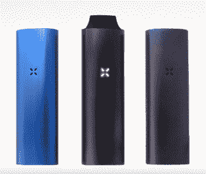

# 冒烟了:采访超酷 Pax 蒸发器 TechCrunch 的创造者

> 原文：<https://web.archive.org/web/https://techcrunch.com/2012/06/17/an-interview-with-the-creator-of-the-ultracool-pax-vaporizer/>

【YouTube = https://www . YouTube . com/watch？v = gdgyiblarb 8 & feature = player _ embedded]

如果你喜欢吸食精致的植物产品，包括但不限于烟草，你应该亲自体验一下 Ploom 的 [Pax，这是一款紧凑的汽化器，配有一个宽敞的烤箱和一些功能，使点烟体验成为一种享受。](https://web.archive.org/web/20221208073917/http://www.ploom.com/pax)

Ploom 的人已经研究汽化器有一段时间了，在 2010 年推出了 Ploom ModelOne。这种小型电子烟使用小豆荚来释放芳香的烟雾。然而，Pax 使用电力而不是丁烷，几乎可以燃烧任何东西。

我与首席执行官兼创意总监[詹姆斯·蒙塞斯](https://web.archive.org/web/20221208073917/https://twitter.com/#!/james_ftw)谈论了新产品，以及他对将蒸发器——以及它们的主人——带入下一个层次的愿景。

**TC:** 说说你自己吧。你是谁？

詹姆斯:亚当和我是在斯坦福大学的研究生产品设计项目中认识的，这是一个设计方面的联合项目。JPD 在校园中央有一个令人惊叹的空间，叫做设计阁楼，每个人都可以在这里生活 2-3 年。所以很自然地，我们花了很多时间在一起，并意识到我们都有相似的兴趣。我们俩都有物理学本科学位，而且对艺术也有很高的兴趣。我有一点工业设计和机械设计的背景，亚当对电子和高科技很感兴趣，在我们相遇之前，他已经在硅谷做了几年的 it 基础设施工作。有趣的是，这是一次完全不相关的关于吸烟的谈话，它将我们引向了一个与我们想象的职业生涯截然不同的方向。
 
**TC:** 这花了多长时间？过程是怎样的？

亚当和我在 2005 年春天提交了一篇名为 Ploom 的硕士论文。当时 Ploom 真的只是一个概念，但我们已经做了一些初步的专利研究，制作了最初的早期原型，并从我们采访和工作的人那里收到了令人难以置信的兴趣，足以让我们觉得 Ploom 真的值得追求。第二年，当我还是校园 d.school 的一名研究员时，亚当和几个朋友住在帕洛阿尔托边缘一个老苹果园的房子里。我们接管了一个房间，继续制作原型，研究和进一步开发一个有凝聚力的商业计划。

烟草不是在硅谷寻求投资的最简单、最直接的类别，所以在我们真正理解事情如何运作之前，我们在技术领域和周围会见了可能至少 100 名风投和天使。2006 年夏天，一些朋友提议让我们占用他们旧金山办公室角落的一张桌子，交换条件是每周两个小时的头脑风暴。第二年，我们从两个天使集团筹集了初始种子资金，并成立了公司，尽管我们在第五个办公场所，但我们仍然在旧金山的同一栋大楼里。

**TC:** 你们为什么要开发汽化器？为什么不是 iPod 保护套？为什么不是老鼠？

**詹姆斯:**我认为没有哪个市场像中国这样规模，几十年来消费者可见的技术变化如此之小。简而言之，烟草领域是一个巨大的机会，我们认为我们可以在那里产生有意义的影响。显然，这是一个巨大的商机，但更重要的是，消费者的需求激增，确实需要得到满足。虽然烟草产品的供应并没有真正改变，但消费者对烟草产品的需求确实发生了变化，我们认为传统烟草公司无法独自满足这些需求。亚当和我真的很喜欢烟草，但对于成为吸烟者或社会吸烟者总是感到矛盾。我们看到了个人对这种产品的需求，并在进一步研究后发现其他人也表达了这种需求。

**TC:** 你在设计这款设备时遇到的最大困难是什么？

詹姆斯:我们对科技的好奇心没有止境。将技术推向新的极限令我们兴奋不已。最大的障碍是决定在复杂的烟草市场上如何最好地引导 Ploom 的能力，从而最好地将 Ploom 定位为烟草领域一个新的、值得信赖的品牌。我们真的为 PAX 帕克思感到骄傲。

接下来还有很多。

**TC:** 你的设计灵感是什么？

**詹姆斯:**消费者。蒸发器领域的其他产品似乎被设计成小发明，当人们知道如何使用它们时会有一种成就感。功能性并不仅仅意味着某些东西打开、变热或产生蒸汽。功能性意味着组件适合其人机界面，按钮的功能显而易见或根本不存在，旋钮和指示器达到了简单和必要的绝对水平，所有这些都是在推动工程角度的可能性界限的同时完成的。

这就是我们通过 PAX 帕克思取得的成就。归根结底，我们认为这个领域的任何产品都应该是奢侈品。我们希望 PAX 帕克思散发出优雅的气息。人们应该为随身携带 PAX 帕克思感到自豪，并对使用它感到由衷的满足。

**TC:** 这年头做硬件有多难？需要什么？

詹姆斯:如今硅谷的硬件真的很难搞。软件似乎真的很流行，尽管我个人的观点是，虽然大多数软件初创公司都回避金钱和美分来换取理论回报，但硬件对消费者来说总是有内在价值，因此在某种程度上让我满意，而软件很少会这样。任何想从事硬件工作的人都需要做好吃苦的准备。有资本要求，大量的商业计划，大量的市场分析需要，这些都需要广泛的知识和愿意长时间疯狂工作，尤其是在最早期阶段。

**TC:** 最近硬件领域有什么变化吗？你发现了新的工具吗？

**詹姆斯:**我们制作了很多 SLA(光固化快速成型)原型，因为我们经常要处理高温部件。几年前，我们发现了一些很酷的新陶瓷基 SLA 树脂，当正确固化和处理时，可以帮助大幅度缩短严肃原型的开发时间。把东西送到人们手中对我们来说一直是重中之重，所以我们维持着一个小型的现场机械车间，我们定期在头脑风暴阶段制作东西，通常像泡沫芯或纸板一样简单。

你们喜欢时不时地使用汽化器来娱乐吗？

詹姆斯:我们热爱吸烟曾经代表的礼仪和优雅。我认为我们已经超越了燃烧的东西，进入了一个时代，一个享受烟草的时代。话说回来，我们总是期待着接下来会发生什么。

[产品页面](https://web.archive.org/web/20221208073917/http://www.ploom.com/pax)