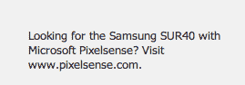

# 表象之下:微软转移三星 LCD 产品，为新平板电脑 TechCrunch 抢到名字

> 原文：<https://web.archive.org/web/https://techcrunch.com/2012/06/18/below-the-surface-microsoft-shifted-samsung-lcd-product-to-grab-name-for-new-tablet/>

在微软新平板电脑 Surface 页面的[底部，有一张奇怪的小纸条:“在找搭载微软 Pixelsense 的三星 SUR40？参观 www.pixelsense.com 的](https://web.archive.org/web/20221208143950/http://www.surface.com/)。啊？

看起来[微软的新 Surface 平板电脑](https://web.archive.org/web/20221208143950/https://beta.techcrunch.com/2012/06/18/the-microsoft-surface-a-10-6-inch-windows-8-tablet-from-microsoft/)并不是该公司的第一款 Surface 平板电脑。在它之前，有一个由三星制造的大型液晶面板，可以安装在桌子上或墙上，使人们能够“使用一个能够识别手指，手和其他放在屏幕上的物体的大型薄显示器来分享，合作和探索。”该产品的最后一次更新是在 2011 年初 CES 展会期间发布的。

该版本 Surface 2.0 的客户包括达索航空公司、富士胶片公司、红牛公司、加拿大皇家银行和喜来登酒店及度假村国际集团。

但是嘿！不仅仅是大公司为 Surface 买单。TechCrunch 也有一个。据坐在 SF(我在伦敦)的 Josh 说:

“它真他妈的大，显然要花 15000 美元左右。我们购买它的初衷是想用它来开会、集思广益、合作，希望能出现一个开发者社区。这从未发生过，我们也很少使用它。现在它是世界上最贵的咖啡桌。”

微软不一定会停止该产品，但它目前已经做了一些奇怪的事情。在一个类似埃舍尔的谜题中，它给出的产品 URL 实际上指向阿炳搜索页面，列出了许多 PixelSense 的进一步链接，这是 Surface table 中使用的技术。[更新:链接现在转到新的[微软产品页面](https://web.archive.org/web/20221208143950/http://www.microsoft.com/en-us/pixelsense/default.aspx)。]

[其中一个老链接](https://web.archive.org/web/20221208143950/http://www.microsoft.com/surface/en/us/pixelsense.aspx)解释了更多关于那是什么:

> PixelSense 允许显示器识别放在屏幕上的手指、手和对象，从而在不使用摄像头的情况下实现基于视觉的交互。显示器中的单个像素可以看到什么在触摸屏幕，这些信息会被立即处理和解释。
> 
> 把它想象成眼睛和大脑之间的联系。你需要两者，一起工作，才能看到。在这种情况下，眼睛是面板中的传感器，它拾取图像并将其馈送到大脑，大脑是我们的视觉输入处理器，它识别图像并对其进行处理。整体来看…这是 PixelSense

PixelSense 技术取代了 Surface 早期版本中的硬件，这是一种听起来笨重的实现方式，需要屏幕表面下的摄像头来感应和响应设备表面的刺激。

目前还不清楚新的 Surface 平板电脑是否使用了旧的 Surface 技术——尽管两者都基于触摸屏，但到目前为止在洛杉矶的活动中，没有提到任何联系。据[本帖](https://web.archive.org/web/20221208143950/http://news.softpedia.com/news/Microsoft-Surface-2-0-Features-Windows-7-and-New-PixelSense-Technology-176602.shtml)称，Surface 平板电脑将运行 Windows 8，Surface LCDs 首先使用 Windows Vista，然后使用 Windows 7。

除了这个名字的贴切性，微软选择现有商标而不是尝试为这款平板电脑开发新的东西还有另一个可能的原因:它帮助该公司不断窥探记者的气味——尼古拉斯·詹姆斯指出了这一点:

“我认为@微软使用#Surface 商标来尽可能长时间地隐藏这件事是明智的！”

我们将向微软询问更多细节，并在了解更多信息后进行更新。