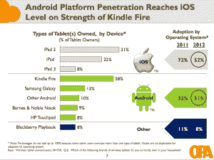

# OPA:美国平板电脑市场的 iOS 和 Android 水平，到 2013 年渗透率达到 47 %, 2012 年在应用上花费 26 亿美元 TechCrunch

> 原文：<https://web.archive.org/web/https://techcrunch.com/2012/06/18/opa-ios-and-android-level-in-u-s-tablet-market-penetration-47-by-2013-2-6b-spent-on-apps-in-2012/>

苹果凭借其 iPad 在平板电脑市场赢得了心智份额，但在美国，当谈到实际使用时，根据在线出版商协会的一项新研究，它实际上与其主要竞争对手 Android 并驾齐驱。该组织发现，虽然 2011 年 iPad 的拥有率超过了 Android 平板电脑，分别为 72%和 32%，但今年这两个比例持平，分别为 52%和 51%，Android 的增长很大一部分来自 Kindle Fire。

这项研究中另一个引人注目的细节是，美国平板电脑的使用正在快速增长。目前，平板电脑用户平均每周使用设备 13.9 小时，其中 74%的人每天都在使用设备，一些有效的商业模式正在围绕这一点发展，包括付费内容和广告。OPA 预测，到明年年底，渗透率可能会接近一个转折点:到 2013 年，47%的消费者将拥有一台平板电脑，而 2011 年只有 11 %:考虑到即使智能手机在 2007 年随着 iPhone 向前迈进了一大步，大多数美国消费者也花了近五年时间才拥有一台智能手机，这是一个非常令人印象深刻的增长。

OPA 总裁帕姆·霍兰(Pam Horan)在一份声明中表示:“考虑到平板电脑仅推出两年多一点，这项研究的发现真正强调了出版商发展业务的可能性，因为消费者愿意打开钱包，以便随时获得原创内容。”。

Kindle Fire 是迄今为止最受欢迎的“安卓”平板电脑——尽管它是基于谷歌操作系统的分叉版本。它占所有平板电脑的 28%，是第二大安卓玩家三星的两倍多，三星有许多尺寸的 Galaxy Tab。这使得 Kindle Fire 的拥有量几乎与最受欢迎的 iPad，iPad 2 处于同一水平，并且远远领先于新 iPad。

该调查特别强调了平板电脑在当今的使用情况。它说“访问内容和信息”是由 94%的平板电脑用户完成的，其中非常健康的 61%为这些内容付费。大约 67%的人使用平板电脑上网；66%的人用手机查看电子邮件。在视频中，54%是最受欢迎的活动；天气信息占 49 %,国家新闻只占 37 %(抱歉坏消息，OPA 出版商成员！).

应用程序在如此高的内容消费量中占据显著地位:70%的平板电脑用户“定期保存和使用”至少一半下载过的应用程序，今年将花费 26 亿美元购买应用程序，高于 2011 年的 14 亿美元。

这些数字很高，表明平板电脑的外形因素可能使其成为比智能手机更自然的常规内容消费工具——尽管后者很方便。

这是 OPA 进行这项研究的第二年。该调查是与 Frank N. Magid Associates 合作进行的，基于对 2540 名年龄在 8 岁至 64 岁之间的互联网用户的在线调查。它指出，样本在年龄和性别方面与美国人口普查相匹配，美国人口普查发现，样本中反映的美国互联网总人口(8-64 岁)在 2011 年为 2.362 亿人，2012 年为 2.432 亿人，2013 年为 2.497 亿人。OPA 的数据收集于今年 3 月 19 日至 26 日。

尽管付费内容发展势头良好，但围绕内容产生收入的另一种主要形式:广告也受到了巨大推动。约 38%的用户表示，他们在平板电脑上看到广告后进行了购买，结果去年平均花费 359 美元购买产品。报告指出，还有 29%的人研究过产品，23%的人点击过广告。最大的问题是，这种行为是否是因为新奇，或者随着平板电脑市场的进一步成熟，这种行为是否会持续下去。(例如，在在线广告中，点击率多年来一直在下降，可能是因为人们变得越来越不敏感。)

