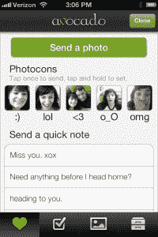

# 前谷歌员工推出了 Avocado，这是一款面向夫妇的应用，由 Baseline、General Catalyst 和 light speed TechCrunch 提供支持

> 原文：<https://web.archive.org/web/https://techcrunch.com/2012/06/20/avocado-mobile-app-for-couples/>

# 前谷歌员工推出了 Avocado，这是一款由 Baseline、General Catalyst 和 Lightspeed 支持的情侣应用

旨在帮助情侣保持亲密关系的移动应用市场正在增长。这一现象第一次引起我的注意是在 Y Combinator 最近的演示日推出的一对组合。但从那以后，我看到一大堆新的应用程序涌现出来，都试图为两个人提供一个紧密的小型社交网络。最新发布的此类应用是 [Avocado](https://web.archive.org/web/20221202063652/https://avocado.io/) ，它是由一对前谷歌员工创建的，他们正在寻找一种更接近和更好地组织他们一起生活的方式。

Avocado 可以在 iPhone 和 Android 移动设备上以 1.99 美元的价格使用，由前谷歌员工克里斯·韦瑟雷尔和詹娜·比洛塔创建，他们在谷歌工作的 20%时间里第一次见面是在谷歌阅读器上。该应用的关键是用户体验，它旨在模拟情侣之间实际互动的方式。

 它允许情侣们创建待办事项清单，划掉项目，上传照片与他人分享，以及互相发送私信。它还允许用户反复创建和发送“快速笔记”以及“快速面孔”，用共同的表情符号替换每个伙伴独特的面部表情。

韦瑟雷尔告诉我，这款应用程序之所以如此命名，是因为鳄梨树只有在彼此靠近的时候才会结果。鳄梨也是成对生长的。哦，还因为“鳄梨”是他在谷歌工作时一台电脑的名字。

Avocado 团队试图通过身份验证和高级加密使自己与众不同，以确保用户是他们注册时所说的人。情侣们必须提供一个共享密码才能彼此联系，这是为了防止冒充者登录并冒充他们不是的人。

当然，韦瑟雷尔和比洛塔不仅仅是创始人，他们也是用户——这款应用帮助他们完成了一项重大的房屋改造。如今，他们可以方便地使用该应用程序来创建和管理错误报告。

两人告诉我，这款应用的研发工作在面向情侣的社交应用真正出现之前就已经开始了，他们对竞争出现的速度感到有点惊讶——特别是因为所有主要的情侣应用都是在过去六个月左右出现的。但 Wetherell 表示，转向更私密的应用是很自然的，因为像脸书和 Twitter 这样成熟的平台缺乏提供真正私人分享的功能。

为了准备在新生的情侣应用领域的竞争，两人在今年早些时候完成了一轮 130 万美元的种子资金，包括来自 Baseline Ventures、General Catalyst、Lightspeed Ventures、FeedBurner 创始人史蒂夫·奥勒乔斯基和电视导演格雷格·艾坦尼斯的参与。这个团队已经雇佣了几个开发人员，但是他们还打算再雇佣几个。