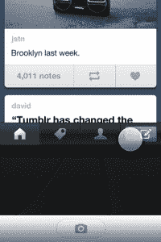

# 更好、更强、更快:iPhone 版 Tumblr 3.0 已经到来

> 原文：<https://web.archive.org/web/https://techcrunch.com/2012/06/21/better-stronger-faster-tumblr-3-0-for-iphone-has-arrived/>

啊，没有什么比早上备受期待的应用程序更新的香味更好的了。正如首席执行官戴维·卡普在上周的创始人大会上承诺的，Tumblr 的 iOS 应用程序 T3 的新版本已经发布。太棒了。(我指的是非常好的方式)。该应用程序经过了彻底的重新设计，速度快了很多，并提供了大量新功能，从 Spotify 支持到基于手势的快捷方式。

当然，登录后，你首先注意到的是一个完全不同的新帖子屏幕。虽然该应用程序之前有彩色图标，如“文本”、“照片”、“音频”和“视频”等。，新的帖子屏幕采用了黑色背景，图标更丰富、更醒目。老实说，它几乎给了 Tumblr 的 iOS 应用一种类似 Android 的感觉。

底部是仪表盘、标签、个人资料和发布按钮。(当你在另一个屏幕上点击“撰写”按钮时，可以看到这个转变——Tumblr 甚至在这里获得了正确的细节。)

 还有其他几项改进，包括支持 Spotify、高分辨率图像和离线访问。最后一个意味着当你没有互联网连接时，你可以发布，回复和重新发布博客——一旦你恢复在线，这些更改将会同步。

还有一些新的基于手势的快捷方式，如启动相机(向上滑动撰写按钮)和文本帖子(向左滑动撰写按钮)。这些并不是必须的东西，而是给应用程序带来一些天赋的精美装饰。屏幕加载速度很快——比如说，比从 iPhone 的锁屏启动相机还要快。

然而，就 Tumblr 的整体愿景而言，最大的变化应该是标签区。这不再是关于你和你的“喜欢”(那些现在在你的个人资料下面)——这是关于发现。不过，标签区有点奇怪。下面只有搜索框和照片。感觉很实验。在没有任何背景的情况下，我为什么要点击一张海牛的照片，或者一张粉红色背景的金枪的照片呢？甚至在我的 Reddit 图片应用程序中，至少有一个标题可以激起你的兴趣。如果给这些照片加上一个小标签会更有意义，因为它们是这样被突出显示的。

尽管有标签，但总体而言，Tumblr 已经为这个停滞了太久的应用程序提供了巨大的更新。非常值得下载。