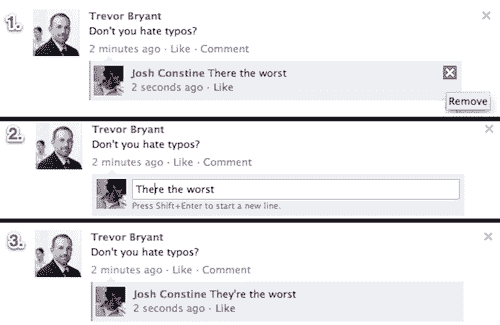

# 不要删你的傻。修好它。脸书推出评论编辑和编辑历史

> 原文：<https://web.archive.org/web/https://techcrunch.com/2012/06/21/facebook-comment-editing/>

不要再说“啊！复制、删除、粘贴、编辑、发布。”脸书现在推出了编辑评论的功能，但用户将能够看到一个线程的完整编辑历史。这是我真正喜欢 Google+的另一个功能，因为我可以用它来写博客，修正我的错误，但脸书现在也有了。

脸书告诉我，评论编辑现在正在推出，未来几天每个人都可以在网上看到。脸书的嵌入式网站评论小工具中还没有评论编辑功能，也没有来自移动设备的评论编辑功能，这该死的自动更正功能就潜伏在那里。此外，你仍然不能编辑原始帖子，所有这些都会比这有用得多。但是我想如果你不得不说或拼错了什么，那就在你的桌面上别人的新闻订阅上做吧。

一年前，脸书在正确的方向上迈出了一步，它允许你在发布评论后的几秒钟内编辑评论，这样你就可以立即修复识别出的错别字，如下图所示。

现在时间限制已经取消了。所以，如果你稍后回来看到你把 Philadelphia 拼错了，就像我今天早上在一篇文章中做的那样(胡说！)，可以改。如果你已经有了这些新功能，你是一些幸运的测试者，很快你的朋友也会得到评论编辑。

不过，有了新的编辑历史，好奇的人可以调查一下。所以不要回头去改变你有争议的观点，让它变得更容易接受，否则你会被叫出来。一旦我得到这些功能，我会添加截图。

我们正在等待脸书的回复，看看评论编辑是否会出现在它的评论框社交插件中，包括 TechCrunch 在内的许多博客都用这个插件来劝阻钓鱼。

这比目前可用的方法更上一层楼，目前可用的方法是复制你的乱七八糟的评论，删除它，开始一个新的评论，粘贴，修复，并发布。当你评论一些愚蠢的东西或者有一个糟糕的错别字时，你的第一反应是立即删除它，而不是复制，然后你不得不绞尽脑汁重新构建它。

虽然这次更新算不上开创性，就像它昨天在聊天中添加的表情菜单一样，它让脸书变得更加用户友好。即使把人们的评论流量减少几秒钟，加起来也有 9 亿人。

真正的问题是脸书是否会允许原创文章的编辑，而 Google+会。虽然有用，但它也可能让人们追溯性地改变他们的观点，导致随后的评论毫无意义。结合时间轴，你可以回到过去，编辑你的整个生活，这可能会让人们过于自我，对他们过去说过的话吹毛求疵。