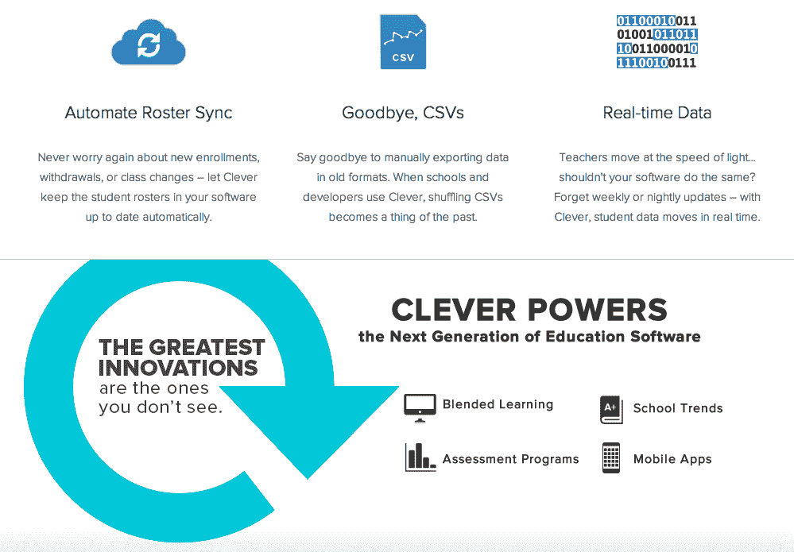

# Y Combinator 支持的 Clever 推出教育数据 Twilio

> 原文：<https://web.archive.org/web/https://techcrunch.com/2012/06/26/clever-launches-twilio-for-ed-data/>

我们都有点厌倦了“X 是 Twilio for Y”的类比(尽管最近在这个等式中看到更多的 Twilio [而不是 Airbnb，这令人耳目一新)，但如果有一个行业需要一些现代的标准化 API，那就是教育。谢天谢地，](https://web.archive.org/web/20230316161537/https://techcrunch.com/2011/06/05/will-airbnb-ever-be-the-airbnb-for-x/) [Clever](https://web.archive.org/web/20230316161537/https://getclever.com/) ，一家总部位于旧金山的初创公司，Y Combinator 目前的成员，今天推出了一个解决方案，将 [Twilio](https://web.archive.org/web/20230316161537/http://www.crunchbase.com/company/twilio) 的一些愿景引入教育。

让我解释一下:教育的未来在于利用技术使学习过程个性化。学校产生并收集大量关于学生的数据，组成我们个人成绩单的数据利用得越好，教师、学习工具、课程等就变得越有效。

学校目前使用传统的信息系统，也称为学生信息系统(SIS)来存储这些数据，其中包括从班级名单和出勤率到分数和 Timmy 过敏的所有数据。但问题是这些系统因学校而异。许多机构或学区开发了自己的专用软件或应用程序来收集、传输和理解学生数据。

实际上，这些系统没有标准的数据格式。因此，当开发人员构建教育软件或教育应用程序时，他们必须手动集成学校碰巧使用的任何特定 SIS 混合物。正如人们可能想象的那样，对于那些想要向多个学校/学区销售软件或产品的人来说，这种开发并不适合。对于教师来说，这通常意味着必须手工输入数据。

“有趣的是，当我们与学校谈论阻止他们采用新技术或软件的最大障碍时，他们的回答令人惊讶，”Clever 的联合创始人泰勒·博斯米尼说。“这不是成本问题，也不是教师不愿意尝试新技术，而是他们不想引入另一个数据孤岛。”

因此，与联合创始人丹尼尔·卡罗尔和拉斐尔·加西亚一起，这三位前哈佛大学同学决定通过构建一个简单的 REST API 来解决这个问题，该 API 将消除手动转换学生信息系统数据的繁重工作。在这一点上，它可能没有得到太多的认可，但创始人说他们已经看到了数量惊人的开发者为学校开发高质量的应用程序——包括 K-12 和高等教育。

但是他们不得不花费太多的时间将他们的应用集成到复杂的数据系统中。与当今科技行业的其他事物一样，问题和解决方案都始于数据，也止于数据。“移动和管理数据是当今阻碍教育的最大问题之一，”Bosmeny 说。因此，开发人员与这些数据系统的智能接口，使他们更容易从 SIS 中访问他们需要的信息，这样他们就可以专注于构建优秀的软件，而不是做单调的工作。

目前，美国有 100 多个不同的学生信息系统，而 Clever 的长期目标是能够覆盖所有这些系统。这是一个雄心勃勃的目标，他们还没有完全实现。这位联合创始人告诉我们，Clever 现在支持超过 60%的学生信息系统，他们正在迅速覆盖其余部分。

简而言之，Clever 正在构建一个简单、干净、通用的 API，这样，一旦学校给予授权，开发者就可以快速访问数据并将其移植到他们的应用程序中。学生信息系统显然不是在 API 时代建立的，所以这是一场持续的战斗，但该团队相信，如果他们能够为教育系统建立一个公共数据平台，所有各方都将受益。

Clever 还不允许开发人员将信息推回到特定的 SIS 中(例如，如果一个人构建了一个数学游戏，结果将被推回到 SIS 中，并为玩游戏的学生记录)，但该功能是下一步要做的。Bosmeny 说团队希望在接下来的几个月里做好准备。

此外，尽管这看起来有些晦涩，但 Clever 发现，学校(及其首席信息官)和开发者对这种技术加入竞争感到兴奋。6 月初，Clever 已经与 4 所学校合并。不到一个月后的今天，他们已经注册了 70 所学校，超过 25，000 名学生已经在他们的系统中。

特别是，这也是 Clever 的方法与典型的 edtech 初创公司相比的不同之处，后者通常需要依靠销售人员直接接触和销售学校(然后帮助他们集成软件)。Clever 并没有直接接触学校，他们一直将教育软件开发商作为进入学校的切入点。

为了赚钱，Clever 将向开发人员收取使用其 API 的费用，尽管这看起来像是一个交易破坏者，但该团队认为，开发人员有动机这样做，并将他们介绍给新的机构，因为他们的应用程序/产品如果有了 Clever 的集成，对学校来说会变得更有吸引力。学校对添加新软件(这意味着更多的手动数据输入)非常害羞，许多学校愿意采用数字自动化或 API 标准化作为替代方案。

另一方面，它也减少了开发人员在同步学生信息系统和他们已经构建的软件时需要做的支持。他们希望这种方法能够利用多米诺骨牌/网络效应，因为一旦一所学校与聪明整合，他们就会希望他们购买的所有应用程序都支持聪明。

有很多令人兴奋的 edtech 初创公司正在构建或扩展令人惊叹的产品和软件，但很少有人从开发者的角度来看待它。通过让教育软件的开发和销售变得更容易，聪明可能会对教育软件市场的规模和形态产生严重的影响。

诚然，现在作出全面的宣布还为时过早，但他们在短短一个月的时间里所获得的牵引力无疑是令人乐观的。目标:成为学校存储数据的事实标准。如果他们能做到这一点，他们不仅将有助于个性化教育并推动其向前发展，而且他们可能会赚一些钱。有些事情并不总是与教育行业相关联。

更多信息，请在这里找到聪明的家。

