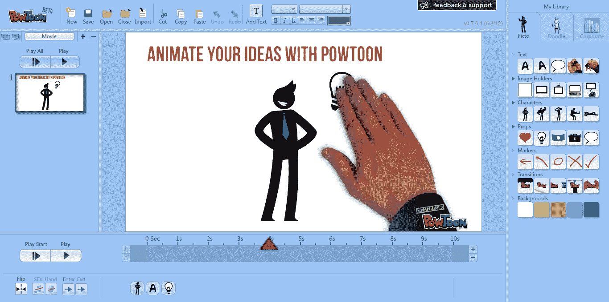
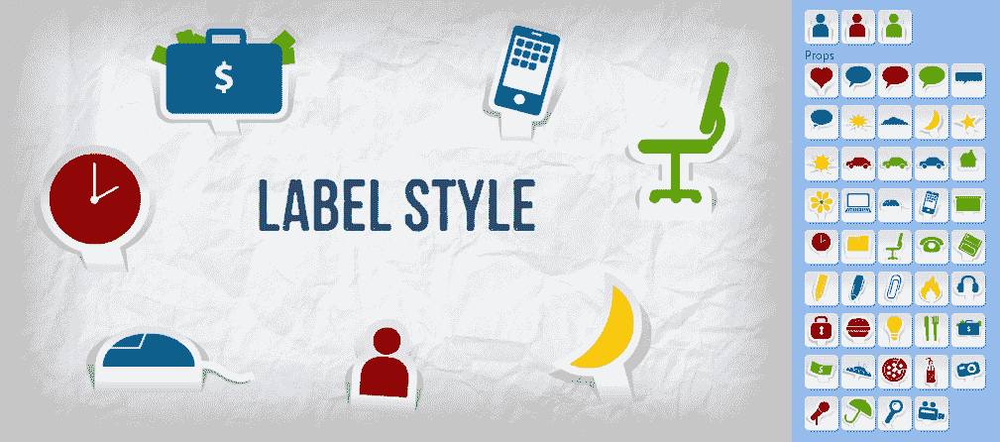

# 现在每个人都可以制作营销视频:PowToon 推出 DIY 演示工具 TechCrunch

> 原文：<https://web.archive.org/web/https://techcrunch.com/2012/06/26/now-everyone-can-make-marketing-videos-powtoon-launches-diy-presentation-tool/>

我们已经厌倦了幻灯片演示，对吧？嗯，至少这是大家的共识。我们甚至已经有一段时间没有对新的 PowerPoint 替代品表现出超级热情了——自从像 [Prezi](https://web.archive.org/web/20221208133128/https://beta.techcrunch.com/2009/04/20/prezi-is-the-coolest-online-presentation-tool-ive-ever-seen/) 、 [Animoto](https://web.archive.org/web/20221208133128/https://beta.techcrunch.com/2011/06/29/animoto-in-it-to-win-it-takes-25-million-in-third-venture-round/) 和[(被 VMWare 收购)SlideRocket](https://web.archive.org/web/20221208133128/https://beta.techcrunch.com/2011/04/26/vmware-acquires-online-presentation-application-sliderocket/) 这样的公司在创业领域出现后就没有了。甚至连使演示社会化的服务 SlideShare 也在去年推出了网络会议服务 Zipcast，为的是让视频变得生动活泼。长话短说。我们现在喜欢视频。拜托，再来点视频。

因此，这正是新推出的(仍是私人测试版)初创公司 [PowToon](https://web.archive.org/web/20221208133128/http://www.powtoon.com/) 所提供的:更多更容易制作的视频。

如果 web 2.0 初创公司试图简化和增加幻灯片制作过程的活力，希望成为“PowerPoint 杀手”，PowToon 希望搭上下一个潮流——我们对一切视频的日益热爱。例如，这些天我们都在寻找用于视频的 Instagram，或者思考如何在移动应用中插入视频广告。我们正在推出基于视频的实时社交网络。等等。等。换句话说，现在轮到视频了。

利用这一趋势，PowToon 提供了一个 DIY 解决方案，用于制作那些几乎无处不在的营销视频、公司演示和解说。顾名思义，在它的内容集合中有相当多的卡通人物。它的内容来自通过 PowToon Marketplace 销售的设计师、动画师、配音演员和声音艺术家——这个想法是，购买组成视频的各个部分，然后自己制作视频，比将其创作外包给专业设计工作室更便宜。这可能是真的，但你应该确保有一个好的剧本和愿景——不是每个人都是有创意的。

免费增值服务面向非专业设计师和视频编辑，它提供拖放对象来添加到幻灯片中。然后，您选择他们的动画，持续时间，添加文本，并添加配乐。然后，嘣，你就有了一个看起来很专业的演示文稿。该服务还包括帮助您入门的模板(例如，产品演示预告、活动邀请等。)，如果需要的话。当然，由此产生的演示文稿可以上传到 YouTube 或在脸书和 Twitter 等社交网络上分享。(PowToon 自己的视频示例在帖子底部)。

这家总部位于英国/以色列的公司由连续创业者伊利亚·斯皮塔尼克(首席执行官)于 2011 年 10 月创立，他现在经营着绿波孵化器和首席运营官·丹尼尔·扎图兰斯基。它通过 Greenwave 从 Spitalnik 获得了一些资金，并从基马风险投资公司获得了一小轮资金，但大部分都是自举。

给创业公司创始人的一个警告:虽然我们和其他人一样喜欢解释者快速学到复杂的概念，但当通过视频向世界介绍你的创作时，记住应用程序/网站/服务本身的视频也是需要的——而不仅仅是一些卡通人物跳来跳去谈论市场和机会，好吗？

这项服务将于 8 月份向公众开放，但是 TechCrunch 的读者现在可以点击这里获取早期邀请。

【T2

【YouTube = http://www . YouTube . com/watch？v=XokhlijAAI0&w=640&h=360]