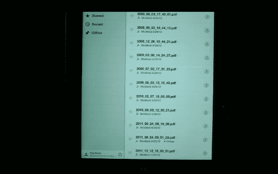

# 谷歌文档现在将支持离线编辑

> 原文：<https://web.archive.org/web/https://techcrunch.com/2012/06/28/google-docs-now-work-offline/>

# 谷歌文档现在将支持离线编辑

今天在 Google I/O 大会上，Google Apps 产品管理总监 Clay Bavor 宣布 Google Docs 将支持离线编辑。巴沃尔证明了这一点，他在舞台上通过 Google Drive 打开一个谷歌文档，输入离线文本。

谷歌文档离线编辑应该可以在多种设备上运行，包括 Chromebook 和智能手机。现在，所有格式更改都将保存到本地缓存中，一旦用户恢复在线，就会同步到 Google Docs。

巴沃尔说，谷歌也在开发电子表格和演示文稿，但 Docs 是这种离线支持的第一次迭代。

实际上令人惊讶的是，Docs 用户到目前为止还不能离线编辑，因为像 Evernote 这样的云应用已经提供离线编辑有一段时间了。

事实上，Docs 本身实际上曾经有这个功能，通过 Google Gears，但它不够快，被扼杀了。在 Bavor 的演示中，这个新的迭代在一秒钟内同步，所以希望它进展得更好。

“如果你从谷歌木卫一飞回来，在飞机上试试，”他说，“效果很好。”该功能将在今天晚些时候对那些乘坐航班的人(以及其他所有人)开放。

