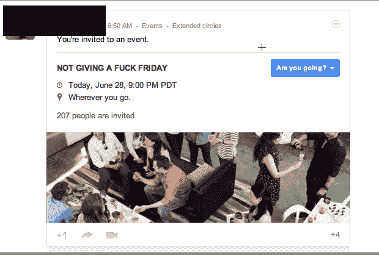
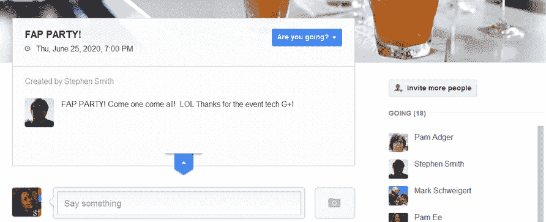
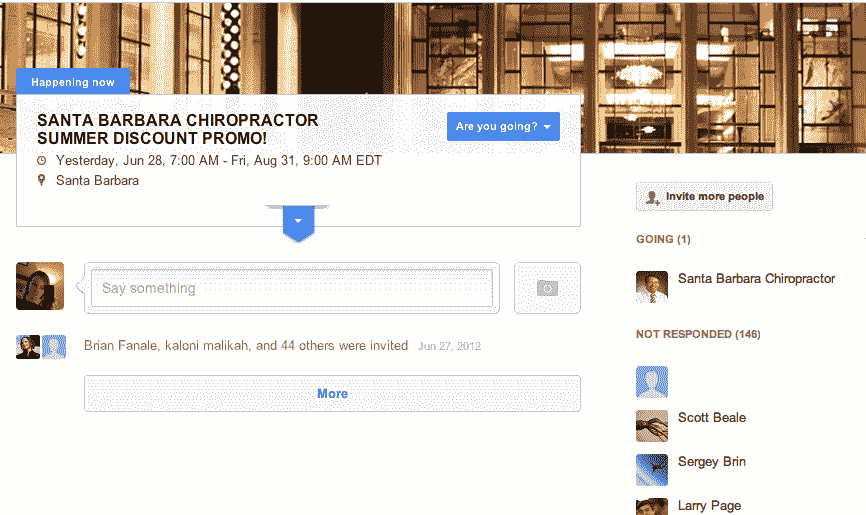
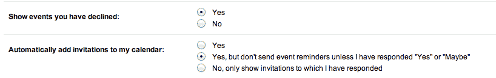

# 谷歌正在推出变革，以打击 Google+活动垃圾邮件

> 原文：<https://web.archive.org/web/https://techcrunch.com/2012/06/29/google-is-rolling-out-changes-to-crack-down-on-google-event-spam/>

在本周的谷歌 I/O 大会上，[宣布了 Google+ Events](https://web.archive.org/web/20230312222437/https://techcrunch.com/2012/06/27/google-i-o/) ，这是谷歌对 Evite 或脸书事件等服务的替代。它马上就像病毒一样传播开来……但不是以好的方式。你看，谷歌在事件的隐私设置方面犯了一个小小的错误。(插入关于脸书嫉妒的笑话。)默认情况下，其他人可以“邀请”你参加活动，这些*会自动*出现在你的日历上——即使你还没有确认你是否会参加。

结果呢？一些用户被邀请参加许多他们几乎不认识的人举办的不必要的活动。对于更受欢迎的用户来说，他们被来自广大网友的数百个请求淹没了。好消息是这个问题已经有了解决方案，并且你现在就可以实现。

Google+ Events 一开始就这样出师不利，这太糟糕了，因为这项服务有潜力变得有用。事实上，Google+ Events 的一个更好的特性是它能够与你的 Google 日历集成。谷歌很少如此无缝地整合其服务——一个恰当的例子是:Gmail 左侧那些可怕的日历和聊天窗口。真的吗？都 2012 年了，我们还在用小工具？但是我跑题了…

然而，就事件而言，谷歌在整合方面走得有点太远了。很快，人们开始在 Google+活动中加入其他人。是的，有些只是为了试验这项服务，有时是个玩笑，有时是为了“营销目的”但是呀，通知真的开始增加了。谷歌允许人们互相发送垃圾日历！谷歌快讯:我们的日历是我们自己的，我们应该掌控它。

更引人注目的一个案例是广受欢迎的 G+er 威尔·惠顿，他公开指责这种情况，现在有报道称谷歌已经做出回应，并将采取行动。根据他的帖子，谷歌+ SVP [维克·冈多特拉](https://web.archive.org/web/20230312222437/https://plus.google.com/107117483540235115863/about)回复了惠顿的[投诉](https://web.archive.org/web/20230312222437/https://plus.google.com/108176814619778619437/posts/BC8NZR8bTAW)，称:

> 我们正在做你所要求的。我们应该考虑和预期人们会如何滥用这一点，这对拥有大量追随者的名人来说会有多痛苦。
> 
> 我们昨天推出了一些修复(有些是大规模出现的 bug 修复)。期待今天更多的修正。抱歉，给你添麻烦了，威尔。

对于谁可以将您添加到活动中，存在一些困惑。Wheaton 说:“要明确的是:我圈子里的人可以给我发一个活动。圈里有我，但没被我圈的人，不可以。”其他人说他们“不断收到陌生人的垃圾邮件”这里有一个非常糟糕的事件垃圾邮件的例子。(注意，垃圾邮件发送者邀请了谢尔盖·布林、拉里·佩奇和莱纳斯·托沃兹！)

【T2

*【美国东部时间下午 1 点更新:鉴于混乱，我们向谷歌核实了此事。一名公司发言人证实，所有的修复程序现在都已经推出。关于日历整合，默认情况下，Google+只把你圈子里的人的事件放在你的日历上。如果你拒绝了一个活动，Google+也会把它放在你的日历上，这样你以后就可以改变主意了。此外，任何人都可以邀请他人参加活动，这将导致电子邮件通知。但是只有当你把那个人圈起来，它才会出现在你的日历上。]*

与此同时，你可以把事情掌握在自己手中。进入您的日历设置，将“显示您拒绝的活动”设置为“否”，然后将“自动将邀请添加到我的日历”设置从“是”切换为“否，仅显示我已回复的活动”这将阻止大量涌入，直到谷歌承诺的改变推广到所有人。

*图片鸣谢，活动页面:惠顿的 G+，丽莎·比默茨的 G+；事件垃圾邮件:斯科特·比厄*