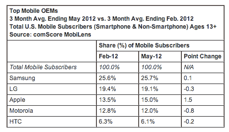
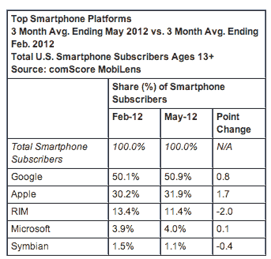
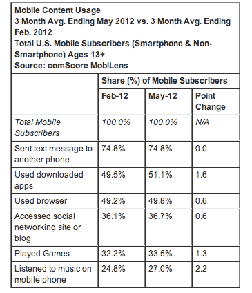

# comScore:在美国移动市场，三星、安卓高居榜首；应用超越网页浏览| TechCrunch

> 原文：<https://web.archive.org/web/https://techcrunch.com/2012/07/02/comscore-in-u-s-mobile-market-samsung-android-top-the-charts-apps-overtake-web-browsing/>

# comScore:在美国移动市场，三星、安卓高居榜首；应用程序取代了网页浏览

comScore 刚刚发布了其最新的月度手机数据，该数据记录了截至 2012 年 5 月的三个月平均手机使用情况。在此期间，2.34 亿 13 岁及以上的美国人使用移动设备，这与该公司 2 月份的报告一致。三星以 25.7%的市场份额位居手机制造商榜首，安卓也名列前茅，份额为 50.9%，而苹果为 31.9%。

报告发现，自今年 2 月的上一次[排名](https://web.archive.org/web/20230328034616/https://techcrunch.com/2012/02/02/comscore-as-u-s-smartphone-usage-grows-android-nears-50-percent-market-share/)以来，三星在移动用户份额方面的地位几乎没有变化，仅上升了 0.1 个百分点。紧随三星之后的是 LG (19.1%)、苹果(15.0%)、摩托罗拉(12.0%)和 HTC (6.1%)。

该公司再次报告称，Android 是最受欢迎的智能手机平台(50.9%的份额)，仅比 2 月份略有上升(0.8 个百分点)。苹果的增幅更大——1.7 个百分点——但所占市场份额较小，为 30.2%。RIM 仍以 11.4%的份额位居第三，但其份额正在下降。RIM 在 5 月份下降了 2 个百分点，在之前的排名中下降了 2.9 个百分点。微软(4.0%的份额)和塞班(1.1%)也榜上有名。

comScore 还调查了我们手机上与打电话无关的其他功能的使用情况。例如，今年 5 月，74.8%的美国手机用户使用短信。移动应用的使用上升了 1.6 个百分点，达到 51.1%，而网络浏览器的使用比例为 49.8%(上升了 0.6 个百分点)。没错——comScore 发现现在使用应用程序的人比使用网络浏览器的人多。该公司上次报告这些数字时发现，应用和浏览器分别以 47.6%和 47.5%的比例不分上下。但应用程序的使用一直在增长——去年 12 月增长了 5.1 个百分点，这一次再次增长。

社交网站和博客的使用率上升了 0.6 个百分点，占移动用户的 36.7%。游戏的增幅更大(1.3 个百分点)，达到 33.5%，但音乐的增幅最大(2.2 个百分点)，达到 27%。

这份报告是在[今天](https://web.archive.org/web/20230328034616/http://tech.fortune.cnn.com/2012/07/02/net-applications-ios-web-share-hit-record-65-3-in-june)发布的另外两个移动排名——网络应用和 StatCounter——之后发布的，这两个排名调查了移动网络使用情况，发现苹果的 iOS 遥遥领先于安卓或其他系统。但是这些数字更多的是关于使用率而不是市场份额。然而，comScore 的数据来自对 30，000 多名美国移动用户的调查，而其他公司使用基于点击的测量技术。