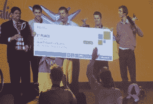

# 乌克兰学生凭借他们的手语-语音翻译手套赢得了微软的想象杯

> 原文：<https://web.archive.org/web/https://techcrunch.com/2012/07/10/imagine-cup-winners-quadsquad-enabletalk/>

# 乌克兰学生凭借他们的手语-语音翻译手套赢得了微软的想象杯

今天在悉尼举行的颁奖仪式上，乌克兰队 quadSquad 刚刚赢得了今年的[微软创新杯](https://web.archive.org/web/20230325002940/http://www.imaginecup.com/)学生技术竞赛(以及 25000 美元)，这要归功于它的手套可以[将手语翻译成语音](https://web.archive.org/web/20230325002940/https://techcrunch.com/2012/07/09/enable-talk-imagine-cup/)。该团队击败了其他 75 个小组，进入了澳大利亚的全球总决赛，在那里他们必须在一群评委面前展示他们的项目。这是微软的第十届创新杯和活动，结合了足球世界杯的能量和学生的球场比赛。今年的创新杯的主题是“想象一个科技帮助解决最棘手问题的世界”，大多数团队专注于医疗保健和环境。

 日本的 Coccolo 团队获得了软件设计类的第二名，他们的系统可以通过让灯相互交谈并找到可以调暗灯光的地方来减少能源使用。来自葡萄牙的团队[wi-GO](https://web.archive.org/web/20230325002940/http://icsocialmediateam.com/2012/07/08/wi-go-portugal-imagine-cup-2012-finals/)开发了一款 Kinect 驱动的购物车，可以跟随残疾人逛商店，获得第三名。

在活动期间，微软还承诺，在 10 月下旬发布新版操作系统后，将向每一位进入决赛的竞争对手发送一台 Windows 8 机器(不过没有说这是否会是 Surface)。

明年的活动将在圣彼得堡举行。随着 Windows 8 的发布指日可待，明年的活动可能会更加强调 Windows，但有趣的是，今年有不少参赛团队已经使用了 Windows 8，即使是在专门的地铁风格应用类别之外。

其他获奖者包括德国的绿道，它获得了可口可乐赞助的环境可持续发展奖。Greenway 的目标是通过建立一个智能导航系统来让[交通堵塞成为过去](https://web.archive.org/web/20230325002940/https://techcrunch.com/2012/07/07/team-greenway/)，该系统不仅可以为司机提供绕过交通堵塞的路线，还可以实际协调整个城市的交通。

意大利团队 [Ingenium](https://web.archive.org/web/20230325002940/http://www.imaginecup.com/MyStuff/MyTeam.aspx?TeamId=48897) 凭借一个项目赢得了健康意识奖，该项目旨在为那些患有自闭症但不容易获得治疗师帮助的人带来更好的治疗方案。

虽然来自亚利桑那州立大学的美国团队没有进入旗舰软件设计比赛的前 20 名，但美国的 Drexel Dragons 团队赢得了游戏设计(手机)类别。

你可以在这里找到所有获奖者的完整名单。