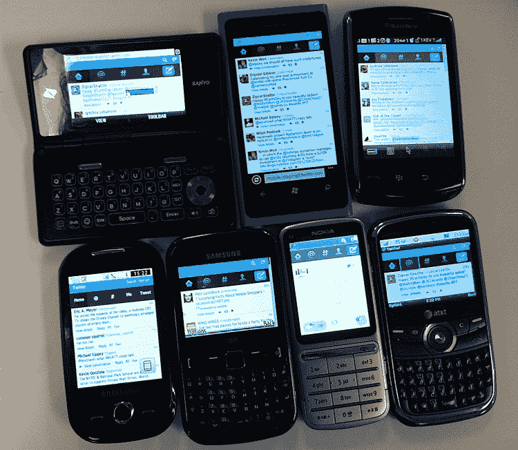

# Twitter 转向大众，通过最新的移动更新 TechCrunch 认真对待超越 iOS 和 Android 的影响

> 原文：<https://web.archive.org/web/https://techcrunch.com/2012/07/11/twitter-turns-toward-the-masses-gets-serious-about-reach-beyond-ios-android-with-latest-mobile-update/>

# Twitter 转向大众，认真对待超越 iOS 和 Android 的最新移动更新

Twitter 今天完成了针对功能手机和旧浏览器用户的移动网站的重大改革。在一篇博客文章中，Twitter 设计团队写道，他们构建了一个“重量更轻、速度更快的客户端，看起来和感觉上都像 twitter.com 和我们的移动应用。”

新网站更加简洁，与浏览器和应用程序界面非常相似，允许该公司在更多平台上提供其产品的最佳版本。这是紧随昨天[发布的用于 iOS 和 Android 的新 Twitter 移动应用](https://web.archive.org/web/20221209123401/https://beta.techcrunch.com/2012/07/10/new-twitter-apps-are-here-push-notifications-from-your-favorite-tweeters-better-expanded-tweets-more/)之后。

Twitter 为期九周的项目成果为数千种不同设备带来了对 13 种不同浏览器的移动支持。在博客上，该团队写道，他们致力于为用户提供“在任何设备上的一致体验”。新网站可以从小到 240 x 240 像素的屏幕扩展到桌面。为了适应较慢的网络和不同的浏览器，该网站针对关闭 javascript 的浏览器进行了优化，页面大小比旧版本小 63%。

【Twitter 用于测试的一些设备

在研究了人们如何使用移动网站后，从分析他们发微博的频率到他们刷新或加载更多微博的频率，设计师们在纸上画了草图，然后开始测试和调整版本。该团队表示，他们在 300 多种不同的设备上测试了移动网站。他们指出，新功能，如 JavaScript 支持和宽屏增强功能，即将推出。

更正(下午 3:03):这篇报道的早期版本称“Twitter 今天宣布对其移动网站进行重大检修。”Twitter 实际上在 5 月份就宣布了这一变化；今天，Twitter 宣布，它已经全面推出，并发布了有关新移动网站的统计数据和信息。