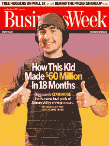

# 更新:Betaworks 收购 Digg(价格远远超过 50 万美元)

> 原文：<https://web.archive.org/web/https://techcrunch.com/2012/07/12/betaworks-acquires-digg/>

bit.ly、news.me、Chartbeat 和许多其他成功产品背后的公司 Betaworks 收购了 Digg.com 社交新闻网站[的](https://web.archive.org/web/20221231023402/http://digg.com/)，金额未披露。Betaworks 的创始人 John Borthwick 将成为 Digg 的新 CEO。Betaworks 转型完成后，该网站的现任首席执行官马特·威廉姆斯将作为常驻企业家加入安德森·霍洛维茨基金。几个月前，在搜索引擎[收购了他最新的创业公司【Milk 之后，Digg 的创始人凯文·罗斯加入了谷歌。](https://web.archive.org/web/20221231023402/http://money.cnn.com/2012/03/20/technology/startups/Google-Digg-Milk/index.htm)

**更新** : *[有传言称](https://web.archive.org/web/20221231023402/http://online.wsj.com/article_email/SB10001424052702304373804577523181002565776-lMyQjAxMTAyMDEwMjExNDIyWj.html)价格仅为 50 万美元，但这个数字[并没有真正的意义](https://web.archive.org/web/20221231023402/https://twitter.com/hunterwalk/status/223528806319788033)，因为该网站仍然可以通过销售广告获得足够多的流量。Digg 首席执行官马特·威廉姆斯在接受 AllThingsD 采访时证实,“整体考虑要大得多”,包括现金和股权。另一位接近谈判的消息人士告诉我们，价格确实不是 50 万美元。我们还不能确定确切的价格。*

Betaworks [承诺](https://web.archive.org/web/20221231023402/http://blog.betaworks.com/post/27070595530/digg)用低预算、小团队和快速更新周期将 Digg“重新变成一家初创公司”。Digg 剩下的员工似乎都不会去 Betaworks。相反，News.me 团队将接管该网站的管理。Digg 表示，Betaworks 将很快推出新的“基于云的 Digg 版本”,作为 News.me 的 iPhone 和 iPad 应用的补充。

据即将离任的 Digg 首席执行官马特·威廉姆斯称，他的团队“考虑了很多 Digg 的发展方向，坦白地说，很多都无法实现 Digg 的初衷——在网上发现最好的东西。我们想找到一种方法，让 Digg 回到它的创业根基。”Betaworks 说它计划“在 2012 年建立 Digg”

Digg 曾经是 Web 2.0 革命的[代言人，在过去几年里，它慢慢淡出了人们的视线，尤其是在它的 4.0 更新疏远了许多用户之后。从那以后，随着内容分享转移到 Twitter 和脸书(以及与之竞争的社交分享网站](https://web.archive.org/web/20221231023402/http://www.businessweek.com/stories/2006-08-13/valley-boys) [Reddit](https://web.archive.org/web/20221231023402/http://reddit.com/) )等社交网络，Digg 再也没有为自己找到合适的位置。它仍然有相当数量的用户，但它今天真的只是以前的影子。虽然像今天的收购这样的公告曾经会在几分钟内收到数百个“diggs”和评论，但今天的公告迄今为止只有 16 个 diggs 和 4 个评论这一事实相当说明问题。

今年早些时候，华盛顿邮报公司雇佣了该网站的 15 名工程师来开发自己的社交产品。从那以后，很明显这个网站迟早会被收购。

2008 年，据报道，谷歌对以大约 2 亿美元收购 Digg 感兴趣，但 T2 放弃了交易。这项交易对这项服务的投资者来说是一个不错的回报。自成立以来，Digg [总共从硅谷最著名的投资者那里筹集了 4500 万美元。上一轮融资——500 万美元的 D 轮融资](https://web.archive.org/web/20221231023402/http://www.crunchbase.com/company/digg)——恰好在一年前结束。当时，该网站的价值仍在 3500 万美元左右，TechCrunch 创始人迈克尔·阿灵顿[报道称](https://web.archive.org/web/20221231023402/https://techcrunch.com/2011/07/12/digg-raises-an-inside-venture-round/)如果没有那一轮融资，该公司在不得不关门之前将只剩下大约 6 个月的时间。