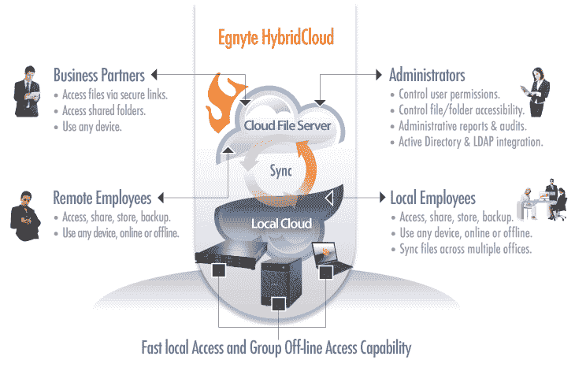

# Egnyte 从 Google Ventures 获得 1600 万美元用于云文件存储服务 TechCrunch

> 原文：<https://web.archive.org/web/https://techcrunch.com/2012/07/17/egnyte-raises-16-million-from-google-ventures-for-cloud-file-storage-offering/>

# Egnyte 从 Google Ventures 获得 1600 万美元用于云文件存储服务

Egnyte 为其云文件存储解决方案从[谷歌风险投资](https://web.archive.org/web/20221207201007/http://www.googleventures.com/)筹集了 1600 万美元。现有投资者[凯鹏华盈&拜尔斯](https://web.archive.org/web/20221207201007/http://www.kpcb.com/)和[北极星创投](https://web.archive.org/web/20221207201007/http://www.polarisventures.com/Default.asp)也参与了 C 轮融资。

Egnyte 提供一种服务，将文档存储在云环境中，文件出现在桌面上的共享和私有文件夹中。

例如，通过谷歌应用程序，人们可以使用 Egnyte 来访问谷歌 GDrive 中的文件或硬盘上的任何其他文件。可以在本地和云驱动器上编辑和更新文档。

Egnyte 的优势在于它的可访问性，但它为如何使用它制定了政策。通过这种类型的控制，IT 可以向组织内外的用户授予访问权限:

Egnyte 寄希望于混合云的流行来实现其长期增长。这是所有主要云服务提供商都在谈论的趋势，因为企业商店正在寻求采用云的最合理的途径。这意味着保留他们需要的服务器，并扩展到任何有权限的人都可以使用的云服务。

首席执行官 Vineet Jain 在接受采访时表示，企业市场的开放可以追溯到 Dropbox 等服务，这些服务提高了人们对存储如何使用的认识。

Egnyte 在一个竞争非常激烈的环境中比赛。它与类似的 [Box](https://web.archive.org/web/20221207201007/http://www.crunchbase.com/company/box-net " Box") 、 [Mozy](https://web.archive.org/web/20221207201007/http://www.crunchbase.com/company/mozy "Mozy") 、 [Syncplicity](https://web.archive.org/web/20221207201007/http://www.crunchbase.com/company/syncplicity "Syncplicity") 、 [SugarSync](https://web.archive.org/web/20221207201007/http://www.crunchbase.com/company/sugarsync "SugarSync") 和、 [Nasuni](https://web.archive.org/web/20221207201007/http://www.crunchbase.com/company/nasuni "Nasuni") 竞争，资金对存储供应商来说很深，仅 Box[去年秋天就筹集了 8100 万美元](https://web.archive.org/web/20221207201007/http://www.forbes.com/sites/nicoleperlroth/2011/10/11/after-rebuffing-600-million-citrix-takeover-cloud-storage-provider-box-net-closes-81-million-in-new-funding/)。