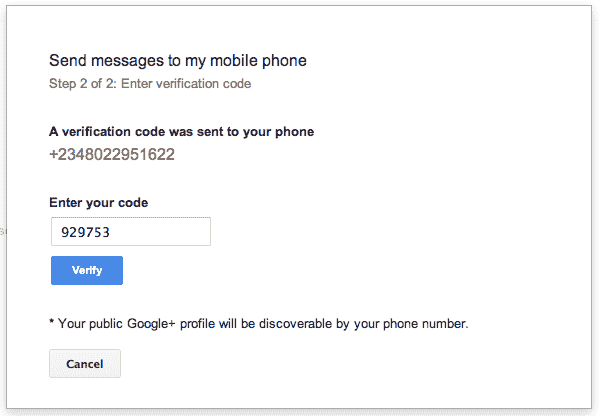

# 谷歌在新兴市场推出基于短信的 Gmail

> 原文：<https://web.archive.org/web/https://techcrunch.com/2012/07/18/google-launches-gmail-over-sms-in-emerging-markets/>

# 谷歌在新兴市场推出基于短信的 Gmail

今天早上，谷歌宣布推出一项新服务，通过短信发送 Gmail 邮件。这项服务简称为 [Gmail SMS](https://web.archive.org/web/20230404142551/http://www.google.com/settings/smsextensions) ，目前仅在智能手机普及率低、互联网连接不可靠的新兴市场提供。加纳、尼日利亚和肯尼亚是最先支持 Gmail 短信的三个国家。然而，虽然谷歌没有说，但很可能这项服务将在不久的将来开始推广到其他地区。

谷歌的非洲博客分享了这项服务如何运作的细节，展示了用户如何建立一个新的 Gmail 短信账户。不幸的是，配置确实需要使用计算机进行初始设置——它不能直接从手机上设置，这将大大增加其传播的可能性。

有关设置的详细信息，请阅读[帖子](https://web.archive.org/web/20230404142551/http://google-africa.blogspot.co.uk/2012/07/send-and-receive-gmail-on-your-phone-as.html)，但这是一个相对简单的过程，包括进入您的帐户设置并在“电话和短信”部分启用短信。我今天早上在美国查了一下。(只是确定一下，你永远不知道！)，抱歉，美国功能手机用户，我们自己似乎没有这种功能。哦好吧。

这项新服务是免费的，但标准短信费率将随之而来。谷歌在这些新兴市场启用短信 Gmail 服务的举动引人注目，因为在许多情况下，短信往往是更受欢迎的沟通方式——甚至是电话。对这些用户的价值在于，它允许他们继续他们通常的短信行为，但也保留了这些信息的在线存档，以便他们下次在电脑前或网吧时方便地访问。它还为他们提供了一个渠道，让他们可以接触到发短信有意义的领域之外的其他人——换句话说，整个世界。