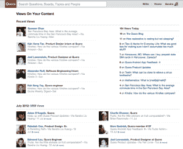

# Quora 推出“观点”,向你展示谁正在阅读你的帖子

> 原文：<https://web.archive.org/web/https://techcrunch.com/2012/08/01/quoras-views-analytics-launch/>

你可能最近已经注意到，Quora 越来越多地要求你登录才能看到该网站的问答内容。今天，它推出了一项新功能，分享它从那些登录用户那里收集的一些数据: [Quora 的“浏览量”，](https://web.archive.org/web/20230326023123/http://www.quora.com/blog/Introducing-Views-on-Quora)网站分析，显示有多少人阅读了你的 Quora 问题、回答或帖子。

现在，当你登录 Quora 时，你将注册为在你的订阅源或每周摘要邮件中看到的“已查看”问题。这将显示给查看问题的其他人或写问题的人，因为他们看到了你的脸和旁边的名字——它还会说是什么引导你到那里的，因为你的观点是“通过”你关注的人或主题。

点击放大

Quora 产品经理桑德拉·黄流昨天在一次采访中说，从 Quora 注销的人的观点仍然会显示在那个帖子的总浏览量中。“这一切背后的基本原理是，它创造了一个更好的系统，人们可以参与其中，”她说。“人们已经能够通过投票和评论(在 Quora 上)提供反馈，现在通过这些观点，他们可以看到更多的影响。”

默认情况下，所有用户的视图都是打开的，但是您可以选择完全关闭或删除您创建的单个视图。但该系统的工作原理就像 LinkedIn 的[“谁查看了你的个人资料”](https://web.archive.org/web/20230326023123/https://techcrunch.com/2007/05/10/see-whos-reading-your-linkedin-profile/)个人分析:如果你关闭了 Quora 的观点，你将无法看到其他人的观点。每个帖子的浏览量都是可见的，Quora 用户也将拥有自己的个人仪表盘，可以查看他们所有帖子的浏览量分析。

然而，与 LinkedIn 不同，Quora 不打算提供允许你匿名浏览同时仍能看到其他人观点的付费功能，Quora 高管马克·博德尼克昨天告诉我。

点击放大

Quora 表示，它只会注册来自 feeds、摘要电子邮件和 upvoting 等公共活动的观点，不会分享关于成人话题或你在网站上没有正式“关注”的内容的观点，例如你在浏览网站或通过网络搜索时发现的东西。

总的来说，我认为这是一个有趣的选择——这肯定会让 Quora 的超级用户和经常发帖的人感到满意，因为作为一名作家，获得关于有多少人在看你的作品的反馈总是有利的(我们 TechCrunch 几乎不停地检查我们的分析和 Chartbeat。)但是对于 if 网站的临时用户来说，让他们的照片出现在你的每周摘要邮件中的东西旁边可能会惹恼一些人。

也就是说，Quora 的设置似乎是经过精心安排的，尽可能地让视图活动变得容易控制和不引人注目，所以它完全不会打扰到人们。这里肯定有一些先例:当然，前面提到的 LinkedIn 个人资料视图功能，以及[路径](https://web.archive.org/web/20230326023123/http://www.crunchbase.com/company/path)以类似的方式显示“视图”分析。未来几天，看看人们对 Quora 新形象的反应将是关键。