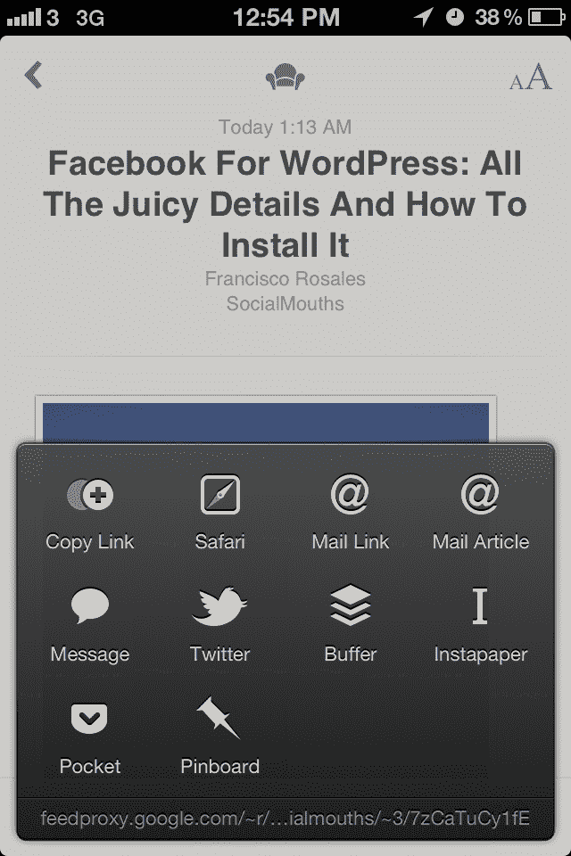

# 社交媒体管理器 Buffer 向开发者开放 API，有望成为“广泛共享标准”

> 原文：<https://web.archive.org/web/https://techcrunch.com/2012/08/01/social-media-manager-buffer-opens-api-to-developers-looks-to-become-widespread-sharing-standard/>

# 社交媒体管理器缓冲区向开发者开放 API，看起来将成为“广泛共享标准”

今天，[向开发者开放了其 API](https://web.archive.org/web/20230119075047/http://bufferapp.com/developers/api) ，这是一个旨在成为“广泛共享标准”的社交媒体管理器。

Buffer 允许用户向他们的脸书、Twitter 和 LinkedIn 账户发帖(Google+ [对其 API 并不宽容](https://web.archive.org/web/20230119075047/https://techcrunch.com/2012/07/18/hootsuite-opens-up-google-page-integration-to-all-users/)，并提供常见的一系列分析反馈。然而，它对非原创内容分享的关注，特别是照片、视频和文章，以及个人用户，使它与拥挤的市场区分开来。

虽然像 HootSuite 和 Sprout Social 这样的竞争对手主要通过向公司提供管理媒体的仪表板来瞄准公司，但联合创始人 Leo Widrich 告诉我 Buffer 有各种各样的用户，其中许多人使用该服务作为个人账户。

Widrich 表示，他们希望帮助任何人和每个人“提高他们社交媒体更新的性能，创造最令人惊叹的社交分享。”使用他们的浏览器扩展和应用程序集成，用户可以找到“最好的内容”，将其添加到缓冲队列中，以便全天发布，这样他们就不会一下子向关注者倾倒内容，然后使用分析来跟踪内容的表现。

“随着超过 15 个集成[在](https://web.archive.org/web/20230119075047/http://bufferapp.com/extras)完成，还有几十个在管道中，我们非常兴奋地建立一个你可以使用的共享工具，无论你在网上哪里找到伟大的内容，”Widrich 告诉我。“我们正在努力建立一个新的网络共享标准，让你的热门链接、图片和视频的定时或不定时共享变得更容易，让更多的朋友和关注者看到。把它放入你的缓冲区，就这样，剩下的交给我们。”

虽然 Buffer 可能会被脸书利用(嗯，我今天在哪里听说过类似的事情[)如果脸书开发类似的工具(我真的认为他们正朝着那个方向发展](https://web.archive.org/web/20230119075047/http://daltoncaldwell.com/dear-mark-zuckerberg)，这项服务现在看起来非常棒和有用，所以检查一下，希望它不会被收购或杀死。或者两者都有！