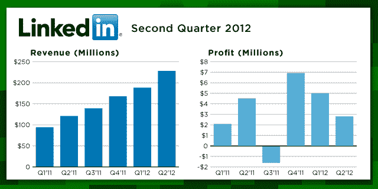

# LinkedIn Q2 的收益超过华尔街:销售额 2.282 亿美元；每股收益 0.03 美元 TechCrunch

> 原文：<https://web.archive.org/web/https://techcrunch.com/2012/08/02/linkedin-q2-earnings-beat-the-street-228-2m-in-sales-eps-of-0-03/>

LinkedIn 刚刚发布了 Q2 [的收益](https://web.archive.org/web/20221207202211/http://investors.linkedin.com/releasedetail.cfm?ReleaseID=697774)，专注于企业的社交网络继续崛起。它公布的收入为 2.282 亿美元，每股收益为 0.03 美元(非 GAAP 每股收益为 0.16 美元)。这使得该公司过去对第一次呼叫的收益估计为 2.163 亿美元，雅虎财经的[估计](https://web.archive.org/web/20221207202211/http://finance.yahoo.com/q/ae?s=LNKD+Analyst+Estimates)收入为 2.16 亿美元。它还超过了 First Call 0.01 美元的每股收益，以及 LinkedIn 自己的 2.1 亿至 2.15 亿美元的收入指导。然而，GAAP 净收入几乎减半至 280 万美元，而 2011 年 Q2 净收入为 450 万美元。(第二季度非 GAAP 净收入为 1810 万美元，而 2011 年第二季度为 1080 万美元。)

Q2 目睹了 LinkedIn 遭受了近年来最严重的宣传灾难，大约 650 万个密码被盗。尽管该公司迅速采取行动修改密码，但这一违规行为可能会让用户不再过于依赖将数据放入社交网络，或将其用于付费服务，但这些结果表明，显然它没有人们想象的那么严重。

LinkedIn 表示，它现在有 1.74 亿会员，高于一年前的 1.16 亿和 2012 年第二季度的 1.61 亿。ComScore 认为该季度的独立访问者为 1.06 亿，这意味着它的活跃用户比率非常高。页面浏览量从上一季度的 94 亿略降至 93 亿。

以下是其部分部门的表现:

招聘解决方案:收入总计 1.216 亿美元，比 2011 年第二季度增长 107%。招聘解决方案的收入比例正在上升。它现在占总收入的 53%,而 2011 年 Q2 奥运会占 48%。

**营销解决方案**:收入总计 6310 万美元，比 2011 年 Q2 增长 64%。2012 年第二季度，营销解决方案收入占总收入的 28%，而 2011 年第二季度为 32%。

**高级订阅**:收入为 4350 万美元，比 2011 年 Q2 增长 82%。LinkedIn 说，付费订阅占 2012 年第二季度总收入的 19%，而 2011 年第二季度占总收入的 20%。

我们将在下午两点收听电话。我们会寻找一些东西:

Q1 移动用户占 LinkedIn 访客的 22%，随着 LinkedIn iPad 应用的推出，投资者将关注该公司是否能够进一步利用这一点。在新闻稿中，LinkedIn 没有提到数字，但表示 iPad 应用程序“受到了积极的欢迎，参与趋势令人鼓舞。”该应用超过一半的页面浏览量是由以内容为中心的产品产生的，如更新、新闻和群组——这意味着潜在的更多赚钱途径。

正如有些人提到的那样，用户参与是另一个焦点。该公司在 5 月份以 1.19 亿美元收购了企业内容共享平台 [SlideShare](https://web.archive.org/web/20221207202211/https://beta.techcrunch.com/2012/05/03/linkedin-acquires-professional-content-sharing-platform-slideshare-for-119m/) ，就在几周前，它[推出了重新设计的](https://web.archive.org/web/20221207202211/https://beta.techcrunch.com/2012/07/10/linkedin-is-gearing-up-for-a-redesign-bigger-pictures-anchored-menu-and-a-life-less-tweeted/)，也是为了让该网站成为用户愿意花更多时间的地方，增加了 LinkedIn Today 的故事流，并为与其他 LinkedIn 成员交流提供了更多选择。

LinkedIn 第三季度的收入预期为 2.35 亿美元，现在已经上调至 2.35 亿至 2.4 亿美元。该公司还将其全年预期上调至 9.15 亿至 9.25 亿美元；在 Q1 的电话会议中，LinkedIn 给出了 8.8 亿美元到 9 亿美元的区间。

在 Q1，LinkedIn 凭借一系列非常强劲的业绩给分析师留下了深刻印象，每股收益为 0.15 美元，而预期为 0.09 美元，营收为 1.885 亿美元，而预期为 1.79 亿美元。

