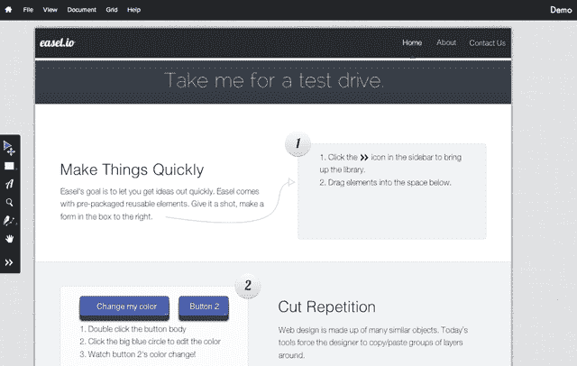

# 认识一下 Easel，一个 YC 支持的让网页设计更简单的网络应用程序 TechCrunch

> 原文：<https://web.archive.org/web/https://techcrunch.com/2012/08/07/easel-a-web-app-for-web-design/>

# 认识一下 Easel，一个 YC 支持的让网页设计更简单的网络应用

浏览器内网页设计应用[画架](https://web.archive.org/web/20221207045346/http://www.easel.io/)刚刚上线。所见即所得的网页设计工具旨在使网页设计和开发更容易，让那些想在网上快速得到他们的想法的团队[，而不必雇用设计师。](https://web.archive.org/web/20221207045346/http://blog.easel.io/blog/2012/07/02/design-without-a-designer/)

画架创始人[本·奥格尔](https://web.archive.org/web/20221207045346/https://twitter.com/mrbogle/ "Ben Ogle's twitter")和[马特·科尔耶](https://web.archive.org/web/20221207045346/https://twitter.com/mcolyer/ "Matt Colyer's twitter")第一次见面是在 Adroll 当工程师的时候，他们已经在 Y Combinator 支持的设计工具上工作了大约四个月。

最重要的特性是速度和协作。文档可以由多个用户实时编辑，更改会像 Google Docs 一样自动同步。

从设计师的角度来看，我认为该应用程序对于没有任何编码经验但知道他们想要什么的人来说是一个很好的资源。在网页设计中构建协作工具是一个好主意。

虽然不像离线设计软件那样强大，但画架提供了制作基本网站的基本工具，可以定制用于桌面、移动或平板电脑浏览。对于曾经使用过像 InDesign 这样的设计软件的人来说，这个编辑器非常直观，但是对于初学者来说，仍然非常简单。移动对象、添加文本和创建形状是一个流畅的过程，不像其他网页设计软件那样呆板。最重要的是，很容易快速地将一些东西组合在一起，同样也很容易改变它。

一个方便的功能是创建元素——文本框、形状或表单的组合——可以很容易地复制和修改。控制面板还带有一套现成的按钮、表格和图标。它们一定很简单，但是设计得很好，你必须努力用它们做一个丑陋的网站。你可以建立一个你自己的部件库，或者使用现有的三个部件中的一个。

一个 Chrome 扩展允许用户从现有网站(大概是他们自己的网站)导入 HTML 和 CSS 来编辑。你也可以为你在 Easel 中设计的网站导出 HTML 和 CSS。

有三种定价模式，从每月 10 美元到 50 美元不等，还有一个免费选项。

【T2