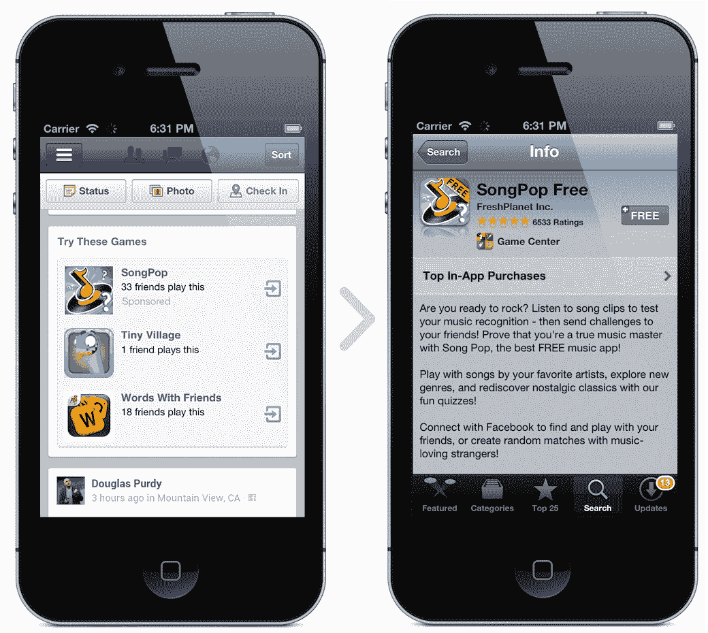
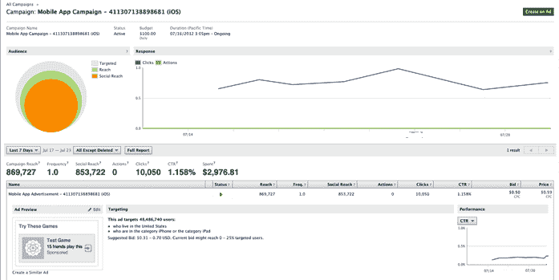

# 脸书推出首个非社交移动广告单元，允许开发者购买应用商店的点击量

> 原文：<https://web.archive.org/web/https://techcrunch.com/2012/08/07/facebook-mobile-app-ads/>

到目前为止，每一个脸书移动广告都必须由你或朋友的活动触发，但今天脸书开始测试一个新的非社交广告单元，让开发者购买移动新闻订阅广告，点击后打开 Android 和 iOS 应用商店购买页面。它们旨在帮助开发者拓展业务。广告是基于每次点击的成本，而不是基于每次安装的成本，然而脸书告诉我，它希望让开发者在未来衡量由他们的应用广告驱动的安装，并且[现在正在接受开发者注册目前很小的私人测试版](https://web.archive.org/web/20230316224632/https://www.facebook.com/help/contact/?id=353190198089522)。

通过向传统的非社交广告开放移动新闻，脸书可能会取悦其投资者，但必须非常小心这些促销活动出现的频率，以确保它们不会淹没有机内容，导致我们把手机塞回口袋。

脸书手机应用的广告出现在“试试这些游戏”的面板上，在手机新闻的传统故事之间。面板显示几个应用程序的名称、缩略图和玩游戏的朋友数量(如果有的话)(在我们收到的例子中是三个)。

有机广告和付费广告可以并排出现，广告标有“赞助商”字样。点击打开手机或平板电脑上的应用程序的原生 iOS 应用商店应用程序或 Google Play 应用程序。

脸书移动广告的覆盖范围、点击量、频率和支出都可以通过一个仪表板来跟踪，广告可以利用脸书的传记、兴趣和设备定位选项。这使得他们比赞助商的故事更灵活，广告商只能将目标锁定在已经提到他们的品牌或使用他们的应用程序的人的朋友身上。

这意味着开发者不需要现有的用户群来为他们的应用做广告，他们可以被用来推广游戏发布——目前这是脸书网站上开发者广告支出的一个巨大来源。

例如，一款新的仅限 iOS 的女孩时尚游戏的广告可以针对生活在洛杉矶的 16 至 45 岁携带 iOS 设备的女性，以最大限度地提高相关性。

看到脸书在移动货币化方面越来越积极，华尔街应该感到兴奋。但事实上，这些是直截了当的广告，而不是商家付费让其更频繁出现的关于朋友的故事，这让脸书在移动领域陷入了困境。它以前依赖于这样的想法，即它的社交广告内容足以证明它们注入新闻提要的合理性。

脸书表现出了谨慎，他告诉我“我们不想展示太多赞助内容，因为这对 news feed 来说是一种错误的体验”，并且它将观察每个人的反应，以确定多长时间展示一次移动应用广告。有点令人担忧的是，脸书告诉我，对于移动应用广告出现的频率，“很难说是否会有频率限制”，因为它仍在进行有限的测试，还不清楚会有多少广告。

当脸书第一次向移动新闻推送推出赞助报道时，它的目标是[将它们限制在每个用户每天一篇](https://web.archive.org/web/20230316224632/https://techcrunch.com/2012/01/10/featured-news-feed-ads/)，但后来扩展超过了这个范围，因为数据显示它们并不那么显眼。上周，在我们[脸书生态系统峰会](https://web.archive.org/web/20230316224632/https://techcrunch.com/2012/08/03/crunchup-facebook-ads/)的舞台上，脸书的广告工程总监 Greg Badros 告诉我，脸书更经常地向点击他们的人显示赞助故事，这可能也适用于移动应用广告。

我自己的非正式快照研究发现，脸书在移动平台上每 125 篇报道就增加一篇文章，我认为用户可以承受大约 3 倍的数量。由于这是一个封闭的测试，我们必须扩大测试，看看什么是有意义的，但我们致力于保持新闻提要有趣和相关。

脸书将进行测试，我们将密切关注，以确保用户不会拒绝原本用于朋友照片和状态更新的 feed，因为它已经被随机游戏的付费广告冲淡了。如果脸书移动应用广告被证明是一种经济有效的推动安装的方式，并且足够受欢迎，可以经常展示，他们可以将支出从移动横幅广告和应用内广告网络中撤出。

然而，从哲学上来说，今天是脸书商业的重要时刻。它最终将新闻提要的相关性委托给了广告商的定向技巧，而不仅仅是社交图的智慧。