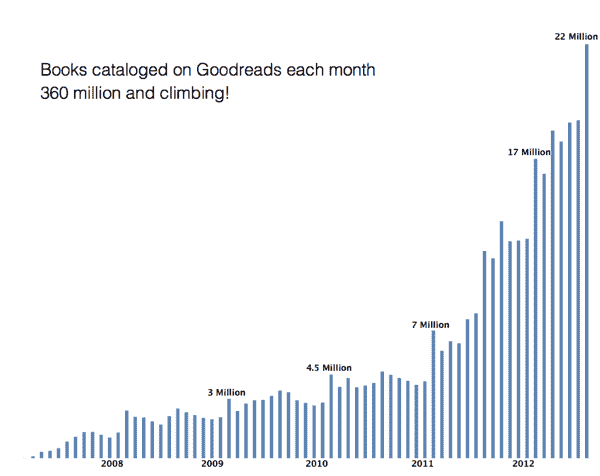

# 阅读在社交阅读网站 Goodreads 上蓬勃发展，该网站刚刚拥有 1000 万会员

> 原文：<https://web.archive.org/web/https://techcrunch.com/2012/08/13/goodreads-10-million-members/>

# 阅读在社交阅读网站 Goodreads 上蓬勃发展，其会员刚刚达到 1000 万

Goodreads 是一个让你分享已经阅读、正在阅读和想要阅读的书籍的网站，该网站称其会员人数刚刚突破 1000 万大关。

这意味着该公司在一年多一点的时间里——更准确地说是 15 个月——注册用户数量翻了一番。2011 年 5 月，Goodreads 花了四年半的时间才达到 500 万会员。

联合创始人兼首席执行官奥蒂斯·钱德勒告诉我，“我们今年增长的主要催化剂”是公司新的脸书开放图表应用程序。他还表示，Goodreads 的图书推荐引擎 T3 在增长中发挥了重要作用，该引擎是在 T4 收购 Discovereads.com 后于 9 月份推出的。

钱德勒指出，“出版业面临一个巨大的发现问题，因为书籍正在数字化”，实体书店正在消失。Amazon.com 正试图通过自己的书籍推荐来解决这个问题，但 Chandler 说这为 Goodreads 创造了“一个巨大的机会”——毕竟，社交阅读网站的主要好处之一是找到朋友推荐的书籍，他过去曾说过 Goodreads 拥有“目前互联网上最好的书籍推荐”

Goodreads 声称拥有超过 3.6 亿本图书，每月增加 2200 万本(还在增加)。钱德勒说，该网站每月的浏览量约为 1.4 亿，每月的独立访客约为 2200 万，因此 Goodreads 可以为其广告商提供大量观众，并为他们提供独特的数据，说明他们的活动是否在推动 Goodreads 社区的参与度。

该公司还刚刚在旧金山搬进了一个 6000 平方英尺的新办公室。

至于接下来会发生什么，钱德勒说，公司正在开发更多功能，让读者在阅读一本书时更新他们的个人资料——所以他们不只是说他们在读什么书，而是说他们对它有多着迷，以及他们在阅读时的任何想法。他还表示，该公司正在与脸书团队讨论在社交网络中建立读书俱乐部(Goodreads 已经在自己的网站上运营读书俱乐部/讨论组)。

