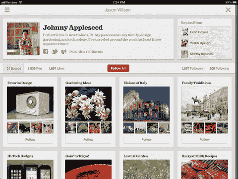
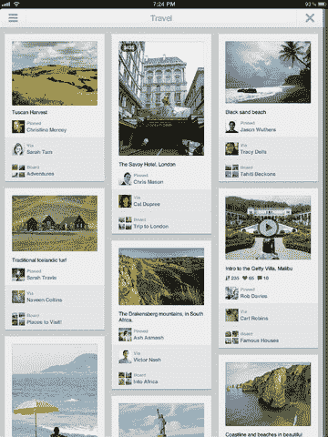
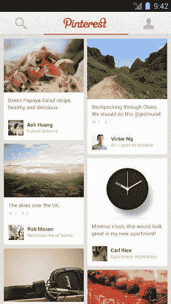
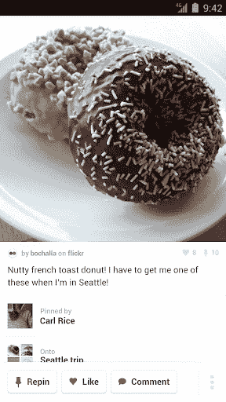

# Pinterest 在移动领域大展拳脚:推出首个原生 iPad 应用，首次亮相 Android TechCrunch

> 原文：<https://web.archive.org/web/https://techcrunch.com/2012/08/14/pinterest-goes-big-on-mobile-rolls-out-first-ever-native-ipad-app-makes-its-android-debut/?utm_source=ausdroid.net>

# Pinterest 进军移动领域:推出首个原生 iPad 应用，首次亮相安卓系统

在大力推动移动应用的过程中， [Pinterest](https://web.archive.org/web/20221207035709/http://www.pinterest.com/) 今天发布了其 iOS 应用的全新更新版本，[2.0 版](https://web.archive.org/web/20221207035709/http://itunes.apple.com/us/app/pinterest/id429047995?mt=8)。这包括为 iPad 定制的全新版 Pinterest】。

该公司还首次推出了 Android 操作系统的第一款[原生应用。](https://web.archive.org/web/20221207035709/https://play.google.com/store/apps/details?id=com.pinterest)

此次更新紧随 Pinterest [向任何人开放其服务](https://web.archive.org/web/20221207035709/https://beta.techcrunch.com/2012/08/08/pinterest-open/)之后——以前，人们需要邀请才能成为网站的一部分。总的来说，Android 和 iOS 应用程序提供了本质上相同的功能:锁定新内容、类别浏览、关注其他用户、重新锁定，以及直接从移动设备锁定。

这些新应用显然是在旧金山的一个派对上推出的，派对上有[美味的纸杯蛋糕](https://web.archive.org/web/20221207035709/https://twitter.com/lizgannes/status/235560123010019332)(TechCrunch 似乎没有被邀请，非常[Regina George](https://web.archive.org/web/20221207035709/http://www.imdb.com/title/tt0377092/)you Pinterest。)也许是因为我们抛出了他们如何看待[成为我们的邻居](https://web.archive.org/web/20221207035709/https://beta.techcrunch.com/2012/06/07/pinterest-ponders-a-san-francisco-home/)，或者[关于他们最新一轮](https://web.archive.org/web/20221207035709/https://beta.techcrunch.com/2012/04/05/pinterest-has-an-invitation-to-the-billion-dollar-startup-club-but-will-it-accept/)[大融资](https://web.archive.org/web/20221207035709/https://beta.techcrunch.com/2012/05/17/rakuten-ceo-on-the-100b-pinterest-round-we-want-pinterest-users-to-pin-images-and-buy-using-our-id/)的早期细节，或者他们疯狂惊人的[用户增长](https://web.archive.org/web/20221207035709/https://beta.techcrunch.com/2012/02/07/pinterest-monthly-uniques/)？

这很酷，反正我正试着做旧人。**更新** : Pinterest 称，TechCrunch *实际上被邀请参加豪华派对*，尽管我和我的同事们没有看到任何电子邮件。估计是在邮件里丢了(万一发生)？无论如何，给其余的记者和 Pinterest 爱好者更多的糖果。

无论如何，除了那些花哨的甜点，总体来说这似乎是一个基本的移动更新——尽管这将使他们的数百万用户感到高兴，并肯定会吸引更多人来看看 Pinterest 的所有宣传是什么。和往常一样，如果有任何额外的重要细节，这篇文章将会更新。

以下是来自 iPad 版 Pinterest 和 Android 版 Pinterest 的一些图片(点击每张图片可放大):

iPad 版 PInterest

iPad 版 Pinterest

Android 版 Pinterest

Android 版 Pinterest