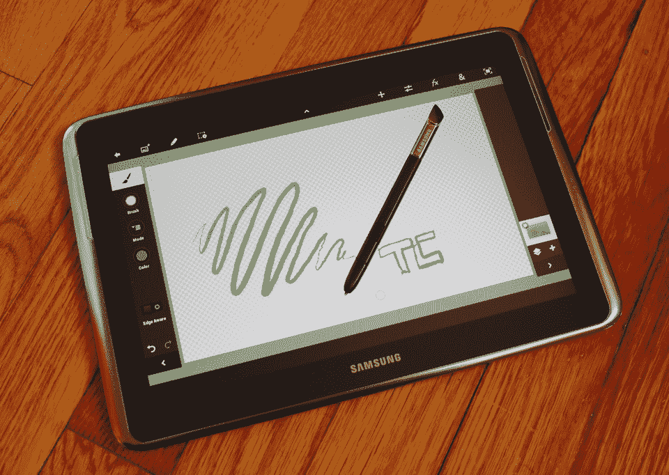
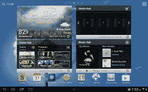
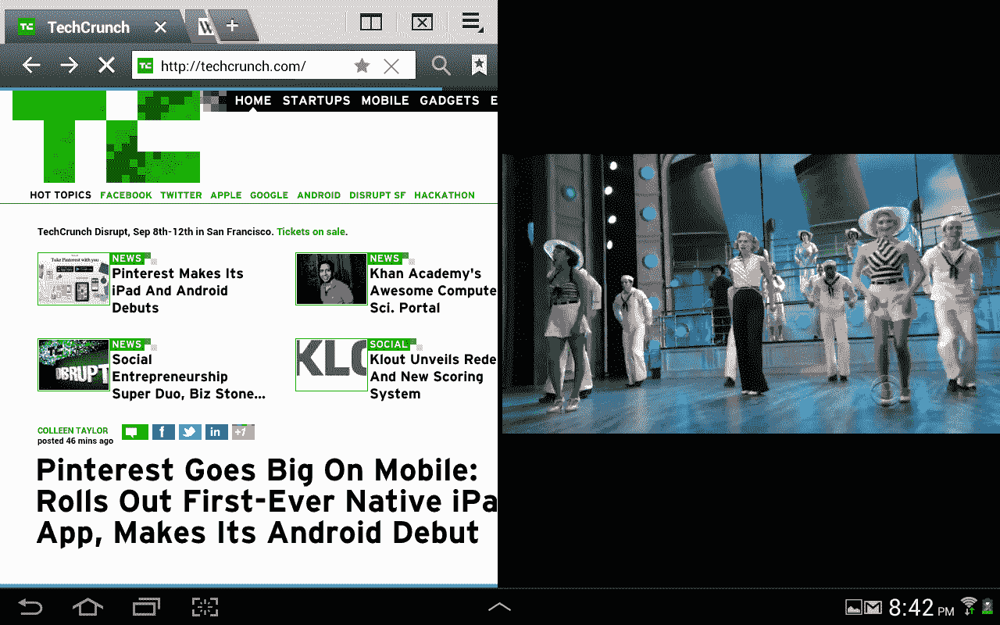
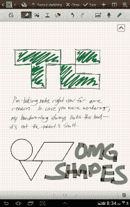
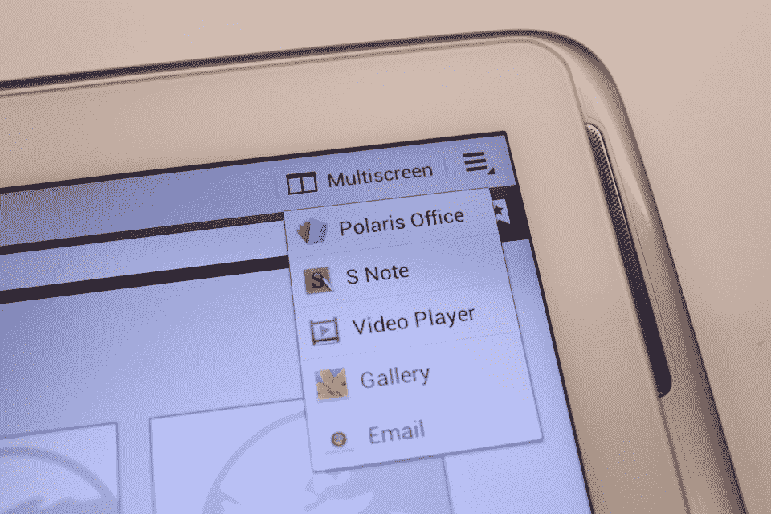
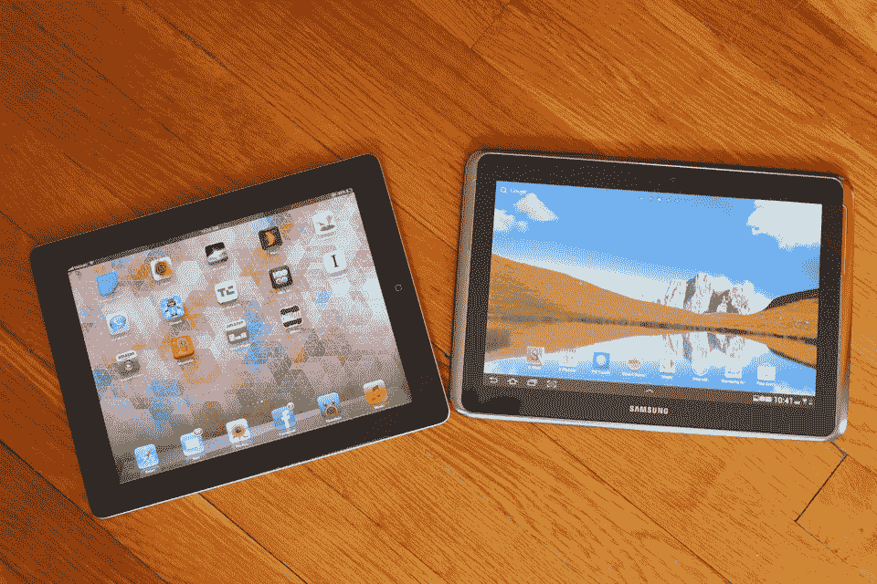

# 三星 Galaxy Note 10.1 评测:如此接近伟大 TechCrunch

> 原文：<https://web.archive.org/web/https://techcrunch.com/2012/08/15/samsung-galaxy-note-10-1-review/?utm_source=feedburner&utm_medium=feed&utm_campaign=Feed%3A+Techcrunch+%28TechCrunch%29&utm_content=Google+Reader>

## 简短版本

几个月前，在巴塞罗那 Fira Montjuic 展览中心的深处，我第一次玩了三星的 10.1 英寸 Galaxy Note 平板电脑。展台服务人员很快注意到，我和数千名其他极客一起玩的设备并不是最终产品，但这并没有阻止我在培训中为这款平板电脑提供一些赞美之词。

现在，在西班牙美好的一天过去近六个月后，Galaxy Tab 10.1 终于准备好在美国登台亮相了。三星的 Galaxy Note 平板电脑[在去年推出后不久就成为了令人惊讶的热门](https://web.archive.org/web/20221207023310/https://beta.techcrunch.com/2012/03/28/samsung-shipped-1-million-galaxy-note-phablets-a-month/)，三星显然希望 Note 公式将推动这款新平板电脑进入大联盟。值得庆幸的是，明天上市的平板电脑与 2 月份几乎所有科技媒体成员都玩过的那款并不完全相同——它肯定更好——如果不是有一些缺点，Galaxy Note 10.1 很可能会成为*击败的*安卓平板电脑。

**功能:**

*   10.1 英寸液晶显示屏，分辨率为 1280 x720
*   Android 4.0.4 冰淇淋三明治，带有三星的定制用户界面(果冻豆将于今年晚些时候推出)
*   1.4GHz 四核三星 Exynos 处理器
*   2GB 内存
*   16 或 32GB 的内部存储空间，支持最大 64GB 的 microSD 卡
*   500 万像素后置摄像头，190 万像素前置摄像头
*   仅 Wi-Fi
*   建议零售价:16GB 型号 499 美元，32GB 型号 549 美元，将于 8 月 16 日上市

**优点:**

*   在大屏幕上使用 S-Pen 是一种享受
*   强大的规格表意味着卓越的性能
*   分屏多任务！

**缺点:**

*   构建质量不能激发信心
*   这些相机令人印象深刻
*   三星的 UI 可能有点霸道

## 长版本

#### 硬件和设计

 从美学角度来说，三星在推出 Galaxy Note 10.1 时并不热衷于冒险——它与该公司最近推出的其他一些 Android 平板电脑没有太大区别，尤其是 10.1 英寸的 Galaxy Tab 2。Note 的 10.1 英寸 PLS LCD 面板被一个相当大的边框所包围，边框本身被金属外观的塑料边框所包围，塑料边框还容纳了平板电脑的两个扬声器。

与此同时，耳机插孔、IR blaster 和 microSD 插槽都可以从 Note 10.1 框架的顶部边缘轻松触及，现在标准的三星 dock 连接器位于 Note 的底部。将标签翻转过来，可以看到一个与 Galaxy S III 相同的无特色背面，顶部有一个明亮的人造金属条，包含 500 万像素的摄像头。Note 看起来非常像它的前身，这不是什么大问题(它们都是相当漂亮的设备)，我不禁希望三星在设计时走一条稍微更冒险的路线。

见鬼，我本来可以接受一个温和的转变。你可能会从两个扬声器和前置摄像头的位置看出，Note 10.1 是一款可以水平放置的平板电脑。通常情况下，这不会是太大的问题，但当垂直拿着 Note 10.1 时，将 Galaxy Note 用作记事本通常会感觉更舒服。

机身质量是典型的三星产品，也就是说纤薄(8.89 毫米)，轻巧(1.31 磅)。)和 plasticky。在制作新的 Note 平板电脑时，三星关注的是保持其重量，以免单手握持时过于笨重。他们在这方面取得了成功(通常都是这样)，但是这个决定也不是没有缺点。如果你在边缘施加一点压力，会听到一点吱吱嘎嘎的声音，并且当压下(漂亮完成的)背板时，会有相当大的弹性。这几乎不是你在平板电脑中遇到的最鼓舞人心的结构，但这只是你必须付出的代价。

自从我上次看到三星附带的 S-Pen 以来，它也经历了一次手术——过去与笔尖相对的电容“橡皮擦”小块不见了。不过从好的方面来看，三星终于设法在 Note 10.1 的后端开辟了一点空间，这样 S-Pen 在不使用时终于有了一个休息的地方。六个月前，这似乎是一个彻头彻尾的疏忽，谢天谢地，三星在正式发布时做出了正确的决定。

#### 软件

像往常一样，三星已经竭尽全力用自己的定制用户界面来掩盖 Android 4.0.4 的任何外表。长期读者可能知道，我是一个不折不扣的 Android 爱好者，但我玩了足够多的三星设备，我已经习惯了它的许多怪癖。

经验丰富的 Android 用户不会有太多问题来找出所有常用的零碎东西在哪里，但 Note 10.1 的用户界面有很多容易被忽略的小细节。点击右下角的时钟会打开一个满是收音机开关的窗口，亮度控制和通知整齐地位于它们下面。触摸 Android 黑色导航栏中间的白色小箭头，会显示一系列常用的应用程序，长按主屏幕可以让用户添加小工具，而不必先启动应用程序启动器。

这大部分都不是特别新，但这张纸条的隐喻袖子上有一些更整洁的技巧。其中一些非常小——从皮套中取出 S-Pen 会带来一个可定制的应用程序列表，以便快速访问，Galaxy S III 的画中画视频浏览器也会出现——但有一个功能尤为突出。三星一直坚持强调 Note 10.1 的生产力角度，因此这家韩国公司实现了我在任何平板电脑中见过的最好的功能之一:分屏多任务处理。

当你发现自己在几个支持的应用程序(在这种情况下，S Note，Polaris Office，以及股票网络浏览器，画廊，电子邮件和视频播放器应用程序)中闲逛时，屏幕右上角会出现一个“多屏选项”。点击它来选择第二个应用程序启动，然后*瞧*——每个应用程序占据屏幕的一半，允许用户一次完成更多的工作(或者更快地分心)。更好的是，用户可以根据需要将内容从一个窗格拖放到另一个窗格。简而言之，这太棒了。

由于这个版本的 Galaxy Note 不能很好地与 3G 或 4G 网络兼容，所以这里没有运营商的臃肿软件——只有三星预装的应用和服务套件。笔优化的 S Note(带有公式匹配和形状匹配功能)也将随之而来，三星的 S Suggest 推荐服务也是如此，该服务突出显示了三星已确认将与相关硬件配合良好的应用程序。生产力发烧友会很高兴知道北极星办公室也回归了，谁会忘记三星的移动通讯服务 ChatON 呢？(差点就做了。)

Note 10.1 还附带了一些第三方应用程序，旨在给硬件一个展示的机会。Peel 远程控制应用程序也回来了，可以很好地利用集成的 IR blaster，而 Photoshop Touch、Kno 教科书和蜡笔物理等应用程序都支持 S-Pen，以便在涂鸦或记笔记的冲动突然袭来时使用。

#### 性能和 S-Pen

让我们先弄清楚一些事情 Galaxy Note 10.1 是一个真正的重量级产品，这主要归功于它的 1.4GHz 四核 Exynos 处理器和 2GB 内存。从数字上来说，Note 10.1 的五个象限平均得分为 5251，而其前身 Galaxy Tab 2 10.1 的得分通常在 2600 到 2800 之间。

即使拥有所有的马力，在不同的主屏幕之间来回滑动时，也会有明显的视觉滞后，因为三星在默认情况下已经将所有的小工具都塞进了主屏幕。这很容易通过删除所有这些小部件并在添加新部件时进行合理的判断来弥补，但令人有点恼火的是，您根本不必为此担心。也就是说，Note 10.1 处理我通常的测试游戏(侠盗猎车手 3，《我的世界》口袋版)和测试视频几乎没有任何问题。

但是说实话，这可不是你想听到的那种表演。好吧，朋友们，让我们来谈谈 S-Pen 吧。

首先，它肯定像宣传的那样工作，而且看起来比上一次更准确。由于集成的 Wacom 数字化仪(加上包装盒中的附加提示)，我能够在绘制草图和书写时进行精确控制，并使用 S-Pen 通过将鼠标悬停在屏幕上来有效地将鼠标悬停在网页上的元素上。我承认我没有在 Galaxy Note 上花太多时间，但在更大的屏幕上使用 S-Pen 似乎更自然。过去的这个周末，我花了几个小时在 S Note 上画人脸和机器人，就像我小时候一样——这种笔/显示器大小的组合有点神奇。

一个主要的改进是因为 Note 10.1 的屏幕更大了——在写字或涂鸦时，很难避免将手腕放在那个相当大的显示屏上，谢天谢地，标签的手掌检测功能在大多数时候都非常有效。这种问题取决于在特定时刻使用的应用程序，其中一些应用程序没有其他应用程序聪明。三星自己的笔友好应用程序(S Memo)似乎从来不会忽视用户的手，但预装的 Photoshop Touch 等应用程序经常让我想知道，为什么我的草图直到我把手从屏幕上拿开时才成形。谢天谢地，这样的事件很少发生。

当然，有几个问题需要注意。以应用程序兼容性为例——拥有首选应用程序的狂热移动 sketchers 可能会发现很难获得完整的 S-Pen 支持。毫无疑问，在 Autodesk Sketchbook 等应用程序中使用 S-Pen 与使用电容式手写笔相比仍有很大差距，但它缺乏在 Photoshop Touch 和 S Note 中绘制草图的魅力。三星表示，它正在与开发人员合作，以拓宽 S-Pen 的功能，但不知道下一个可靠的 S-Pen 应用程序要多久才能问世。

通过手写输入文本是另一个大杂烩。一般来说，如果你有清晰、明确、易于分析的笔迹来识别笔记，这是非常可靠的，但是如果你的笔迹倾向于草率的结尾，你的收获就会有所不同。尝试用 S-Pen 全力以赴的诱惑可能非常强烈，但标准的屏幕键盘有一些明显的优势，尤其是纯粹的速度。

#### 显示屏、摄像头和电池

Galaxy Note 的 10.1 英寸显示屏没有什么明显的问题，但也没有太多值得大书特书的地方。这个面板(就像你将在 Android 标签中看到的大多数弹出面板一样)的尺寸为 1280 x 800，像素密度为 149.45 PPI——对于这种尺寸的平板电脑来说，这是相当不错的，但在看到苹果最新的 iPad 后，这就很不令人满意了。甚至像宏碁这样的公司也在用他们的平板显示器做大 T4，所以看到三星在这里保持保守有点令人失望。

除了呻吟之外，颜色是明亮和生动的(有一个在观看模式之间切换的设置，以防你感到挑剔)，即使我旋转纸条寻找不合适的观看角度(没有任何角度)。

这对任何人来说都不应该感到惊讶，但 Galaxy Note 10.1 的 500 万像素后置摄像头和 190 万像素前置摄像头都有很多不足之处。用笔记本的相机拍出一些大体上不错的照片是可能的，但结果往往是粗糙和褪色的。

话又说回来，当你的手机很有可能做得更好的时候，你真的不应该首先用这个东西来拍照。也就是说，相机糟糕的事实仍然有点刺痛——给人们拍照并 PS 出他们的眼睛非常有趣，但当源图像不确定时，你很难创作出令人惊叹的成品。

也可以随意录制视频，只要你的期望得到适当的调节。后置摄像头能够录制 720p 视频，但最终的镜头同样不令人满意。相机在紧要关头当然可以用，但十有八九，你最好还是去拿些别的东西来抓拍。

当进行我们的标准电池压力测试时(对于外行来说:屏幕亮度设置为 50%，当不直接使用时，该设备会在一系列无休止的谷歌图像搜索中运行)，该标签设法坚持了不到 9 小时 20 分钟。一点也不寒酸，尤其是考虑到织补的东西有多小。

很难将这个数字转化为实际使用的天数，因为大多数人不会一直坐在平板电脑前，根据我的经验，这相当于在电池最终耗尽之前断断续续使用了近三天。像往常一样，你的里程会有所不同，但我怀疑你不需要经常跑去电源插座。

## 结论

现在我们来看最重要的问题:值得买这些东西吗？我敢打赌，很少有人会考虑购买像 Galaxy Note 10.1 这样的小众设备，仅仅因为它有一个漂亮的处理器，或者因为它轻薄。最终，决定因素将是 S-Pen。如果你是噱头的粉丝(或者只是一般的安卓粉丝)，那么 Galaxy Note 10.1 绝对值得你考虑。

也就是说，像这样的设备并不存在于真空中。其 499 美元的基本价格使其与新的 16GB iPad 不相上下，后者肯定会成为任何潜在平板电脑客户的竞争者。考虑到 iPad 强大的开发者支持和真正出色的显示屏，它似乎仍然是目前更值得购买的产品。我希望情况不是这样(当谈到 S-Pen 业务时，我会神魂颠倒)，但这是一个可悲的事实——由于三星正在 Note 10.1 上尝试一些不同的东西，所以还没有多少应用程序真正充分利用 S-Pen。

如果我们严格考虑 Android 平板电脑，有许多调整会使 Galaxy Note 10.1 成为拥有的设备——更高分辨率的屏幕，更多 S-Pen 兼容的应用程序，以及更坚固的结构都浮现在脑海中。如果三星抓住其中任何两个问题并加以解决，Note 10.1 将是必买之物。尽管如此，Galaxy Note 是一款非常好的 Android 平板电脑，只是差一点就跨过了伟大的门槛。