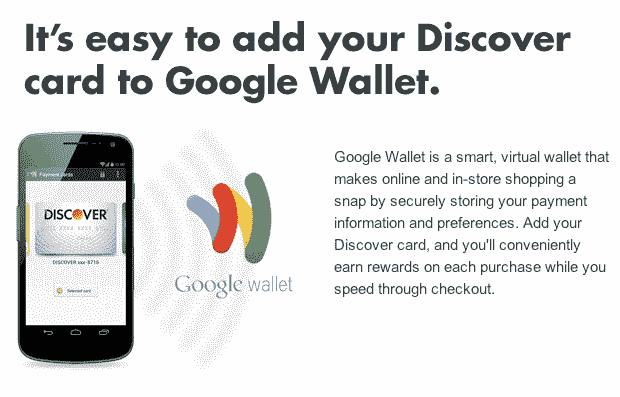

# 发现与谷歌的合作伙伴，让将信用卡添加到谷歌钱包变得更容易 TechCrunch

> 原文：<https://web.archive.org/web/https://techcrunch.com/2012/08/16/discover-google-wallet-api/>

# 发现与谷歌的合作伙伴，使其信用卡添加到谷歌钱包更容易

谷歌钱包，该公司基于 NFC 的安卓虚拟钱包，在本月早些时候[得到了重大更新](https://web.archive.org/web/20221204191935/https://beta.techcrunch.com/2012/08/01/google-wallet-all-credit-debit-cards/)，谷歌开始让用户能够使用 Visa、MasterCard、American Express 和 Discover 的卡。今天，谷歌和 Discover [宣布](https://web.archive.org/web/20221204191935/http://www.businesswire.com/news/home/20120816005878/en/Discover-Brings-Google-Wallet-Cardmembers)他们正在让 Discover 的客户更容易将他们的卡存入谷歌钱包。Discover now 使用谷歌的[保存到钱包 API](https://web.archive.org/web/20221204191935/https://developers.google.com/commerce/) 允许其持卡人从 Discover 的在线账户中心直接将信用卡保存到钱包账户。

这是主要信用卡公司首次使用这一功能。目前，用户必须在手机上或谷歌钱包网站上输入信用卡号码。有了这个工具，Discover 用户只需登录他们的普通信用卡账户，找到谷歌钱包的“添加您的卡”按钮，然后登录他们的谷歌账户。发现然后安全地将所有信息传输到谷歌钱包，你就大功告成了。

Discover 是美国较小的信用卡公司之一，但鉴于移动支付系统和虚拟钱包在美国仍有点新奇，这肯定会提高移动支付的整体意识，并为谷歌钱包带来一些新用户。毕竟，大多数用户每月至少登录他们的信用卡账户一次来支付账单，如果谷歌设法与其他主要信用卡发行商合作，这个 API 可能会成为谷歌钱包的一大福音(特别是面对这个市场日益激烈的竞争)。

很高兴看到谷歌直接与信用卡公司合作。毕竟，当谷歌将美国运通加入谷歌钱包时，美国运通从未正式签署合作协议。

在今天的公告中，谷歌还指出，自从推出对所有主要信用卡的支持以来，它“看到了注册和应用程序使用的显著增长，因为人们已经将他们所有的卡都加载到谷歌钱包中。”这并不令人惊讶，因为谷歌钱包以前只与花旗银行发行的万事达卡合作，但谷歌尚未提供任何谷歌钱包使用的具体数字，所以很难衡量该计划实际上有多成功。

