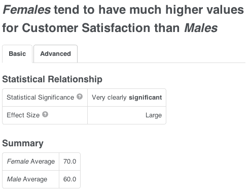
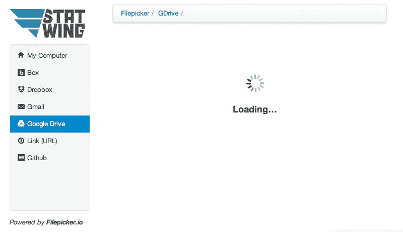

# Statwing 如何让数据问题变得更简单，这样你就不必雇佣统计专家了

> 原文：<https://web.archive.org/web/https://techcrunch.com/2012/08/16/how-statwing-makes-it-easier-to-ask-questions-about-data-so-you-dont-have-to-hire-a-statistical-wizard/>

# Statwing 如何让询问数据问题变得更容易，这样你就不必雇佣统计专家了

如果你曾经尝试过使用 SPSS 软件，你就会知道当你试图做简单的分析时会有多么可怕。SPSS 是为统计学家分析数据集而设计的。但是，即使是统计学家也发现做这样的工作令人恼火，比如制作一个简洁的图表来显示变量之间的关系。

事情是这样的。你雇了一个能帮你做这件事的顾问。这就是为什么拥有 SPSS 的 IBM 的工资单上有数千名分析师。

[Statwing](https://web.archive.org/web/20230316161151/http://statwing.com/) 是一家 Y-Combinator 初创公司，它将晦涩难懂的技术术语翻译成浅显易懂的英语，这样你就可以自己进行数据分析了。

联合创始人格雷格·拉夫林解释说，Statwing 旨在让人们更容易提出有关数据的问题。我同意，但我也认为这项服务有更多的内容。这是接口被抽象化的另一个例子。统计使过去需要对统计有深入了解的人才能做的事情变得更容易。近来我们经常看到这种趋势。做任何数量的任务都不需要专业知识。我可以写这篇博文，然后马上发布。我不需要技术帮助来做到这一点。

在比较 Statwing 和 SPSS 时可以看到这一点。不同之处在于:Statwing 带有可视化、总结句子和简单的英语翻译。像“p 值”这样的技术术语隐藏在高级标签中。

下面是 SPSS 分析的输出:

[")](https://web.archive.org/web/20230316161151/https://techcrunch.com/2012/08/16/how-statwing-makes-it-easier-to-ask-questions-about-data-so-you-dont-have-to-hire-a-statistical-wizard/spss-custsat-output-all-2/)

以下是相同数据的统计输出:

以及附带的文本:

使用这项服务非常简单。你上传格式正确的数据，然后选择不同的变量来查看，如性别和地理位置。数据可以从你的电脑、Google Drive、Dropbox、GMail、网站 URL、GitHub 和 box 上传。

它使用起来非常简单。你选择你想要比较的变量，然后服务给你分析。你可以在这里看到一个演示[。](https://web.archive.org/web/20230316161151/https://www.statwing.com/demo)

Statwing 现在是免费的。最终会转变为免费增值模式。

Statwing 的分析和简单的数据可视化让我想起了 [Tableau](https://web.archive.org/web/20230316161151/http://tableau.com/) 。我喜欢这项服务，因为它能帮助像我这样的人做我以前做不到的分析。

但是 Statwing 并不简单。它需要更多的迭代来更好地解释为什么某个分析不起作用。该公司最大的挑战将来自于扩展该服务可以获取的数据源。随着这些数据源变得越来越复杂，Statwing 将需要继续专注于其核心价值，即帮助像我这样的人，他们不需要学习大量新的技术技能就能找到答案。