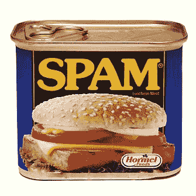
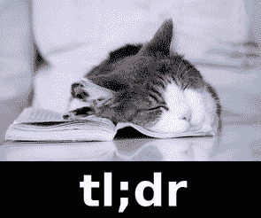

# 为什么没人驯服电子邮件 TechCrunch

> 原文：<https://web.archive.org/web/https://techcrunch.com/2012/08/19/why-no-one-has-tamed-email/>

**简历:** *Gentry Underwood 是一名软件设计师，也是* [*乐团*](https://web.archive.org/web/20221005220704/http://orchestra.com/) *的首席执行官，该公司最近宣布致力于一款名为* [*邮箱*](https://web.archive.org/web/20221005220704/http://mailboxapp.com/) *的移动电子邮件应用。你可以在推特上的* [@gentry](https://web.archive.org/web/20221005220704/http://twitter.com/gentry) *找到他。*

每个人都抱怨电子邮件。我们被这些东西淹没了。我们感觉被淹没了。不知所措。失去控制。

最近有很多关于如何应对的讨论。乔丹·克鲁克[讨厌它](https://web.archive.org/web/20221005220704/https://beta.techcrunch.com/2012/08/05/i-hate-email/)，MG·西格勒[试图戒掉它](https://web.archive.org/web/20221005220704/https://beta.techcrunch.com/2011/07/06/i-wouldnt-say-ive-been-missing-it/)，艾伦·亨利[认为你不能](https://web.archive.org/web/20221005220704/http://lifehacker.com/5932858/how-to-focus-and-stay-productive-when-youre-expected-to-always-be-available)。人们希望 Gmail 加快速度。为了[赶上](https://web.archive.org/web/20221005220704/https://beta.techcrunch.com/2012/07/30/hey-google-i-dont-care-about-hangouts-i-just-want-to-read-my-email/)，或者，某人，任何人，[做出更好的](https://web.archive.org/web/20221005220704/http://pandodaily.com/2012/05/04/is-gomail-the-future-of-email-i-hope-so/) **。虽然每个人似乎都认为电子邮件坏了，但似乎没有人知道如何修复它。**

在 [Orchestra](https://web.archive.org/web/20221005220704/http://mailboxapp.com/) 我们已经[钻研电子邮件“问题”](https://web.archive.org/web/20221005220704/http://blog.orchestra.com/where-orchestra-is-headed)有一段时间了。这是一个众所周知的挑战，但我们学到的很多东西让我们感到惊讶。我想分享一些关于电子邮件是如何损坏的以及如何修复它的见解。

## **电子邮件是如何被破解的**

是什么让电子邮件如此糟糕？原来邮件中的“问题”实际上是几个问题拼凑成的焦虑和痛苦的混合体。正如我的一个前老板常说的，“这是一个真正的便便三明治”(只是他没有用“便便”这个词)。以下是配料:

#### 1.我们收到了太多我们不在乎的电子邮件

对于每一封重要的电子邮件，我们都会收到几封来自我们不想听到的人或服务的邮件。这令人恼火:一盏小灯熄灭，告诉我们有新邮件，当我们看到它时，我们经常想“谁给了你让我注意的钥匙？”

电子邮件是在一个互联网总人口由几百名科学家和工程师组成的时代创建的。那时，垃圾邮件还不在任何人的关注范围内，所以电子邮件地址被设计成一扇敞开的大门，任何人都可以通过。

好消息是，这部分问题基本上已经可以解决了。虽然我们不能强迫别人将我们从他们的抄送名单中删除，但垃圾邮件过滤器这些年来已经变得非常好了。垃圾邮件占所有发送电子邮件的 78%，但是大部分根本不会到达我们这里。剩下的部分可以用多种方式进行解析和打包。Gmail 过滤器是一种简单的方式，像 [SaneBox](https://web.archive.org/web/20221005220704/https://beta.techcrunch.com/tag/sanebox/) 、 [Unroll.me](https://web.archive.org/web/20221005220704/http://unroll.me/) 和 Gmail 的[优先收件箱](https://web.archive.org/web/20221005220704/https://mail.google.com/mail/help/intl/en/priority-inbox.html)这样的服务试图自动推送不太重要的内容。总有退订按钮:花一个小时收集并退订所有你实际上不读的垃圾——它将改变你的生活。

#### 2.许多电子邮件又长又复杂

即使你清除了垃圾邮件，我们收件箱中的许多重要邮件也很难消化。有时发送者只需要抓住要点，有时他们应该使用完全不同的媒介。

我们都在变得越来越简洁。在过去，我们只能把电子邮件比作实体信件。今天，我们互相发送即时消息、文本、推文和其他简短的交流方式。越来越多的人理解短信的价值，这开始改变我们关于社会认可的通信规则。

但这种转变需要时间，我们在这个问题上无能为力。当公司试图用更切中要害的东西彻底取代电子邮件时(想到了谷歌浪潮和 T2 快捷邮件)，他们面临着网络效应的负面影响:如果你的解决方案要求其他所有人也进行转换，你最好忘记它。

*能做的是*让小团体承诺在特定环境下使用电子邮件以外的东西。例如，Asana 旨在取代工作组中与项目相关的电子邮件通信。在 [Orchestra](https://web.archive.org/web/20221005220704/http://www.orchestra.com/) ，我们最活跃的用户中有许多是夫妇，他们不想让彼此的收件箱塞满家务杂事。像这样的工具可以极大地帮助减少电子邮件，但是除了电子邮件之外，它们必须存在。他们无法取代它。

#### 3.大多数电子邮件客户端都很糟糕

总的来说，我们用来“处理”电子邮件的工具并不能很好地帮助我们。这有许多原因:

当组织同样重要时，它们是为沟通而设计的。今天的工具所反映的古代客户是为交流而设计的。虽然沟通显然很重要，但这只是其中的一部分。我们的收件箱也起到了(可怕的)待办事项列表的作用。我们每个人都有任务困在收件箱里，但这是一个组织混乱。结果，我们的收件箱感觉混乱不堪，不堪重负，产生焦虑而不是控制。

他们太慢了。我们收到大量电子邮件，但我们的工作流程往往很笨拙。处理一条消息可能要花很长时间，一点点的延迟很快就会累积起来。经常有隐藏的快捷键和电源功能，但大多数用户并不知道。这是基本的交互设计，这里有大量的机会。

**它们是桌面时代的遗物。**我们口袋里的移动电脑[正在改变一切](https://web.archive.org/web/20221005220704/https://beta.techcrunch.com/2012/08/05/computer-walk-with-me/)。然而，大多数移动电子邮件客户端实际上是桌面版的狭窄版本，很少利用移动设备的优势。我们可以利用这些新发现的奇迹，让我们前所未有地控制我们的收件箱，但这样做的工具尚未被设计和创造出来。

## **改进的机会**

在处理[邮箱](https://web.archive.org/web/20221005220704/http://mailboxapp.com/)的时候，我们开始相信大多数改进电子邮件的机会来自于重新思考收件箱。这种方法可以让你彻底改变电子邮件的体验，而不用试图颠覆电子邮件本身。正如 MG 西格勒最近写的那样，“这不是要取代电子邮件。一次又一次的尝试失败了又失败了。这是关于改变我们看待电子邮件的方式。”

新的收件箱，尤其是利用智能手机的收件箱，也可以成为解决其他电子邮件相关问题的门户。更好的界面可以鼓励我们抓住要点。更智能的工具可以帮助我们快速确定未来过滤的候选对象。收件箱是与电子邮件建立新关系的关键。

## **资格的高门槛**

【T2

少数其他公司也对收件箱得出了同样的结论，最著名的是[麻雀](https://web.archive.org/web/20221005220704/http://sprw.me/)、[流畅](https://web.archive.org/web/20221005220704/http://fluent.io/)、[仪式](https://web.archive.org/web/20221005220704/http://www.ritual.io/)、[邮件导航](https://web.archive.org/web/20221005220704/http://www.kickstarter.com/projects/1380180715/mail-pilot-email-reimagined)、[邮箱](https://web.archive.org/web/20221005220704/http://www.postbox-inc.com/)和[。邮件](https://web.archive.org/web/20221005220704/http://www.vanschneider.com/work/mail/)。然而，考虑到如此巨大的市场，竞争者的总数却少得惊人。有些玩家最近[关门了](https://web.archive.org/web/20221005220704/https://beta.techcrunch.com/2012/08/08/heres-what-happened-at-fluent/)或者[被收购了](https://web.archive.org/web/20221005220704/https://beta.techcrunch.com/2012/07/20/google-acquires-iosmac-email-client-sparrow/)，而其他人真的比[早期概念](https://web.archive.org/web/20221005220704/https://vanschneider.squarespace.com/mail-progress)多不了多少。

如果有这么多的机会，为什么很少有人真正尝试重新思考收件箱呢？尽管这个工具很熟悉，但是使用电子邮件真的非常非常困难。

**一个技术难题:**大规模处理电子邮件意味着必须管理大量数据，同时还要与古老的协议和似乎永无止境的边缘案例进行交互。麻雀团队[花了将近 10 年时间](https://web.archive.org/web/20221005220704/http://www.theverge.com/2012/8/17/3247680/sparrow-fades-where-are-mac-mail-apps)开发麻雀的电子邮件引擎。Gmail 团队最近才开始在 iOS 上为来自他们自己服务的邮件提供移动推送通知。对于[邮箱](https://web.archive.org/web/20221005220704/http://mailboxapp.com/)，我们估计每 100，000 名用户在高峰时段每秒需要处理数百条消息。这些都是艰巨的挑战。

一个设计难题:从事电子邮件客户端工作的设计师面临一个难题:产品的好处必须足以激励人们尝试一种新工具，同时界面需要熟悉和直观。改变是艰难的，即使现状行不通。一个成功的设计将尽可能地降低采用门槛，同时在整体体验方面仍然提供巨大的好处。这不是一件容易的事。

一个棘手的商业问题:不管有多少人使用电子邮件，在这个领域赚钱都具有挑战性。对于一个创业公司来说，要建立一个成功的企业，它必须提供比用户可以免费获得的东西好得多的东西，而这需要时间去创造。竞争者需要跑道，最好是大量的跑道，但许多投资者害怕这个空间。例如，融资挑战是 Fluent 关闭的核心。

## **要么做大，要么回家**

如果建立更好的电子邮件体验如此困难，为什么还要尝试呢？因为这是一个影响我们所有人的现实问题。我们都使用电子邮件，但很少有人喜欢我们使用它的方式。现在正是时候:这个[新的移动时代](https://web.archive.org/web/20221005220704/https://beta.techcrunch.com/2012/08/05/computer-walk-with-me/)创造了大量的机会，将电子邮件的体验转变为快速和愉快的事情。

我们相信，重新思考收件箱是一个巨大的机遇和令人畏惧的挑战，这是唯一值得 T4 付出血汗和眼泪的事情，这是一家初创公司起步所需要的，也许有一天会在宇宙中留下印记。