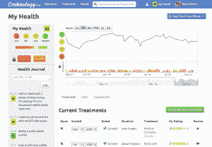

# YC 初创公司 Healthy Labs 希望成为慢性病患者的首选网站

> 原文：<https://web.archive.org/web/https://techcrunch.com/2012/08/20/yc-startup-healthy-labs-wants-to-be-the-go-to-site-for-people-living-with-chronic-illness/>

近年来，人们可以在精心设计的网站上从经过审查的个人那里找到可靠的信息，这些网站专注于许多主题。想知道在 Zynga 最近股价下跌期间，作为 Zynga 的一名员工是什么感觉吗？Quora [支持你](https://web.archive.org/web/20230316161448/http://www.quora.com/Zynga-Stock-Price-Collapse-Summer-2012/How-do-Zynga-employees-feel-about-the-companys-summer-2012-stock-price-drop/answers/1438212)。想了解一下获得绿卡的法律流程？[检查 Avvo](https://web.archive.org/web/20230316161448/http://www.avvo.com/legal-guides/renewing-green-card) 。如何向媒体发布创业建议？带[去看看分公司](https://web.archive.org/web/20230316161448/http://branch.com/b/launch-press)。

但当涉及到对被诊断患有慢性疾病的人的建议和支持时，事情就没那么容易了。人们分享技巧、治疗经验和支持的主要场所被归入了似乎停留在 20 世纪 90 年代和早期的那种回答网站和网络论坛。

[Healthy Labs](https://web.archive.org/web/20230316161448/http://www.healthylabs.com/) ，一家在当前一批 [Y Combinator](https://web.archive.org/web/20230316161448/http://www.crunchbase.com/company/y-combinator) 初创公司中孵化的新公司，希望填补这一空白，成为慢性病患者的必去之地。Sean Ahrens 和 Will Cole 是由他们在加州大学伯克利分校学习计算机科学时相遇的 Sean Ahrens 和 Will Cole 共同创建的，Healthy Labs 本月首次推出了测试版的 Crohnology，本质上是一个针对克罗恩病和结肠炎患者的社交网络。

这是一个小众游戏，但它是一个大游戏:克罗恩病和结肠炎本身仅在美国就折磨着 150 万人，在世界范围内约有 500 万人。这类问题的本质是，它们的影响是非常个人化的，就像对治疗的反应一样——对一个人有效的可能对另一个人无效。所以传统医学还没有找到治疗这些疾病的方法。但是，有一个很大的集体分享、比较和对比的元素，尤其是在网上，可以帮助个人发现什么样的治疗和维护方案可能对他们有效。

作物学简介(点击放大)

关于健康实验室和 Crohnology 的一个关键问题是，它正在建立一个只针对患者的网络——人们必须被证实确实被诊断出患有相关疾病，然后才能加入。这意味着不让人们购买药物和某些整体“治疗”，并让社区以正在处理身边慢性病的真实人群为中心。

Crohnology 允许人们使用只有他们才能访问的分析工具私下监控他们的个人进展，并通过他们更广泛可见的网站资料显示他们对治疗的反应的更一般的更新。但是，由于隐私是分享医疗状况的关键，健康实验室网站上的任何内容都不会在搜索引擎中被索引，也不会被那些没有经过验证的帐户的人看到。

目前，Healthy Labs 只运行克罗恩病，其团队仅由三人组成:阿伦斯(12 岁时被诊断患有克罗恩病)、科尔和另一位名叫莎拉·布拉农的开发人员。但仅 Crohnology 一项的反响就很显著:自从该网站向公众推出测试版以来，大约一周内就有 1400 名成员加入了该网站，科尔告诉我，他们收到的反馈令人难以置信地鼓舞人心。

他们希望推出的下一个垂直领域是处理自身免疫疾病，如多发性硬化症和囊性纤维化。

这里可能的创收选择很明显——制药业在赚钱方面毫不逊色——但健康实验室的联合创始人威尔·科尔告诉我，他们在考虑货币化时会非常小心。科尔承认，Healthy Labs 可能有机会在希望对新药进行有针对性的临床试验的公司和愿意参与这些试验的人之间充当中介——但关键是，这将是一个完全选择加入的系统，它将使网站的用户受益，如果不是比制药公司更多，也是一样多。

总而言之，作为一家刚刚成立的初创公司，该公司是一个不考虑创收的公司。但这似乎是一个非常认真的事业，有一个巨大的目标市场，在一个潜在有利可图的空间。未来几个月，健康的实验室肯定会受到关注。