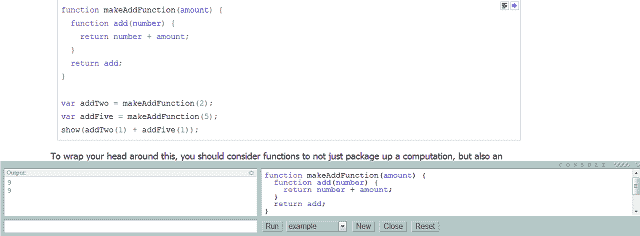
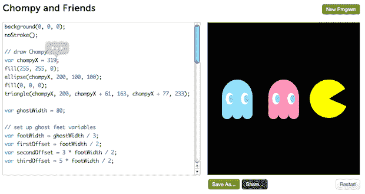
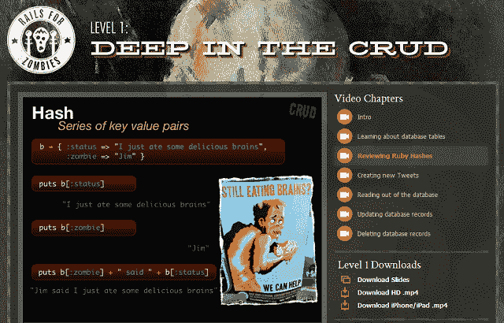
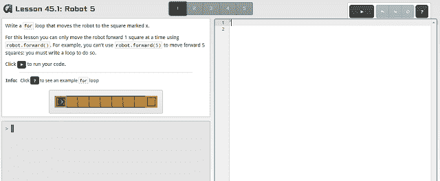

# 从自己的浏览器中轻松学习代码的 5 种方法 TechCrunch

> 原文：<https://web.archive.org/web/https://techcrunch.com/2012/08/21/5-ways-to-learn-code-from-the-comfort-of-your-own-browser/>

过去几年的一个大趋势是浏览器内编程教程的兴起，这刺激了对程序员日益增长的需求。在动手编写一点代码之前，您必须购买一本书并配置一个开发环境的日子已经一去不复返了。

也许你想在你的工作计算机上开始学习，但是没有权限安装一个编程环境。也可能你想马上开始，不想处理订购书籍或安装软件。无论你的动机是什么，这里有五个地方可以让你的浏览器马上开始使用。

## 1.雄辩的 JavaScript

[雄辩的 JavaScript](https://web.archive.org/web/20230204060553/http://eloquentjavascript.net/) 实际上是一本计算机科学书籍，但它可以在网上免费获得。网络版包含可以在浏览器中完成的交互式课程。你只需要在一个小盒子里输入你的代码，页面就会运行它。如果你是一个想要了解计算机科学的初学者，这是一个很好的资源，但是这些课程不能立即应用。如果您只是想学习足够的 JavaScript 来立即开始编程，这可能会令人沮丧，但对于更深入的理解来说更好。

## 2.代码集

我们之前已经多次报道过 [Codecademy](https://web.archive.org/web/20230204060553/http://www.codecademy.com/) 及其将代码素养带给大众的使命。例如，这里是我们对该公司在其剧目中增加 Python 课程的报道。它还提供 JavaScript、HTML 和 CSS。Codecademy 也被 [批评](https://web.archive.org/web/20230204060553/http://www.hackeducation.com/2011/10/28/codecademy-and-the-future-of-not-learning-to-code/)提出的概念课程不能立即适用于现实世界的问题，但该团队一直在采取措施改进。

## 3.可汗学院

上周可汗学院修改了它的[计算机科学版块](https://web.archive.org/web/20230204060553/http://www.khanacademy.org/cs)，增加了一套浏览器内的 JavaScript 教程。与这里提到的其他教程不同，可汗学院的课程侧重于创建图形和动画。他们使用为多媒体艺术家设计的[处理](https://web.archive.org/web/20230204060553/http://processing.org/)编程语言的 [JavaScript 实现](https://web.archive.org/web/20230204060553/http://processingjs.org/)。这些课程可能不会立即适用于试图学习面向业务的前端开发的人，但如果你想制作艺术或游戏，这是一个很好的起点。

## 4.代码学校

“代码学校”提供免费和付费的浏览器课程，其中许多是针对更有成就的程序员的。但它也有一个关于 JavaScript 库 jQuery 的免费课程，声称包含“刚好足够”的 JavaScript，可以立即开始使用 jQuery。如果你是一个网页设计师，想拓展你的技能，这可能是一个不错的起点。

其他课程涵盖 Git、CSS、Ruby on Rails、Node.js 等。

课程包括视频，随后是互动练习，以及艺术作品和主题。上面显示了 Ruby on Rails 的入门课程“僵尸的 Rails”。

## 5.代码复仇者联盟

[代码复仇者联盟](https://web.archive.org/web/20230204060553/http://www.codeavengers.com/)让我想起了很多代码学校在浏览器课程中的高度风格化，但艺术含量较少，也没有视频。它目前提供三个教程:JavaScript 1 级、JavaScript 2 级和 HTML/CSS。

尽管它在计算机科学教育网站上得到了[普遍积极的](https://web.archive.org/web/20230204060553/http://codingatschool.com/review-code-avengers/)评论，但我同意丽贝卡·海姆斯的观点，她写道 JavaScript 课程似乎不太实用。

## 奖金 1:程序员

我们在之前已经[介绍过的](https://web.archive.org/web/20230204060553/https://techcrunch.com/2012/04/06/learning-to-code-apps-programr-the-codecademy-for-higher-level-languages-adds-support-for-android/) [Programr](https://web.archive.org/web/20230204060553/http://www.programr.com/) ，并没有提供很多浏览器内的课程(虽然有一些)，但是它提供了一个基于浏览器的空间，可以在浏览器内学习和尝试不同的语言，而不需要安装编程语言和开发环境。这并不是唯一的基于浏览器的开发环境——像 [Cloud9 IDE](https://web.archive.org/web/20230204060553/https://c9.io/) 和 [Action](https://web.archive.org/web/20230204060553/https://www.action.io/) 这样的公司也在让从网络为网络开发成为可能。但是 Programr 专注于学习和实验。

## 好处 2:试试 Ruby

TryRuby 是一个基于 web 的 Ruby 教程，由著名的 [why a lucky stiff](https://web.archive.org/web/20230204060553/http://www.slate.com/articles/technology/technology/2012/03/ruby_ruby_on_rails_and__why_the_disappearance_of_one_of_the_world_s_most_beloved_computer_programmers_.single.html) 和~~创建，现在由 Andrew McElroy~~ 维护，现在由 Code School 维护。这是有史以来第一个浏览器编码教程。几年前我尝试的时候发现它有点问题(尽管显然 ~~McElroy~~ Code School 从那以后已经更新了)，它已经被跨平台桌面应用 [Hackety Hack](https://web.archive.org/web/20230204060553/http://hackety.com/) 取代。