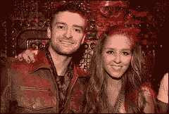
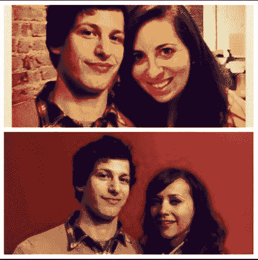

# 天才的霍恩斯坦女士:@Shirls 如何愚弄硅谷

> 原文：<https://web.archive.org/web/https://techcrunch.com/2012/08/28/talented-shirley-hornstein/>

硅谷到处都是骗子，这通常是件好事。但欺骗和彻头彻尾的撒谎是有区别的，当人们一家接一家地欺骗公司时，是时候揭穿他们了。

所以:如果你在网上搜索雪莉·霍恩斯坦，你可能会认为她是科技界人脉最广的人之一。[这是她上个月在 THRIVEGulu 派对上的照片](https://web.archive.org/web/20221205105804/http://bub.blicio.us/eliza-dushku-joss-whedon-thrivegulu-photos/)，在那里硅谷人有机会见到好莱坞极客英雄乔斯·韦登和艾丽莎·杜什库。[这是她在嘎吱嘎吱嘎吱的嘎吱嘎吱声](https://web.archive.org/web/20221205105804/http://www.businessinsider.com/check-out-silicon-valleys-top-startups-celebrate-their-brightest-stars-2012-2#you-can-already-find-a-bunch-of-silicon-valleys-entrepreneurs-heres-former-mashable-writer-ben-parr-silicon-valley-entrepreneur-shirley-hornstein-spencer-chen-at-clipsync-and-a-few-others-2)。在这里，她是风险投资和天使投资领域的顶级女性之一(这份名单在《福布斯》杂志上再次发表)。

然而，当涉及到霍恩斯坦时，很难区分什么是真的，什么是假的。看看这篇文章顶部的照片——这是我在脸书与她联系时看到的第一批照片之一。看起来她一定是贾斯汀·汀布莱克最好的朋友，对吗？除了它几乎可以肯定是一个 PS 过的赝品，正如你可以从下面的[原始照片](https://web.archive.org/web/20221205105804/http://www.justintimberlake.com/news/esmee_kicks_off_her_european_tour)中看到的，那是我们通过谷歌找到的。在这篇文章中，你可以看到更多霍恩斯坦精通 Photoshop 的例子。

她不仅声称与大名人有联系。一年多前我第一次见到她时，她一直在谈论她与肖恩·帕克和[创始人基金](https://web.archive.org/web/20221205105804/http://www.foundersfund.com/)的关系——尽管我不认为我曾经明确她在公司的确切角色。看来我不是唯一被她说服的人。事实上，创始人基金采取法律行动阻止她声称她为他们工作。你可以在下面阅读他们的完整投诉，但这里有一个报价:

> 不迟于 2011 年 7 月开始。Hornstein 女士参与了一种行为模式，包括作出虚假和误导性的书面和口头陈述，旨在欺骗潜在的商业伙伴和雇主，使他们相信她与 Founders Fund 及其合作伙伴有着以前和/或现在的业务和雇佣关系。事实上，霍恩斯坦女士现在不是，也从来不是创始人基金的员工或商业伙伴，或者创始人基金的任何合伙人或高管。

作为一个例子，Founders Fund 提到了发表在 Women 2.0 网站上的一篇博客文章，Hornstein 说她“有与许多硅谷公司合作的经验，包括 iMeem、Nitro PDF、Dropbox 和 Founders Fund。”(该帖子已被删除，原因不明，但你可以[在此](https://web.archive.org/web/20221205105804/http://webcache.googleusercontent.com/search?q=cache:_QNjoj4WYQ8J:stage.women2.com/learn-to-become-an-angel-investor-from-googles-marissa-mayer/+&cd=3&hl=en&ct=clnk&gl=us)阅读存档副本。诉状称:“那份陈述是虚假的。”。

诉状还称，“2011 年 9 月 16 日，霍恩斯坦女士在一封发给一家大型创业网络公司的电子邮件中，再次声称自己在 Founders Fund 工作。这种说法同样是错误的。”

哦，投诉中没有提到这一点，但我也被告知，霍恩斯坦不知何故带着创始人基金徽章参加了 Disrupt。

当 Hornstein 听说我正在写这篇文章时，她给我的编辑发了电子邮件，暗示有很多关于她的虚假谣言在流传。这可能是真的，你也不应该把法律投诉中的一切都当成客观事实。但是我和很多人谈过他们和霍恩斯坦的个人和职业经历，嗯,“谎言之网”这句话反复出现。(不管怎样，[她似乎没有对创始人基金的主张](https://web.archive.org/web/20221205105804/http://webaccess.sftc.org/Scripts/Magic94/mgrqispi94.dll)提出异议，事实上该公司已经申请了缺席判决。)

匿名的个人抱怨(每个人都坚持我不使用他们的名字)可能至少应该带着一点怀疑的态度来看待，但是当每个人告诉我他们的故事时，每个人都遵循一些非常相似的模式。当他们第一次见到霍恩斯坦时，她说出了很多名字，声称自己与名人和硅谷大腕关系密切。(举个例子:她说她是 Dropbox 的第一批天使投资人之一，帮助他们进入 Y Combinator。)她会想方设法介入每家公司，承诺介绍和会见上述名人和大人物。然后，如果她没有很快被发现说谎，这场猜谜游戏可能会持续一段时间，尽管人们对她的名人 Instagram feed 和她为什么不能交付的借口有所怀疑。直到最后有一个谎言大到无法维持，一切都崩溃了。有时这只是令人尴尬，在其他情况下，声誉或交易被欺骗所损害。

我的一个消息来源告诉我:“如果没有别的，我已经学到了一个宝贵的人生教训——不要相信任何人，直到他们交付。”

在过去一年左右的时间里，霍恩斯坦似乎已经参与了包括 Zaarly、Giftiki 和 Postmates 在内的初创公司的一些工作。我很确定还有更多，但这些是她过去和我讨论过的，或者我在网上看到她提到的。很难给出一个准确的时间顺序，因为我联系过的大多数公司都拒绝置评(扎尔利证实她在 2011 年做过几个月的顾问)，霍恩斯坦在 LinkedIn 上的个人资料也很少。

今天早上我也给 Hornstein 发了邮件，讨论了这篇文章的细节，但是我还没有收到回复。

现在，重提对一个似乎不在大型初创公司或风险投资公司工作的人的指控可能看起来很卑鄙，尤其是在[二月](https://web.archive.org/web/20221205105804/http://twitter.com/Shirls/status/170371806434304000)的这条隐晦但懊悔的推文的背景下:“我明白因果报应，我做了一些愚蠢的事情，现在我正在为此付出代价，但我得到了教训。我真的做到了。请不要再折磨我了？:-(“听着，雪莉·霍恩斯坦从来没有对我做过什么坏事。除了，你知道，撒谎。听起来她在山谷里已经做了很多，似乎是时候公开了——在其他天真的灵魂接受她的朋友请求之前。

**更新:**正如[最近在 Betabeat 上发表的一篇文章](https://web.archive.org/web/20221205105804/http://betabeat.com/2012/08/shirley-hornstein-shirls-credit-card-fraud-records/)(这篇文章对霍恩斯坦的行为提出了更多、更详细的指控)所指出的，TechCrunch 社区经理艾琳·布莱瑟纳在 2011 年末曾是她的室友，时间大约为六个月。我们最初把她排除在外是为了保护霍恩斯坦的受害者。我和 Elin 谈过这个故事，但她不是这篇文章的动力，也不是我在这个故事中描述的经历的来源之一。(我专门为这个职位面试了五个人，尽管还有一些其他的非正式谈话。自从它被上传后，我收到了人们描述类似经历的邮件，还有一些评论，你可以在下面看到。)

[创始人基金诉霍恩斯坦](https://web.archive.org/web/20221205105804/http://www.scribd.com/doc/104211716/Founders-Fund-v-Hornstein "View Founders Fund v. Hornstein on Scribd")