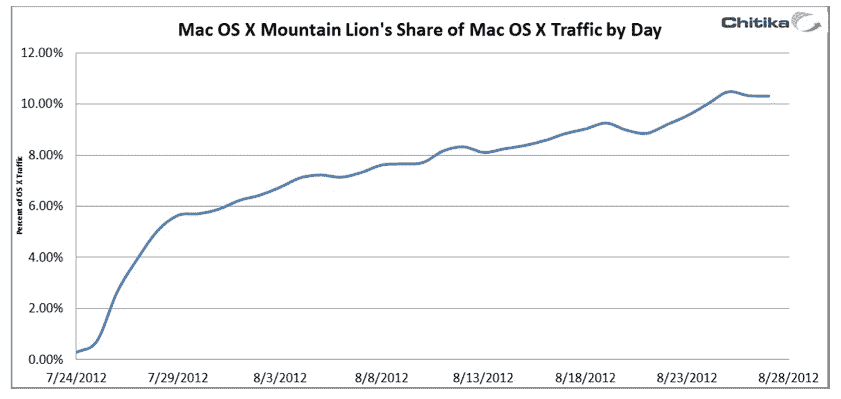
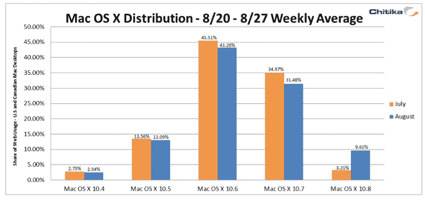

# 报告:推出一个月后，Mountain Lion 现在为超过 10%的 MAC 电脑提供支持 TechCrunch

> 原文：<https://web.archive.org/web/https://techcrunch.com/2012/08/30/report-one-month-after-launch-mountain-lion-now-powers-more-than-10-of-macs/>

# 报告:推出一个月后，Mountain Lion 现在支持超过 10%的 MAC 电脑

[山狮](https://web.archive.org/web/20230127141211/http://www.apple.com/osx/)，苹果 OS X 桌面操作系统的最新版本，[在一个多月前发布了](https://web.archive.org/web/20230127141211/https://techcrunch.com/2012/07/25/os-x-mountain-lion-review/)，根据[来自](https://web.archive.org/web/20230127141211/http://insights.chitika.com/2012/mountain-lion-adoption-update)[广告网络 Chitika](https://web.archive.org/web/20230127141211/http://chitika.com/) 的最新数据，它已经在超过 10%的 MAC 电脑上运行。在发布后安装量明显飙升之后——该操作系统在发布后 48 小时就已经在 3.2%的 MAC 上运行了——Mountain Lion 在 Chitika 合作伙伴网络的网络流量份额继续稳步增长，甚至一个月后也没有下降的迹象。

Chitika 表示，Mountain Lion 的采用率有望超过其前身 OS X 狮。Lion 花了三个月的时间才达到公司网络上 OS X 总流量的 14%。当然，Mountain Lion 的增长有可能在未来两个月内保持平稳，但如果目前的势头继续下去，新操作系统将在未来三周内超过 14%。与 Lion 相比，Mountain Lion 的评论通常更积极，正如 Chitika 的分析师指出的那样，新的大量新功能使新操作系统感觉更像是一次真正的升级，而不是从雪豹升级到 Lion。

至于 OS X 的总体情况，雪豹(OS X 10.6)继续占据主导地位，占 Chitika 网络所有流量的 43%以上，其次是 Lion (31.5%)和 Leopard (13%)。顺便说一下，在 TechCrunch 的读者中,《山狮》已经占据了 30%的流量,《山狮》仍然是我们读者中最受欢迎的《OS X》版本(41%),只有 25%的读者还在使用《雪豹》。

