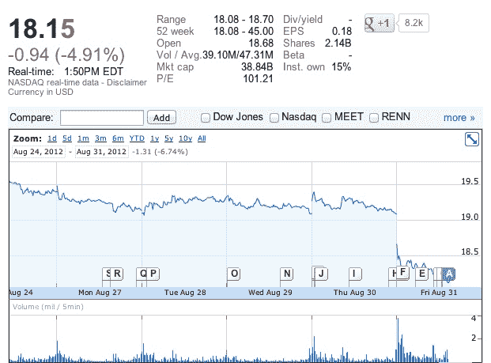

# 脸书股票创下新低，自首次公开募股以来下跌超过 50%

> 原文：<https://web.archive.org/web/https://techcrunch.com/2012/08/31/facebook-stock-hits-a-new-low-now-down-more-than-50-since-ipo/>

# 脸书股票创下新低，自首次公开募股以来下跌超过 50%

脸书的股票刚刚创下新低，自这家社交网络公司 5 月份首次公开募股以来，已经损失了超过 50%的价值。在分析师 BMO 资本市场[将该公司股票的价格估计从 25 美元下调至 15 美元后，股价创下新低。研究公司 eMarketer 也刚刚](https://web.archive.org/web/20221205202400/http://www.bloomberg.com/news/2012-08-31/facebook-drops-on-advertising-sales-growth-concern-at-bmo.html)[宣布](https://web.archive.org/web/20221205202400/http://www.emarketer.com/Article.aspx?R=1009314)预计脸书今年的收入将保持在公司之前的估计之下。eMarkteter 现在预测脸书 2012 年的广告收入将达到 42.3 亿美元。这比 2011 年增长了 34%，但 eMarkter 此前估计，脸书今年的广告收入可能高达 50 亿美元。

8 月 16 日，早期投资者终于有机会出售股票，脸书的股票在本月早些时候已经跌至新低。不过，当时脸书的股票价值仍超过 19.60 美元。今天，该股徘徊在 18.15 美元左右。该公司股票的首次公开发行价格为 38 美元。

值得注意的是，虽然上一个禁售期的到期已经给该股带来了很大压力，但在 11 月中旬下一个禁售期到期时，将有更多股票可供交易。MarketWatch 的丹·加拉格尔指出，8 月中旬有 2.71 亿股股票发行，但 11 月中旬可能会有 12 亿股上市，这可能会给股价带来更大的压力。

*那么，脸书应该怎么做呢？读读乔希·康斯坦丁的思想:[坚持到底，脸书。即使你的股价暴跌](https://web.archive.org/web/20221205202400/https://beta.techcrunch.com/2012/08/16/user-experience-user-experience-user-experience/)*