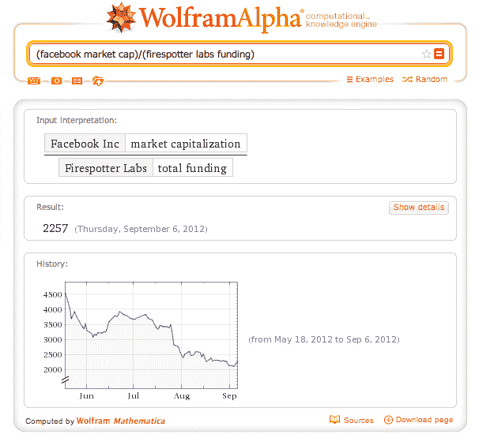

# Wolfram Alpha 使 CrunchBase 数据可计算，正好适用于 Disrupt SF TechCrunch

> 原文：<https://web.archive.org/web/https://techcrunch.com/2012/09/07/wolfram-alpha-makes-crunchbase-data-computable-just-in-time-for-disrupt/>

# Wolfram Alpha 使 CrunchBase 数据可计算，正好赶上 Disrupt SF

如果你打算密切关注[扰乱三藩市](https://web.archive.org/web/20230210113936/https://techcrunch.com/events/disrupt-sf-2012/)，Wolfram Alpha 刚刚宣布了一个有用的新功能。它的计算引擎中加入了[的](https://web.archive.org/web/20230210113936/http://blog.wolframalpha.com/2012/09/07/making-crunchbase-computable-with-wolframalpha/) [CrunchBase](crunchbase.com) 数据。你现在可以了解更多关于一个特定的启动，比较他们或做任何其他计算与其他 Wolfram 阿尔法数据。

将 CrunchBase 添加到其数据源是 Wolfram Alpha 不断努力使一切都可以计算的一部分。通常，科学数据是第一位的，但该公司在 8 月份宣布了脸书的个人分析报告，现在是 CrunchBase 整合。

CrunchBase 将完成搜索结果中关于私营公司的信息。这些天来，他们专注于科技初创公司，这就是为什么他们选择使用 TechCrunch 的数据库和 API。集成的算法部分仍然需要一些微调。

他们首先关注之前的 Disrupt 决赛选手。例如，你现在可以比较一下 Ark、DataSift 和 Firespotter Labs 的融资历史——[的开发者 Disrupt NYC 2012 的获奖服务 UberConference](https://web.archive.org/web/20230210113936/https://techcrunch.com/2012/05/23/uberconference-wins-techcrunch-disrupt-nyc/) 。你可以用 Wolfram Alpha 中的宏观经济数据或任何其他数据来想象任何类型的计算。例如，[脸书市值是费尔斯波特实验室资金的 2257 倍——但是这个数字正在慢慢下降。](https://web.archive.org/web/20230210113936/http://www.wolframalpha.com/input/?i=%28facebook+market+cap%29%2F%28firespotter+labs+funding%29)

最后，这里是 C. Alan Joyce 在 Wolfram Alpha 的博客上的几句话:“祝今年的参赛者好运！如果我们还没有覆盖它们，我们会在会议结束后尽快让它们进入 Wolfram|Alpha。”

