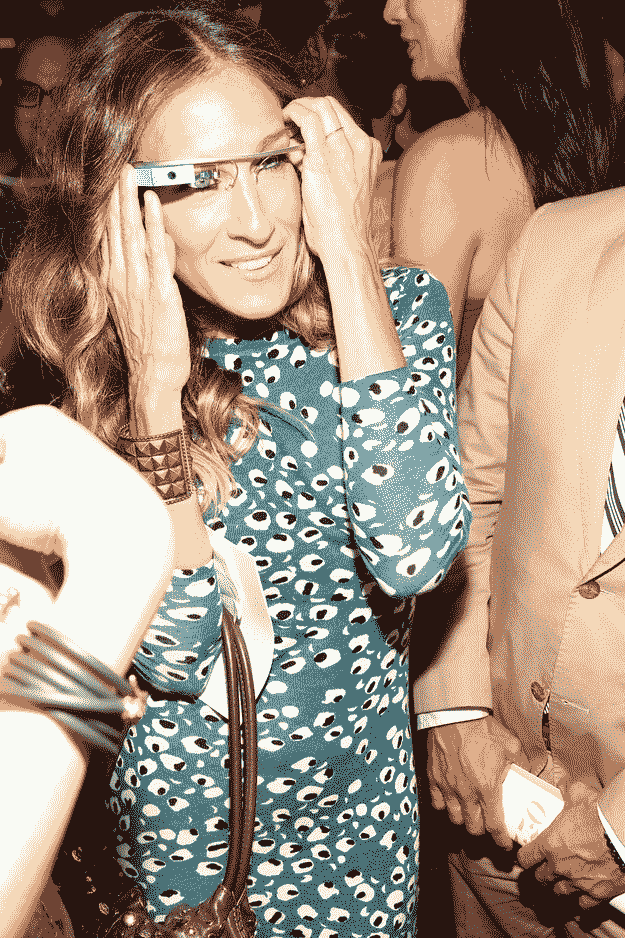

# 黛安·冯·芙丝汀宝模特在时装秀上戴谷歌眼镜

> 原文：<https://web.archive.org/web/https://techcrunch.com/2012/09/10/diane-von-furstenberg-models-wear-google-glass-on-the-catwalk/>

# 黛安·冯·芙丝汀宝模特在 t 台上戴着谷歌眼镜

我们曾与纽约时尚社区讨论，在我们运营 [Disrupt](https://web.archive.org/web/20230301174742/https://techcrunch.com/tag/Disrupt) 期间，将纽约时装周推迟几天，但他们就是不听。更重要的是，谢尔盖·布林和谷歌送了一堆谷歌[眼镜](https://web.archive.org/web/20230301174742/https://techcrunch.com/tag/Glass)给[黛安·冯·芙丝汀宝](https://web.archive.org/web/20230301174742/http://www.dvf.com/)(一个著名的设计师)，后者用一些在 nerdosphere 最受欢迎的技术装备了她的游戏装备。

莎拉·杰西卡·帕克也试穿了。

很明显，谷歌认为这些谷歌眼镜可能会受到全世界的冷遇，这是鼓励人们至少给他们一个公平待遇的外联努力之一。我担心这类展览会让眼镜成为今年的必备配件，太空时代的互联网眼镜会取代蓝牙耳机成为下一个十年的冲洗设备。

也不全是坏事。毕竟，它将使大众的虚拟现实民主化，这是非常令人惊讶的。正如新[博客 Mote 和 Beam](https://web.archive.org/web/20230301174742/http://moteandbeam.net/) 的乔尔·约翰逊所说，“我不讨厌它？作为一个噱头，它只会起一次作用。但不会过度分散注意力。”

[通过 Buzzfeed](https://web.archive.org/web/20230301174742/http://www.buzzfeed.com/amyodell/well-heres-one-way-to-make-google-glasses-less-go)