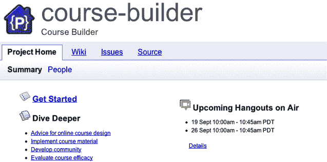

# 谷歌推出开放课程生成器 TechCrunch

> 原文：<https://web.archive.org/web/https://techcrunch.com/2012/09/11/google-launches-open-course-builder/>

# 谷歌推出开放课程生成器

谷歌[为越来越多的中小学和知名大学开发在线课程推出了开源课程建设](https://web.archive.org/web/20221006061519/http://googleresearch.blogspot.com/2012/09/helping-world-to-teach.html)网络应用。准系统网站是一个轻量级的在线课程材料、跟踪学生参与度(通过网络流量和调查)以及评估表现的方式。“我们想利用这次发布来表明谷歌相信它可以为教育领域的技术做出贡献，”谷歌的研究总监 Peter Norvig 说。

【YouTube http://www.youtube.com/watch?v=GAY5ICoVnA8]

Course-builder 来自一个实验性的谷歌课程“用谷歌进行搜索的能力”[，该课程面向全国各地的学校，向学生介绍谷歌在线研究的更高级功能。Norvig 说，寻找力量的课程“取得了巨大的成功，也产生了一些我们认为有助于与世界分享的技术”。“我们认为，通过分享我们生成的代码，我们可以影响教育领域的更多人。在这一点上，业界正在进行许多实验，我们认为贡献一个开源项目将是一个有益的起点，可以帮助每个人。”](https://web.archive.org/web/20221006061519/http://www.powersearchingwithgoogle.com/)

谷歌希望知名大学，如斯坦福大学和麻省理工学院，已经开始将他们的课程免费放到网上。

有许多网站，如 Udemy，长期以来一直为个人用户提供服务，让他们创建自己的课程(并获得报酬)。然而，大学正在寻找内部解决方案，一个通用的代码库来开发定制课程可能会有所帮助。