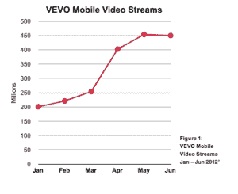
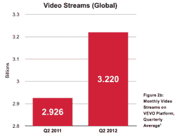

# VEVO:去年全球观看了 400 万个视频，Q2 的移动流量翻了一番，达到 13 亿个视频流 TechCrunch

> 原文：<https://web.archive.org/web/https://techcrunch.com/2012/09/11/vevo-mobile-traffic/>

# VEVO:去年全球观看了 400 万个视频，Q2 的移动流量翻了一番，达到 13 亿次

早在 3 月份， [VEVO 推出了一个巨大的新设计](https://web.archive.org/web/20221210034940/https://beta.techcrunch.com/2012/03/09/the-new-vevo-music-video-giant-adds-personalization-facebook-playlists-continuous-play/)，这个大唱片公司旗下的音乐视频巨头增加了连续播放功能，并增强了其个性化和社交功能。得益于与脸书的 Open Graph 的紧密集成， [VEVO 很快看到通过社交网络观看和分享的视频数量大幅增加](https://web.archive.org/web/20221210034940/https://beta.techcrunch.com/2012/05/23/vevo-facebook-traffic/)。与此同时，该公司一直在大力推进移动应用，最近[开始在](https://web.archive.org/web/20221210034940/https://beta.techcrunch.com/2012/09/07/vevo-ipad-app/)重新设计的移动应用中推出新功能。

事实上，移动仍然是 VEVO 增长最快的平台，该公司今天在其 [Q2 收视率报告](https://web.archive.org/web/20221210034940/https://sparkpr.box.com/s/vmyqedphfpb6xnev0pj9)中表示，迄今为止，已有 1800 万个移动和平板电脑应用程序下载，比 2011 年 Q2 增长了 146%。

 根据该报告，VEVO 最受欢迎的移动平台是 iOS，其在 2012 年 Q2 的移动流量比去年同期增长了近一倍，全球流量超过 13 亿次。与此同时，VEVO 6 月份全球移动视频流量为 4.5 亿。

与 2011 年 6 月相比，2012 年 6 月移动端每月活跃用户数量增长了 33 %,达到 500 万，而每个用户每月在移动端观看的平均视频数量增长了 11 %,达到 15 个视频。

数字还显示，观看音乐视频仍然是一种社交体验——即使是在移动设备上——87%的 VEVO 观众与他人一起观看视频，而 64%的移动观众也是如此。

总体而言，在 2011 年 7 月至 2012 年 6 月期间，全球共观看了 400 亿部音乐视频，其中美国的观看量为 93 亿部。与此同时，平均每天有 1.03 亿个视频在 VEVO 上被观看，该平台的全球足迹现在包括每月 30 亿个视频流。

 细分来看，在第二季度，该公司的全球月度 uniques 在 5 月份达到 4.31 亿，本季度平均为 4.29 亿——比去年同期增长了 5%。VEVO 的全球月度视频流在 5 月份达到 33 亿，本季度平均为 32 亿。

然而，在逐月的收视率中，VEVO 看到了整体流量的下降——它说不到 10%。它将这一下降归因于“VEVO 最重要的联合合作伙伴 YouTube 在其主页上推广的内容的优先顺序的变化”以及季节性，Q2 通常很少发布大牌艺术家的音乐，该公司预计第三季度和第四季度会有所增加。