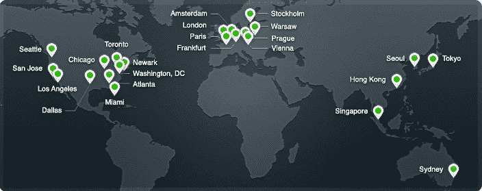
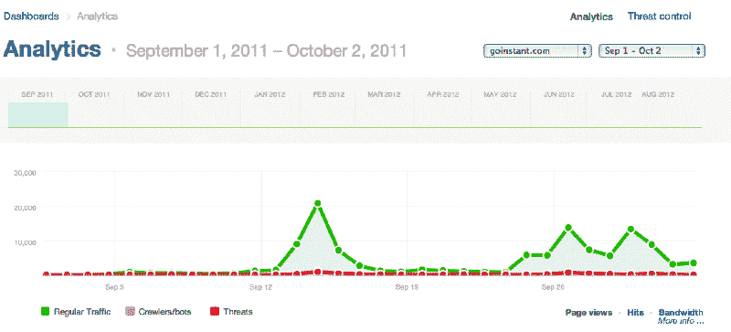

# CloudFlare 首席执行官 Matthew Prince 谈到打击扰乱战场神经和避免网站崩溃

> 原文：<https://web.archive.org/web/https://techcrunch.com/2012/09/16/cloudflare-ceo-matthew-prince-on-beating-disrupt-battlefield-nerves-and-avoiding-site-meltdowns/>

CloudFlare 差不多两年前在旧金山第一届 TechCrunch Disrupt 上发布。这对我们来说是一次不可思议的经历，我们的成功很大程度上要归功于 stage Disrupt 为我们提供的舞台。从那时起，我们已经部署了 23 个数据中心(自发布以来每月一个)，增加了 50 多万个客户网站，并通过 CloudFlare 网络提供了近 5000 亿次页面访问。已经两年了。

**隔岸观火**

对我们来说，最有收获的事情之一是在四次 Disrupt 活动中帮助其他公司推出产品:2011 年纽约、2011 年旧金山、2011 年北京和 2012 年纽约。CloudFlare 的主要功能是保持网站快速稳定运行，即使在流量激增时也是如此。如果说 Disrupt 网站的推出有什么作用的话，那就是带来了巨大的流量爆发。根据我们的统计，在过去两年中，我们已经帮助了大约 25%的战地公司确保他们的网站保持在线，即使在 Disrupt 启动带来的巨大负载下也是如此。

在 [Disrupt San Francisco 2012](https://web.archive.org/web/20221007071228/https://beta.techcrunch.com/events/disrupt-sf-2012/) 前夕，我认为接触一些一年前推出的杰出公司会很酷，以便让你在幕后一窥在那里推出会是什么样子。比特卡萨(战地决赛选手)的首席执行官托尼·高达、 [CakeHealth](https://web.archive.org/web/20221007071228/http://www.cakehealth.com/) (战地决赛选手)的首席执行官丽贝卡·伍德库克、 [GoInstant](https://web.archive.org/web/20221007071228/http://www.goinstant.com/) (被 Salesforce 收购)的首席执行官杰冯·麦克唐纳都是去年比赛中的佼佼者。他们的网站都在 CloudFlare 上发布，所以我们有他们服务器上看到的实际日志数据。他们同意让我分享他们的经历和他们流量日志中的细节，以便让公司在战场上做好准备。

**如果你启动**会有什么期待

为了了解战地公司可以期待什么，我们汇总了 CloudFlare 推出时位于其网络上的 20 家公司的日志数据。虽然具体数字有所不同，但以下是他们网站的情况:

*   在 TechCrunch Disrupt 的三天时间里，预计你的网站流量会平均增加 3 到 10 倍。对于没有进入决赛的一般公司来说，在 TechCrunch Disrupt 期间，预计每天会有 10，000 到 20，000 的页面访问量，其中大约 20%的流量集中在你在台上的那个小时。
*   如果你有一个消费者的吸引力，你可以期待得到更多的流量，如果你是商业或企业为重点。
*   如果你有效地利用社交媒体，你可以利用扰乱观众来进一步扩大你网站的流量。
*   即使你没有进入决赛，三天的比赛都会带来流量。对大多数公司来说，最大的峰值出现在 TechCrunch 发表关于你公司的文章时(通常在你上台后不久)。
*   对于进入决赛的公司来说，在你上台和宣布获胜者期间，流量可以达到每秒数百个请求。

**神经与细节**

你只能发射一次。在 3000 名技术娴熟的现场观众面前这样做，更不用说通过直播观看的无数人了，这是令人紧张的。每个竞争对手都听过这样的恐怖故事:网站在演示过程中崩溃，当全世界都在试图访问它们的时候却变得无法访问。我记得在我们发布的前一天晚上，我和我的联合创始人李·霍洛韦和米歇尔·扎特琳在索马一家名为“La Bricola”的意大利小餐馆共进晚餐。CloudFlare 仍然没有完全工作，我们都计划工作到深夜，但我们三个人休息了几分钟，吃了晚饭，喝了点酒。那天晚上我们的祝酒词是:“请不要让服务器融化。”

几乎所有准备在 Disrupt 上发布的公司都有同样的担忧。“在 TechCrunch Disrupt 之前，我们非常紧张。“当我们走上舞台时，我们不知道我们的网站会发生什么，”来自 GoInstant 的 Jevon MacDonald 回忆道。下面是 CloudFlare 控制面板的截图，显示了 GoInstant 的网站到底发生了什么。GoInstant [于 9 月 13 日](https://web.archive.org/web/20221007071228/https://beta.techcrunch.com/2011/09/13/goinstant-is-browser-sharing-with-no-downloads/)在 stage 上推出，网站流量持续攀升，14 日达到 20，000 多页的峰值，因为该公司演示了该产品，并打断了与会者的检查。仪表盘显示了本月福布斯、个人电脑杂志和 ZDNetlater 的大新闻点击量，但与扰乱网站发送的流量相比，它们相形见绌。

CakeHealth 的丽贝卡·伍德库克说，“你总是很紧张，担心会出错或会崩溃，但你需要专注于你的演示，讲述你所打造的产品的故事。”CakeHealth [于周一在 T4 推出，是进入 Disrupt 战地决赛的七家公司之一。三天来，网站的访问量持续增长。总之，CakeHealth 的网站在不到 72 小时内获得了超过 200 万次点击。当丽贝卡做最后一次推介时，该网站每秒钟收到几百个请求。](https://web.archive.org/web/20221007071228/https://beta.techcrunch.com/2011/09/12/cake-health-the-mint-for-health-insurance-launches-to-the-public/)

Bitcasa 是七个 Disrupt 战地决赛选手中的另一个，它的流量峰值更大。“我们的网站有几个 EC2 实例，”Bitcasa 的托尼·高达解释说。“我们把时间花在了确保后端和产品的构建上，我们没有担心构建我们的网络基础设施。”Bitcasa 对消费者有吸引力，流量激增。在为期三天的会议中，85，318 人注册了他们的测试版。“Disrupt 为我们的网站带来了最初的影响者流量，然后我们鼓励他们通过社交媒体告诉他们的朋友 Bitcasa。结果超出了我们的想象。”

与我交谈过的每一个在 Disrupt 上发起的人都对那次经历记忆犹新。无论你是赢是输，一旦你登上这个舞台，你将永远成为 TechCrunch 大家庭的一员，这将在未来几年为你的公司带来回报。在 CloudFlare，我们很自豪能够帮助许多 Disrupt 公司发布产品。

对于在今年 Disrupt SF 上发布的每个人，CloudFlare 团队祝你们好运。