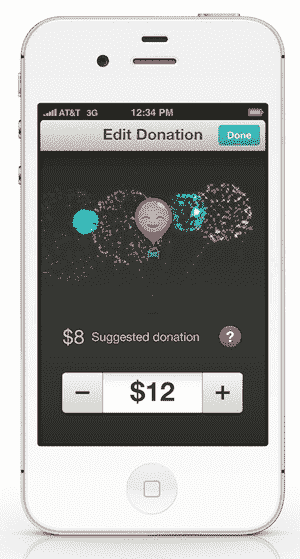

# Lyft 对社区的关注和粉色小胡子背后的故事| TechCrunch

> 原文：<https://web.archive.org/web/https://techcrunch.com/2012/09/17/lyfts-focus-on-community-and-the-story-behind-the-pink-mustache/>

你要求搭车，车开了过来，你坐进前座，给了司机一拳。这听起来像是你最好的朋友来接你时你会做的事情，而这正是超级热门的拼车服务 Lyft 想要效仿的体验。

今天，我与 Lyft 的联合创始人约翰·齐默(John Zimmer)坐在一起，讨论该公司对社区的态度，以及我们在旧金山不断发展的垂直交通。

我还找到了 Lyft 所有汽车上著名的粉红色小胡子背后的故事根源，但我们稍后会谈到这一点。公司[今天](https://web.archive.org/web/20230406025435/http://itunes.apple.com/us/app/lyft-on-demand-ridesharing/id529379082?mt=8)更新了它的应用程序，我们也将谈到这一点。

到目前为止，我对 Lyft 的体验是，它是为那些不介意与酷人交谈的人提供的服务。当然，如果你想坐在出租车的后座，你可以静静地坐在那里，不用担心有人打扰你，而你却在不停地打电话。有时候，我喜欢聊天。好吧，我喜欢一直聊天。Lyft 的司机很友好，这也是该公司希望在其车队中体现的一点。

齐默告诉我，“我们试图寻找有抱负、友好的人，当你和一个人一起乘车时，你会想‘嘿，那可能是我。“这种方法完全有道理，因为我们都有过在最后一刻结识一两个朋友的经历。

到目前为止，Lyft 的成功在很大程度上归功于它所产生的口碑效应。Zimmer 告诉我，产品内置了口碑，可以在从提货到付款的整个过程中为您带来便利。这很聪明，当你听到 Zimmer 声音中的喜悦时，你就知道该公司正在做一些事情。

对这项服务的需求在这家拥有 32 名员工的公司中一飞冲天，该公司目前拥有 200 名司机。随着越来越多的人听说 Lyft，将需要更多的司机。齐默并不认为这是一个问题，因为司机们开始兴奋地接近他。

### 是 Lyft 对优步？

我发现 Lyft 的体验与优步完全不同。这是一种比简单地坐进一辆漂亮的黑色轿车更愉快、更互动的社交体验。一个并不比另一个更好…只是不同而已。

有趣的是，Zimmer 告诉我，越来越多的人来到 Lyft，这些人在过去首先选择不出门。这些人在财务上很保守，因为费用而不去郊游。凭借简单和较低的价格，Lyft 实际上让人们更多地走出家门。

你觉得你和一个朋友在车里，这没有错。Zimmer 告诉我，该公司有一个“休息室”,司机们可以在那里聊他们与车手的经历。无论是给某人带一个三明治，还是让他们在车上选择音乐，Lyft 司机都有自己的萌芽社区。

### 社交图谱的下一层

当我和 Zimmer 谈论技术如何将一些人变成社交恐惧症患者时，他分享说他感觉潮流正在那里转向:

> 社交图的下一波浪潮是授权服务，如 Airbnb 和 Lyft，让人们有机会进行身体互动。因为 Airbnb，人们对此更加开放。Airbnb 采取了沙发冲浪，并采取了额外的一步。

Airbnb 确实为平台和舒适度打开了闸门，围绕这种在短短几年前听起来很疯狂的个人交易的想法。

车手们很开心，这将会影响到车手们。他们做自己喜欢的事情赚钱，还能认识很酷的人。事实上，一个女孩已经和她的一个 Lyft 司机约会过几次。

### 粉红色的胡子

联合创始人洛根·格林(Logan Green)所说的第一次碰撞，绝对是 Lyft 让我难以忘怀的事情之一。然而，你不能忽视你在每辆汽车前面看到的象征性的粉红色胡子。为什么留胡子？为什么是粉色？我问过齐默，他敞开了心扉。

> 我们最初只是想为女性提供这种服务，作为一种安全的服务和一个非常特殊的客户群。部分原因就在于此。

此外，该公司一贯使用的两种颜色，绿色和粉色，是对谷歌地图图钉的回应，绿色和红色。该公司决定采用“更友好”的绿色和粉色。

### 关注幸福和快乐的更新

该公司刚刚为其 iOS 应用程序推送了一个更新，并在你准备好支付(或捐赠，如该应用程序所说)你的司机时添加了一些有趣的动画。你不用加号和减号箭头，而是用铅笔输入你想付给司机的钱数。当你增加数量时，一个气球就会充满，然后最终会燃放烟花。

就是这样的小事，让你觉得一个公司真的关心你。相信我，Lyft 在乎。他们能把它变成一个巨大的生意吗？是的。都是为了好玩吗？不。但是如果公司能同时带来一些乐趣，带来微笑，那么对每个人来说都是一个胜利。

Zimmer 在结束我们的谈话时说:

> 建设社区是我的动力，也让我很高兴从事这项工作。

这是个不错的商业模式，Lyft。

[图片来源: [Flickr](https://web.archive.org/web/20230406025435/http://www.flickr.com/photos/lizasperling/7640819472/sizes/z/)