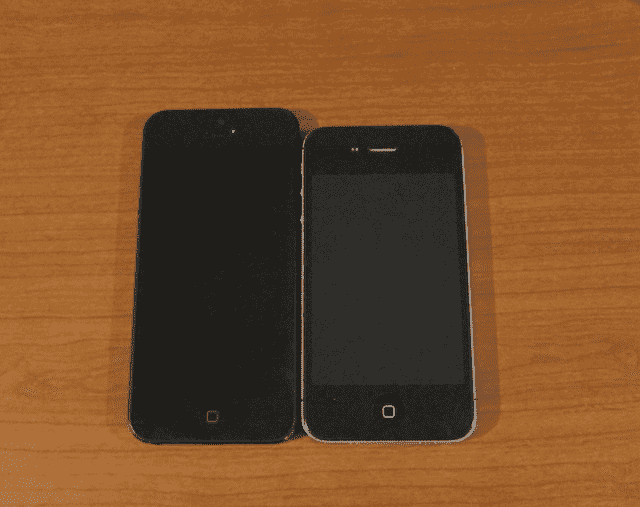
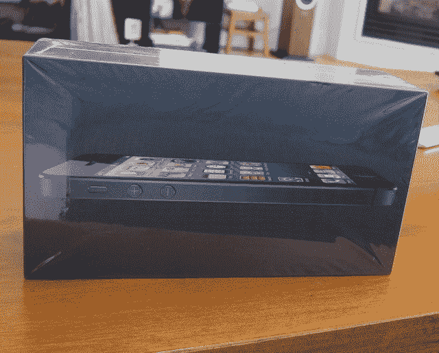
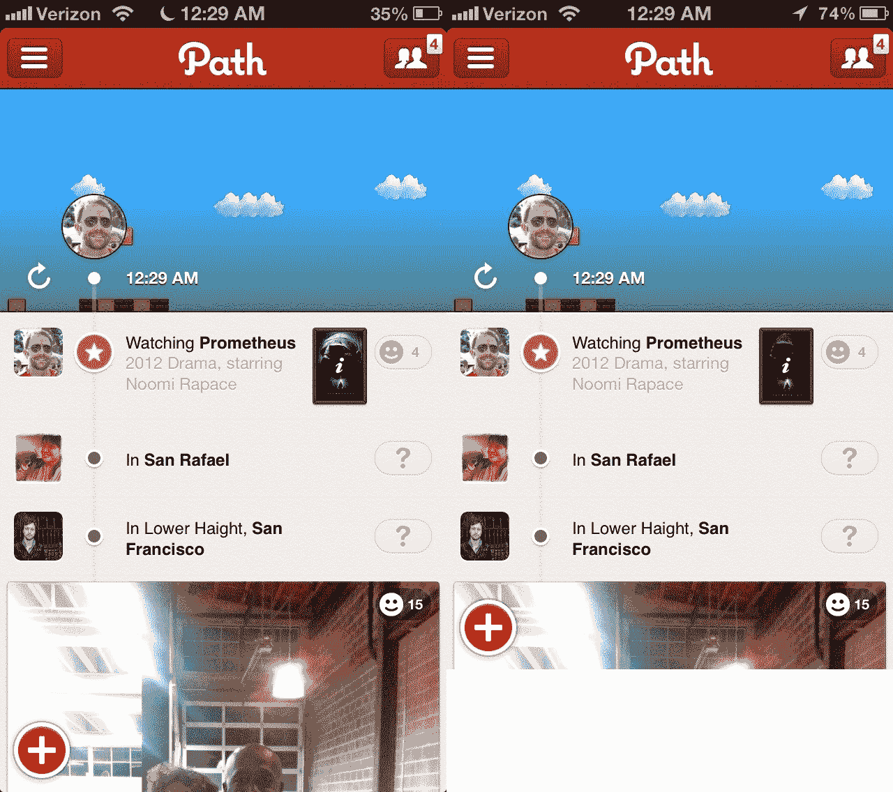
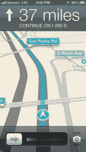
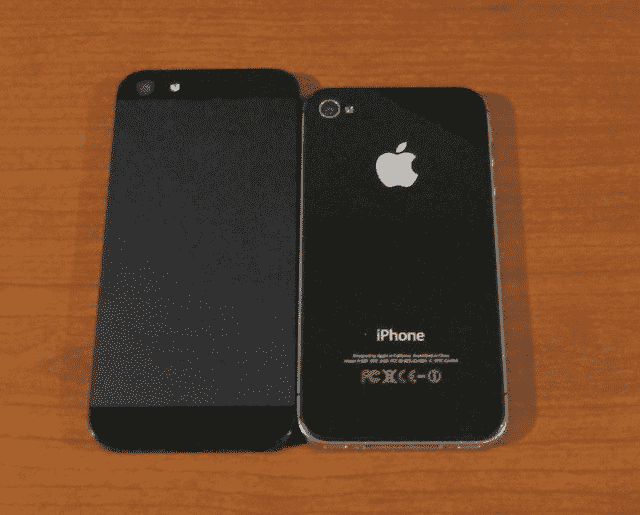
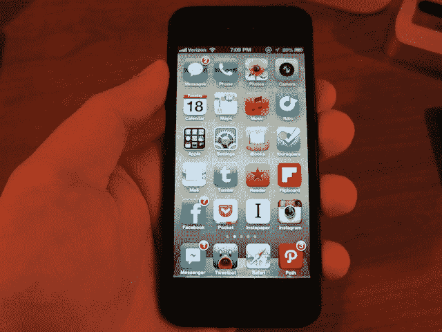

# 凭借 iPhone 5，苹果将智能手机打造得近乎完美

> 原文：<https://web.archive.org/web/https://techcrunch.com/2012/09/18/iphone-5-review/>

你拿起它，它几乎感觉是假的。这并不是说它感觉很便宜；因为事实并非如此——事实上恰恰相反。只是看起来不真实。对于过去两年一直拿着 iPhone 4/4S 的人来说，肯定不是这样。感觉像是有人拿走了其中的一个设备，然后把它掏空了。

iPhone 5 来了。

在过去的几天里，我有机会玩了玩最新的 iPhone。我就不拐弯抹角了:太棒了。

当然，你可能希望我这么说。但这并不意味着我错了。事实是，你要么听我的，要么就输。你会想要这部手机的。

阅读自发布以来的新闻报道，你可能已经听说 iPhone 5 令人失望，或者无聊。坦率地说，那些人是傻瓜。他们要么没有真正使用过这款设备，要么只是在上周的活动结束后在动手区玩了几分钟。(或者更糟糕的是，由于过去几年苹果在科技领域的主导地位，他们在工作中表现出了自己的厌倦。)定期使用设备才是真正重要的。在这方面，iPhone 5 在几乎所有可以想象的方面都大放异彩。

事实上，我会更进一步:我真的相信这是苹果迄今为止做的最好的 iPhone 升级(胜过 iPhone 到 iPhone 3G 的跳跃和 iPhone 3GS 到 iPhone 4 的跳跃)。因此，这是迄今为止最好的 iPhone 版本。到目前为止。

先说尸体。我已经说过它有多轻了。我几乎想把它比作家具店地面展示单元上的假电子占位符——但这显然是不对的。也许把它和一些安卓手机相比会更好。其中几个也很轻。这里的关键区别是，这些往往通过塑料外壳来实现低重量。这让他们觉得自己很廉价。

iPhone 5 在两个主要方面减轻了 iPhone 4/4S 的重量。首先，用铝代替玻璃。第二，通过将触摸技术集成到显示屏本身(以前，它是显示屏上的一层)，这使得苹果可以在手机正面使用更薄的玻璃。

在过去两年的日常使用过程中，iPhone 4/4S 在我手中从未感到沉重。但当我拿起 Nexus S 这样的 Android 设备时，毫无疑问 iPhone 更重。现在，iPhone 5 实际上比 Nexus S 更轻，而且，它没有恢复到塑料。其结果是，这款设备感觉和 iPhone 4/4S 一样坚固和实用。

减少前玻璃和移除后玻璃的好的副作用是，iPhone 5 现在也比 iPhone 4/4S 薄得多。这在我的日常使用中不太明显，但是把它们放在一起，区别就很明显了。

如果你像我一样，把 iPhone 放在裤子前面的口袋里，iPhone 5 的整洁和重量都是最受欢迎的增加(减少？).

iPhone 5 重量的另一个疯狂之处是，即使增加了明显更大的屏幕，它也轻了很多。这清楚地证明了苹果的硬件和制造实力。人们不禁想知道，苹果公司用旧的 3.5 英寸屏幕能做出多轻的 iPhone 5…

说到屏幕，我是对 iPhone 上更大的屏幕有意义的怀疑者之一。我的理由有两个。首先，我不想看到 Android 用户和开发者面临的那种碎片化，因为在那个生态系统中有各种各样的设备尺寸。第二，我只是喜欢 3.5 英寸的屏幕尺寸。从人体工程学的角度来看，它似乎很完美。

在这两种情况下，苹果都做了一些聪明的事情。

在碎片化方面，苹果通过允许开发者选择 4 英寸屏幕来避免任何重大问题，但只能作为他们瞄准 3.5 英寸屏幕的同一应用程序二进制文件的一部分。换句话说，将不会有只在 iPhone 5 屏幕上运行的应用——至少短期内不会(我确实认为 4 英寸屏幕将最终成为标准)。我听说苹果也没有计划强制要求开发者*必须*瞄准 4 英寸屏幕。这完全取决于他们。

而如果他们不针对新屏幕，那真的不是什么大事。iPhone 5 只是采用标准尺寸的应用程序，并以“信箱”模式运行它们，在屏幕的顶部和底部(或侧面，如果设备是水平的)有小的黑色条。把它想象成一个在 iPad 上运行的 iPhone 应用程序——只是效果没有那么明显，因为 iPhone 5 的屏幕远小于 iPad 的屏幕(4 英寸对 4 英寸)。9.7 英寸)。事实上，在黑色的 iPhone 5 上，由于设备的黑色正面，很难注意到黑色的条纹。酒吧只是融合在一起。

信箱模式的一个好的副作用是 iOS 系统元素仍然可以使用更大的屏幕。例如，当推送通知进来时，它们从屏幕顶部向下翻转，完美地停留在 3.5 英寸应用程序的上方(而不是在它的顶部)。

尽管如此，我确信许多开发者将把目标锁定在 4 英寸屏幕上，因为我怀疑 iPhone 5 将很快成为迄今为止最畅销的 iPhone(更不用说下个月即将推出的新 4 英寸 iPod touch 了)。苹果公司在 iPhone 5 发布前与几家公司合作(OpenTable 和 CNN)，我被告知他们很容易就能准备好 4 英寸的应用程序。

事实上，在我写这篇文章的时候，已经有几个为 iPhone 5 定制的应用程序在 App Store 上线了(这很疯狂，因为大多数开发者还没有亲眼见过 iPhone 5)。Reeder、Path、Tweetbot、Well、Lift、Highlight、GroupMe 和 Tiny Post 都是不错的选择。正如你可能想象的那样，苹果的所有主要应用程序也是如此。(可悲的是，Twitter 本身今天刚刚推出了一个重大的 5.0 升级，显然没有获得 4 英寸的备忘录——尽管它们已经被纳入了 iOS。当然，新近专注于本土应用的脸书也没有。)

上面列出的大多数应用程序只是利用较长的屏幕来实现垂直列表风格的显示目的。但我个人最感兴趣的是那些利用额外空间在用户界面/UX 方面发挥创意的应用程序。CNN 是其中之一，因为他们将 iPad 应用程序的一些元素带到了 iPhone 5 应用程序中(尽管更新版本尚未上线)。

苹果在 4 英寸屏幕上做的另一件聪明的事情只是让它更高。也就是说，iPhone 5 的屏幕宽度与之前的每一部 iPhone 完全相同。只是更长而已。这最小化了变更的工效学影响(以及对开发人员的影响)。

老实说，这是我还在适应的事情。我没有发现我的拇指使劲去够上面的任何触摸元件，但我确实发现自己拿着设备的方式与我拿着以前的 iPhones 略有不同(暗示一下“你拿错了”的笑话)。我很确定这是我会慢慢习惯的。没什么大不了的。(虽然有点烦人的是，用 3.5 英寸的应用程序点击屏幕顶部的趋势不再会让你滚动到应用程序的顶部，因为你必须实际点击时间区域。)

我非常欣赏邮件和日历等应用程序中的垂直屏幕，它现在可以显示更多的信息。它也非常适合任何文本繁重的应用程序。当然，还有网络。

*(下图:针对 iPhone 5 和 iPhone 4S 优化的路径。)*

【T2

在水平模式下，新屏幕的比例为 16×9，恰好接近大多数电影(以及高清电视)的拍摄比例。这使得在 iPhone 上观看电影或电视节目的体验更好。屏幕不再被垂直的黑条所占据——实际上是信箱区。

是的，不用担心，iPhone 5 很好地通过了口袋测试。也就是说，它可以放在你的裤子口袋里，而不会突出来。同样，如果有什么不同的话，它在这方面比以往任何时候都更好，因为它更薄更轻。

1500 字，我还没有提到另一个最大的补充:LTE。说到网速，iPhone 5 现在快得要命。

事实上，LTE 速度非常快，比我家的 WiFi 还快。这是我第一次用新 iPad 体验到的东西，很高兴看到威瑞森的网络还在运行(下面会有更多)。说到威瑞森，我们中使用过威瑞森 iPhone 的人在过去几年中受到了一些忽视，因为尽管威瑞森的 3G 覆盖区域似乎是美国主要运营商中最强的，但他们的速度肯定比竞争对手 AT & T 慢。LTE 不再是这样的情况。

我对使用 LTE 的 iPhone 5 进行了一些测试，通常速度会下降约 20 Mb/s，上升约 4 Mb/s。相比之下，我在威瑞森 3G 上运行的 iPhone 4S 每秒下降了将近 2 Mb，每秒上升了 0.75 Mb。(去年 3 月，我对支持威瑞森 LTE 的新款 iPad 进行了测试，速度下降了近 40 Mb/s，因此网络显然已经饱和，但仍然保持良好。)

我认为威瑞森唯一的缺点是你仍然不能一边打电话一边使用数据。Sprint 也是如此。美国电话电报公司允许这样做。这是旧的 CDMA 网络的一个局限，iPhone 5 在语音方面仍然依赖它。当 LTE 可以承载语音时，这种情况应该会改变。不管怎样，这对我来说不是一个交易破坏者，但如果你经常打电话，这是值得考虑的。

说到手机，语音质量似乎比以往任何时候都要好。苹果在 iPhone 5 上添加了一些新的降噪麦克风，以帮助提高通话清晰度。不幸的是，他们在设备中使用的另一项新的语音技术(宽带音频)是[不太可能](https://web.archive.org/web/20230406055111/http://www.macrumors.com/2012/09/13/u-s-carriers-unlikely-to-support-iphone-5s-wideband-audio-european-support-more-likely/)很快被美国运营商采用。

有了 iPhone 5 的摄像头，苹果选择走出百万像素的军备竞赛(仍然是 800 万像素)，转而专注于其他事情，如弱光摄影。结果明显更好，尽管仍然不如一个好的傻瓜相机(如佳能 S 系列)或 DSLR。

似乎很明显，很多注意力只是放在了将一个与 iPhone 4S 中的相机一样好的相机*放入 iPhone 5 新的薄机身上。*

到目前为止，最好的新相机功能是全景模式，这是惊人的。它使用起来如此简单，效果如此之好，我怀疑很多人会开始经常使用它，我们可能会看到一些新的全景应用程序弹出。

(我不得不大幅缩小下面这张照片，因为它大约是 10,000 x 2,500 像素。)

iPhone 5 的另外两个已经受到大量关注的元素是新的 EarPods 和新的 Lightning 连接器。我是 EarPods 的忠实粉丝，因为它们几乎完全适合我的耳朵——尽管我知道并非每个人都是如此。我也第一次可以用标准的苹果耳机听到低音。它们可能不是金钱所能买到的最好的耳机(也不应该有人期望它们售价 29.99 美元——或者新款 iPhone 的*免费*)，但它们比旧款耳机有了巨大的进步。

与耳机相关的最不和谐的变化可能是将插孔移到了 iPhone 的底部。这一直是 iPod touch 的标准，但直到现在才出现在 iPhone 上。刚开始有点奇怪，但应该不会引起太大的戏剧性(著名的遗言)。

至于闪电连接器，就是它的本来面目。很多人都很沮丧，因为他们需要为他们的旧配件配备适配器。但这是进步的代价。与旧的 30 针连接器相比，Lightning 连接器很小，并且能够将它的任何一侧朝上插入是很好的。我也不会错过 iPhone 底部长孔中堆积的口袋棉绒。

在说到 iOS 之前，我们先来说说 iPhone 5 的速度。我没有运行任何科学基准测试(我确信这些将在其他评论中出现)，但我确实做了一些常规的使用测试。结果很明显:iPhone 5 的速度明显快于速度很快的 iPhone 4S。

一个重要的警告:我测试了一台装有 iOS 6 的 iPhone 5 和一台装有 iOS 5 的 iPhone 4S，所以一些改进可能是在软件上。但据我所知，新的 A6 芯片(或许还有更多内存)才是真正的关键。

启动 iPhone 5 通常比 iPhone 4S 少花 30 秒。加载较重的应用程序(如 Path，它缓存了大量数据)，速度快了一倍。我尝试的每一款游戏都明显比 iPhone 4S 快。像 GTA 3 和 Infinity Blade 这样的大型游戏启动*明显比*快。这些游戏还没有为 A6 优化。

网页加载速度也更快，尽管在某些情况下，这无疑更多地是关于 LTE 方面的。与 iPhone 4S 相比，在 iPhone 5 上用 Camera+保存一张经过严重过滤的照片要少花 20 秒的时间。这是我记录的最大差异之一。

5 甚至连加载设置应用程序都快了很多。

现在，关于 iOS 6，你可能已经读到了很多，因为它已经在开发者手中几个月了，苹果已经在他们自己的活动中预览了两次。从表面上看，iOS 5 的飞跃似乎并不重要，因为外观和感觉都是一样的。

一些变化包括 Siri，它现在可以做更多的事情(但仍有很长的路要走)。iCloud，更全面地集成到操作系统中。脸书，现在已经被嵌入到操作系统中(由于它非常简单，应该会导致应用注册的爆炸式增长)。

iOS 6 的一大新元素是 Passbook。目前还没有任何内容可以使用，但是我有机会玩了一些演示版，它们运行得很好。供应商可以给你发送一封带有 Passbook 有效负载的电子邮件，当你点击它时，它会立即加载到你的 Passbook 中。只要有大的供应商(看起来像是星巴克、达美、喜达屋、Ticketmaster、Fandango 等等)，这应该是一个非常有用的新功能。

iOS 6 最大的变化是地图应用。之前由谷歌地图提供支持，苹果已经为应用程序和 iOS SDK 建立了自己的地图后端。许多人似乎对此感到担忧——这是有充分理由的:对许多人来说，这无疑是使用最频繁的应用程序之一。

在过去的几天里测试地图，我留下了深刻的印象。不，我不认为它们比谷歌地图好，但无论怎么想象，它们都不差。我查了当地的场馆，都找到了。我查过海外的地方，也找到了。我玩过 3D 的东西，很漂亮，但可能不是每天都有用。当然，我也用过方向。

有一天，我在高速公路上相当广泛地使用了转向，效果很好。把它放在锁屏上很棒，更棒的是，即使你在其他应用程序中它也能工作(它会在你移动时弹出提醒)。这是一个受欢迎的新增功能，是许多用户一直要求的最后一个“勾号”功能之一。

一个不受欢迎的减法是公交路线，因为它们不再存在于应用程序中。相反，苹果公司表示，他们将与其他应用程序制造商合作，但还没有人上线，所以我无法测试。如果你住在一个公共交通很重要的城市，这就糟了。但在旧金山这里，我们有更紧迫的问题:就像市政本身从来没有实际工作。

我怀疑苹果会对这一变化有很大的抵触情绪。但我也预计他们会很快迭代他们的地图。谁知道呢，也许我们会在应用商店里看到一个谷歌地图应用程序，就像我们对 YouTube 应用程序所做的那样。

总的来说，iPhone 5 绝对是全垒打。苹果采用了我仍然认为是最好的智能手机(iPhone 4S ),并在几乎所有方面对其进行了完善。是的，这包括电池寿命部门。虽然很难与一年前的 iPhone 4S 相提并论，但电池似乎比一年前好了一点(尽管 iOS 也存在一些问题)。苹果声称 3G 和 LTE 使用时间为 8 小时，这似乎是正确的。

(另一方面，iPhone 5 的亮度设置导致屏幕在较低的设置下更亮。很难知道那是 iPhone 5 的东西还是 iOS 6 的东西。但它似乎也有助于延长电池寿命。)

关于这款设备，我能说的最糟糕的事情是，与这里发现的新铝制(顶部和底部有玻璃“窗口”)后盖相比，我更喜欢 iPhone 4/4S 的玻璃后盖的外观。但我更喜欢铝的感觉。总的来说，我觉得全黑的外观(包括侧面和角落)更有吸引力。“它有黑色的吗？在《T2》中，布鲁斯·韦恩问卢修斯·福克斯。是的，是的，它是。这无疑是蝙蝠侠会用的手机。

如果你一直在争论买不买 iPhone 5——看起来你们很多人都没怎么争论过，已经有 200 万部预购了——我建议你赶紧买。即使从 iPhone 4S 来看，iPhone 5 也是一个显著的进步。(当然，我知道承运人合同承诺也可能在其中发挥作用。)如果你有一部 iPhone 4，或者，但愿不会，一部 iPhone 3GS，那就尽快买一部 iPhone 5。

如果你有一部 Android 手机，并且一直在等待 iPhone 的重大更新，以探索或重新探索该设备，现在是时候了。如果你是 Windows Phone 7 的用户，在迁移到 Windows Phone 8 的过程中遇到了麻烦，你可能也想看看。如果你仍然是黑莓用户，那么，祝你好运。我想我帮不了你。

那些担心围绕 iPhone 5 的“失望”言论的人，我建议你从周五开始去苹果商店，亲自尝试一下。我猜你会马上意识到所有这些恐吓实际上是多么的荒谬。iPhone 5 是苹果最擅长的事情的顶峰。这是一部近乎完美的智能手机。

