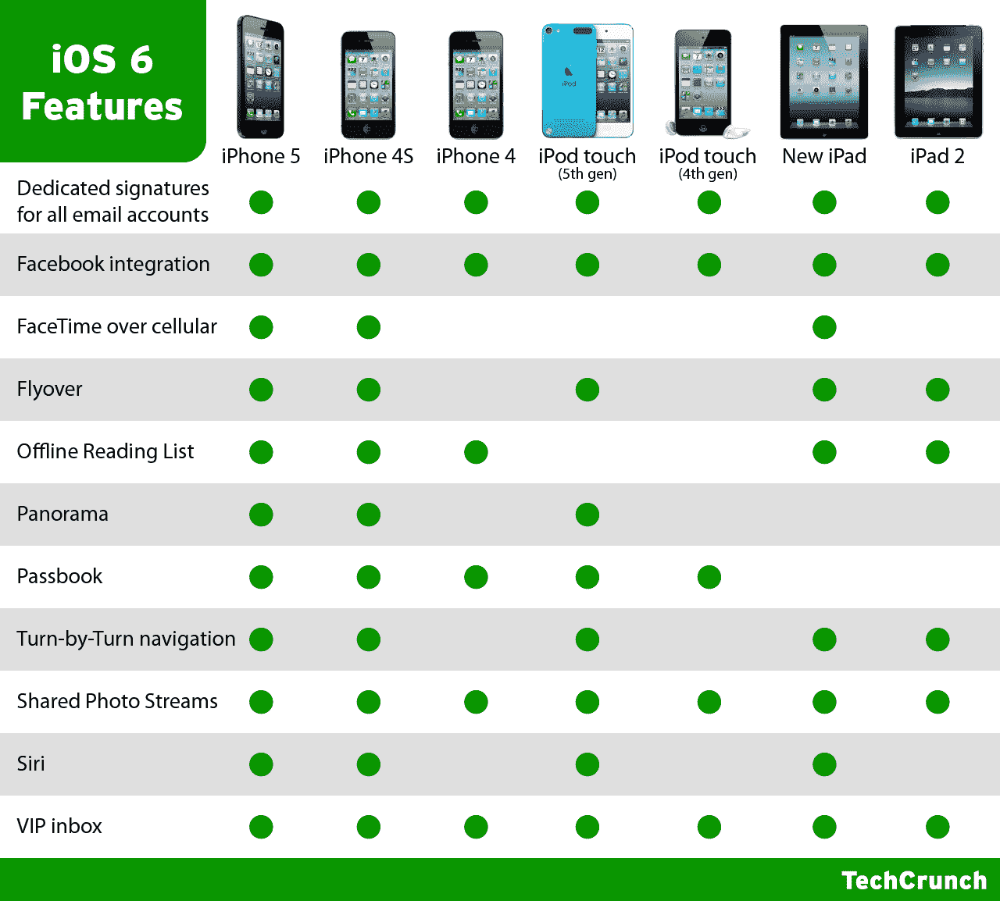

# iOS 6 现已推出:以下是你的 iDevice 获得的功能 TechCrunch

> 原文：<https://web.archive.org/web/https://techcrunch.com/2012/09/19/ios-6-is-now-available-heres-what-features-your-idevice-gets/>

# iOS 6 现已推出:以下是你的 iDevice 拥有的功能

苹果推出了 iOS 6 live，这意味着你现在可以更新，要么通过访问 iPhone 3GS 或更高版本、iPod touch 第四代或更高版本或 iPad 上的设置>通用>软件更新，要么通过插入 iTunes 并检查更新。iOS 6 提供了一长串新功能，包括一些亮点，如全系统脸书集成、苹果新的 Passbook 应用程序、更普遍有用的 Siri，以及其他许多功能。

但是，虽然 iOS 6 提供了许多新东西，但并不是每个人都会得到它。有一些特定于设备的功能，所以我们准备了这个方便的图表，列出了新移动操作系统的一些关键功能，以帮助你浏览 iOS 6 中有什么和没有什么，这取决于你碰巧拥有什么样的设备(或者即将拥有什么样的设备，就 iPhone 5 或第五代 iPod touch 而言)。如果你还没有看到它，请耐心等待，我们听说苹果的服务器可能会被关闭，但它确实是活的。

【T2